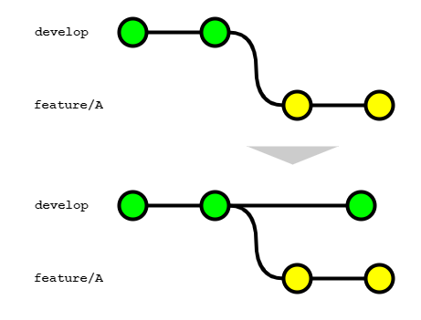

# Gitブランチフロー規約

本コーディング規約は、世の中のシステム開発プロジェクトのために無償で提供致します。

ただし、掲載内容および利用に際して発生した問題、それに伴う損害については、フューチャー株式会社は一切の責務を負わないものとします。

また、掲載している情報は予告なく変更することがございますので、あらかじめご了承下さい。

# はじめに

本ドキュメントはGitブランチ管理の標準的な運用ルールをまとめている。以下の想定で作成されているため留意すること。

- GitHub ／ GitLab の利用
- トランクベース開発（フィーチャーフラグ）を **採用しない**
- ライブラリではなく、アプリケーション（CLIツール、サーバアプリケーションなど）開発で利用する

# ブランチ戦略の選定

本ドキュメントで想定する各ブランチ役割については[ブランチの整理](each_branch.md)に記載する。

ブランチ戦略は以下の方針で選定する。

- できるかぎりシンプルなモデルを選択し、運用コストを下げる
- プロジェクトのフェーズや体制に応じて、変更を許容する

現実的に利用する可能性が高いブランチの運用パターン３つ示す。

選定を記載順で導入を検討する。

- GitHub Flow → Lite GitLab Flow → GitLab Flow

| 名称             | 利用ブランチ                                          | 概要                                                                                                                                                                                                                                                                                                                                                                                                                        | 運用コスト | 使い所                                                                                               |
| ---------------- | ------------------------------------------| --------------------------------------------------------------------------------------------------------------------------------------------------------------------------------------------------------------------------------------------------------------------------------------------------------------------------------------------------------------------------------------------------------------------------- | ---------- | ---------------------------------------------------------------------------------------------------- |
| GitHub Flow      | `main`<br> `feature`                      | 最小のブランチ管理パターンで、開発人数が少なく、検証作業は全員で行う場合に有効。<br>マージの都度本番環境へデプロイする前提。                                                                                                                                                              | 低         | ・個人開発<br>・プロジェクト初期フェーズで断面管理を厳密に行わない場合                                                          |
| Lite GitLab Flow | `main`<br>`develop`<br>`feature`<br>`topic`<br> `hotfix`  | GitHub Flowに`develop`ブランチを追加するパターン。（特定の呼称はないのでLite GitLab FLowと命名。）<br>`main`ブランチをプロダクトリリースブランチとし、開発中ソースコードとは分ける。 | 低         | ・本番リリース済みプロダクトの開発などで、一定品質を保証する必要がある場合<br>・開発作業とリリース作業が並行しないチーム構成である場合                           |
| GitLab Flow      | `main`<br>`develop`<br>`release` <br>`feature`<br>`topic` <br> `hotfix` | GitHub Flowに`develop`ブランチと`release`ブランチを追加するパターン。<br>GitLab Flowでは`main`ブランチを`production`ブランチ、`release`ブランチとを`pre production`ブランチと呼称するが、本規約では`main`/`release`に統一する。 | 中         | ・リリース作業と開発作業が並行して行われる場合<br>  ・断面を指定して複数テスト環境にデプロイしたい場合 |

## 変則的なパターン

### developブランチが複数作成する場合


複数リリースバージョンを並行して開発する場合、developブランチを複数作るパターンも考えられる。  
上記の例では日々のエンハンスとは別に数カ月後に大型リリースがある場合を想定する。  
あるタイミングで大きく機能が変わる場合にエンハンス用開発ブランチ（`develop`）とは別の開発ブランチ（`develop2`）を作成する。（featureフラグでの対応も考えられるが、本記事でブランチで対応する場合を想定する。）  
このパターンではそれぞれのdevelopブランチに対しては独立してfeatureブランチで機能開発が行われるが、`develop`から`develop2`への同期に注意する必要がある。
`develop`の変更にはバグフィックスや軽微なUI向上が含まれる想定であり、これらの変更は日次あるいは週次の比較的高頻度で本番環境へリリースされる。  
当然、`develop2`はこれらの変更を加味して大型リリース向け開発を進める必要があるので、`develop`のmainブランチ反映されるたびに`develop`から`develop2`への同期を行う必要がある。  
`develop`から`develop2`への同期は以下の様に行う。

- リベースとしてしまうと`develop2`を元にfeatureブランチを作成して開発している開発者が混乱することになるため、マージコミットにて同期を行う。  
- 誤操作を避ける目的でcherry-pickは行わない。


develop2のリリースは以下の手順で行う。

1. `develop`から`develop2`へマージコミットによって同期を行う。（2でコンフリクトが起こらないよう、前準備の意味合いで実施する。）
2. `develop2`から`develop`にマージを行い、その後は通常のリリースフローに従う
3. 問題なくリリースが完了し次第、`develop2`を削除する

`develop`から`develop2`へマージ後、`develop2`を`main`ブランチに反映させる手順も考えられるが、`develop2`から`develop`へのマージとすると以下のメリットがある。

- 本番環境（=`develop`）との差分を把握することができる
- より一般的な名称である `develop` ブランチのみ残るため、新規参画者フレンドリーである

### 過去バージョンをサポートする場合


社内ライブラリなど過去のバージョンをサポートする場合、バージョン別にsupportブランチを作成するパターンも考えられる。
インターフェースの大型改善や、仕様変更を受けてversion1からversion2へupdateを行った場合を想定する。
メインの更新はversion2（mainブランチ）に対して行っていくが、version1の利用ユーザーが存在する場合、バグfixやセキュリティアップデートを並行して行うことが考えられる。  
そういった場合はversion1を示すブランチ（`support/v1`）を別途作成、そのブランチからfeatureブランチを作成してfixを行う。  
featureブランチのマージ後、マイナーバージョン（あるいはパッチバージョン）を上げたタグをコミットし、本番環境へリリースする。  
※この例ではversion1とversion2が別リソースとして動いていることを前提としている。同一リソースで複数バージョンが稼働する場合はversion2のブランチで対応を行う必要がある。

# マージ戦略の選定

マージ戦略とは、複数のブランチ間で生じた変更の取り込み方針を指す。

具体的には「マージコミット」「リベース」「スカッシュマージ」を次の2ケースで選択する。

1. 開発中の機能ブランチに対してメインの開発ブランチの変更をどう取り込むか
2. メインの開発ブランチに開発およびレビューが完了した機能ブランチをどう取り込むか

次の事項に影響を与えるため、Gitの使用を開始する前に決めることが重要である。

- プロジェクトのコミット履歴の管理
- コンフリクトの解決
- 開発プロセスの円滑な進行
- 最終的なソフトウェア品質

## 1. 機能ブランチに開発ブランチの変更を取り込む



機能ブランチで開発を進めている最中に、別の開発者により開発ブランチがアップデートされることはよくあることである。コンフリクトしている場合は解消が必須であるし、品質保証の観点でも最新の開発ブランチの変更を機能ブランチに取り込んだ上で、テストなどの検証作業を行う必要がある。

[開発ブランチの変更を機能ブランチに取り込む方法](merge_develop_to_feature.md)に記載した2つの方法のうち、「リベース」による方法を推奨する。


理由は次の通り。

- マージを選択すると、そのたびにマージコミットが作成され履歴が複雑になり、レビューアの負荷が高まるため
- スカッシュマージはこのケースでは選択できないため
- コンフリクトリスクは、マージ・リベース問わず発生するもので、リベースの選択による悪影響は存在しないため

マージによる変更の取り込みが既存のブランチを変更しないのに対し、リベースは全く新しい（元のコミットIDとは別のコミットIDで）コミットを作成するため、次の4点に注意すること。

1. 開発者は `git pull` 時の挙動をリベースにするよう設定する（`git config pull.rebase true`）。
2. 複数人に影響を及ぼすpublicなブランチでは、決してリベースを使用しないこと
   - 永続ブランチである `develop` や `main` ブランチが該当する
   - リベースにより新しいコミットが作成されるため、他の人が作業しているブランチと整合性が取れなくなり、大きな混乱を招く可能性がある。永続ブランチは **強制プッシュできないよう保護しておく**
3. リモートにプッシュ済のブランチでリベースを行った場合、強制プッシュ（Force Push）が必要になること
   - 開発者はプッシュ時に `--force-with-lease --force-if-includes` フラグを渡すことで、意図せずリモートブランチの変更を上書きしないようにする
     - `--force-with-lease`: ローカルのリモート追跡ブランチの ref とリモートの ref を比較し、ローカルの状態が最新でない場合（要はプッシュ先のリモートブランチに変更が入ったが、ローカルで `git fetch` していない場合）は、プッシュに失敗する。逆にいうと、プッシュ前に `git fetch` を実行済みの場合は、リモートの変更を上書きする形で強制プッシュができてしまうため、これを防ぐには `--force-if-includes` フラグを併用する
     - `--force-if-includes`: リモート追跡ブランチの変更がローカルに全て取り込まれていない場合は、プッシュに失敗する。これにより意図せず他の人のコミットを上書きすることを防ぎつつ、必要な変更を強制的にプッシュすることができる
4. メインの開発ブランチの変更を頻繁に取り込む場合、同じようなコンフリクトの解消を何度も求められる可能性があること
   - GitのRerereを有効化する（`git config rerere.enabled true`）ことでコンフリクトの解消を記録し、繰り返しの操作を自動化できる

::: tip

強制プッシュすることにより、レビューコメントが消えてしまわないかという懸念を聞くことがある。2024年7月に実施した調査では強制プッシュ運用による支障は無いという結果だった。

- 「a.履歴保持」: 強制プッシュを行い、GitHub投稿したレビューコメントが履歴として何かしらのページで取得できるかどうか。GitHubではConversationタブで確認
- 「b.行単位の紐づけ（該当行の変更なし）」: レビューコメントが付けられた行とは別の変更を行い、強制プッシュしたときにレビューコメントの紐づけが残るかどうか。GitHubではFile chagedタブで確認
- 「c.行単位の紐づけ（該当行の変更あり）」: レビューコメントで付けられた行を修正し、強制プッシュ時の挙動。レビュー対応をしたとみなしレビューコメントのひも付きは解除されているべきである。GitHubではFile chagedタブで確認

| サービス        | a.履歴保持 | b.行単位の紐づけ（該当行の変更なし） | c.行単位の紐づけ（該当行の変更あり） |
|----------------|--------------|---------------------------------|---------------------------------|
| GitHub         | 残る           | 残る                              | 消える                              |
| GitLab         | 残る           | 残る                              | 消える                              |

:::

## 2. 開発ブランチに機能ブランチの変更を取り込む

プルリクエスト（以下、PR）を経由して、開発が完了した機能ブランチをメインの開発ブランチに取り込むためには、GitHub（GitLab）上でPRを経由する運用を行うこと。

[開発ブランチに機能ブランチの変更を取り込む方法](merge_feature_to_develop.md)に記載した3パターンのうち、「スカッシュマージ」による方法を推奨する。


理由は次の通り。

- 開発ブランチの履歴をクリーンに保てるため
- PRをよりシンプルに保つインセンティブとしたいため（単一のコミットメッセージで表現できる程度の方がレビューコストも小さいため）

「Squash and merge」による変更の取り込みを行う場合、次の4点に注意すること。

1. マージ後は機能ブランチを削除すること
   - 変更元の機能ブランチのコミットをまとめたコミットが新たに作成されるめ、元の機能ブランチを再利用して（例えば追加のコミットを作成して）PRを作成してもコンフリクトが発生する。そのためマージ後はリモート/ローカルの双方で速やかに機能ブランチを削除することが望ましい
   - リモート側の機能ブランチはGitHubの設定にて「Automatically delete head branches」を選択することで、マージ後に自動でブランチの削除が行われる。（GitLabでは、マージリクエストから「Delete source branch」オプションを有効にすることで、マージ後に自動でブランチの削除が行われる。プロジェクトの設定で「Enable "Delete source branch" option by default」を選択しておくとデフォルトで有効になる。）
   - ローカル側の機能ブランチは `branch -d` コマンドでは削除できないため、`branch -D` コマンドを用いて削除する必要がある。
2. 部分的なコミットの取り消しができない
   - 履歴上は1つのコミットになるので、マージ後に一部の変更だけを取り消すということができない。取り消しはPRの単位となるため、PRの単位をなるべく小さなまとまりにすることが望ましい
3. Authorが失われる
   - 機能ブランチにコミットを行った人がAuthorになるのではなく、「Squash and merge」を行った人がAuthorになるため、OSS開発を行う場合など、厳密にコントリビューションを管理する必要がある場合は注意されたい。GitHubでは「Squash and merge」を行う場合、デフォルトでコミットメッセージに `co-authored-by` トレーラーが追加され、1つのコミットが複数の作成者に帰属するようにするようになっている[^2]。この記述は削除しないようにする
4. 機能ブランチの取り込み以外のケースでは、「Squash and merge」以外を選択すること
   - 例えば、`develop` ブランチを `main` ブランチや `release`ブランチにマージする場合など、取り込み元のブランチの変更が大きい場合は、コミットメッセージを1つにまとめることによる弊害が大きいため、別のマージ戦略を検討すること

[^2]: https://docs.github.com/ja/pull-requests/committing-changes-to-your-project/creating-and-editing-commits/creating-a-commit-with-multiple-authors

# ブランチ運用アンチパターン

ブランチ運用でよく課題に上がるパターンとその対応を紹介する。

## 追い抜きリリース

以下のような状況とする。

- 2つのチケット（issue-312、issue-394とする）があり、どちらも同じファイルの修正を含む
- 先にissue-312がdevelopにマージされ、その後に着手されたissue-394がマージされた
- 以下のような条件があるため、issue-394分を先にリリースしたい
  - issue-312のリリースは業務上の合意が得られていない（エンドユーザ操作に影響があるため、事前告知した日時でリリースしたいなど）
  - issue-394は不具合修正であり業務課題として目につくため、なるべく早くリリースして解消したい


よく陥りがちな対策としては次の2点が考えられる。

1. issue-312をリバートする
2. issue-394のコミットのみをcherry pick してmainブランチにマージする

1のリバートはGitHubの機能で提供されていることもあり簡単に行えるが、手戻りであることは間違いないし、コミットの履歴が汚れるため、保守運用の視点ではマイナスである。2のcherry pickは操作、管理とも煩雑でミスが出やすいという課題がある。

処方箋だが、前提条件に応じて複数の対応策が考えられる。

1. issue-312のマージがおかしかったケース
   - 本来想定していたリリーススケジュールから見て、issue-312がdevelopにマージされている状態が正しくないのであれば、issue-312はdevelopにマージせず待機しておくべきだった
   - 誤ってissue-312をマージしてしまったことが原因であれば、リバートを行うことが正しい
2. issue-394のマージがおかしかったケース
   - 本来想定していたリリーススケジュールを破って、issue-394を優先してリリースしたいというのであれば、`feature` ではなく `hotfix` ブランチで対応すべきであった
3. developマージ後、デプロイメント環境へのリリース間隔が数時間~1日など短い場合は、フィーチャーフラグでデプロイとリリースを区別するべきであった

2の例を以下に図示する


# コミットメッセージ規則

Gitのコミットメッセージは原則自由とする。理由は以下である。

- 通常、作業はチケット管理システムを駆動に開発するため、情報が重複する
- リリースノートの自動生成での扱いは、どちらかといえばラベルとPRのタイトルが重要
- メンバーによっては粒度の小さいコミットを好む場合も多く、運用の徹底化を図る負荷が高い

チーム規模や特性によっては、Gitのコミットメッセージをルール化する方ことにより、メリットがある場合は `Conventional Commits` をベースとした以下の規約を推奨する。

- [コミットメッセージ規約](commit_message_rule.md)

# ブランチ命名規則

ブランチ名の命名規則は、[ブランチの整理](each_branch.md)の記載内容に従うこと。

# タグ規則

Gitにはタグ機能があり、リリースポイントとしてタグを作成する運用とする。

これにより、リリースしたアプリケーションやライブラリに何か不具合があれば、切り戻しや原因追求が容易になる利点がある。

タグを利用するうえでの運用ルール・命名規則などは[タグ規則](git_tag.md)を参考にする。

# ラベル規則

IssueやPRを分類することができるラベルについての利用は自由とする。

PRに適切なラベルを設定し、 [自動生成リリースノート - GitHub Docs](https://docs.github.com/ja/repositories/releasing-projects-on-github/automatically-generated-release-notes) に記載があるように `.github/release.yml` への設定を行うことで、リリースノートの生成をラベル単位にグルーピングできる。

PRを後で探しやすくするための検索キーとしての位置づけと、リリースノート自動生成という観点でラベルを準備すること。

# ローカルでの作業例

gitコマンドでの作業例を記載する。リモートブランチへのプッシュは、`--force-with-lease --force-if-includes` オプションを付けることを必須とする。

```sh
# 変更作業
git checkout -b <branchname>
git add
git commit -a

# リモートブランチの変更を同期
git pull origin develop

# コンフリクト対応
git add <file1> <file2> ...
git commit -a

# リモートブランチへプッシュ
git push origin HEAD --force-with-lease --force-if-includes
```

# VS Code上でのGit操作

[VSCode上でのGit操作](vscode_git_ope.md)で、利用頻度が高いとされるGitクライアントである、VS Code上でのGit操作を紹介する。

# 推奨設定

GitやGitHub/GitLabの環境設定は、[推奨設定](recommended_settings.md)にまとめる。
