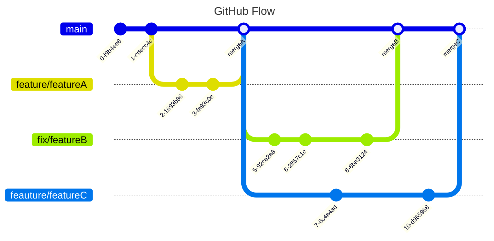

# Gitブランチ管理標準

## はじめに

Gitブランチ管理の標準規則です。2,3名のような小規模チーム～50名程度の中規模での利用を想定しています。

開発プロダクトには、ライブラリ（他のアプリケーションやライブラリからimportして利用されるもの）か、アプリケーション（CLIツール、サーバアプリケーションなど）と言った区別があるが、本規約はアプリケーション開発を中心として規約をまとめる。

Gitリポジトリ構成はモノリポ、マルチレポ複数のケースが存在する前提で記載する。

GitHub、GitLabでの運用を中心に記載する。

## 前提

- feature branchesが前提
- trunkやfeature flagsは対象外。

## パターン

フォーマット作って複数人で分散
使い所まで示したい
軸: 人数/

### Githubフロー

#### 概要

`main` と `feature` の2つのブランチのみを使用する非常にシンプルな運用である。

`main` は常にデプロイ可能な状態であることを前提とし、新機能の追加やバグ修正の際には `main` から `feature` ブランチを切り出し、
テスト、レビューを経て、デプロイ可能な状態になり次第 `main` にマージする。

シンプルな運用のため、ソースコードの素早い変更と迅速なリリースが可能となり、結果、アプリケーションへのフィードバックおよびその改善のスピードを向上させることができる。
また、ひとつひとつの `feature` ブランチのライフサイクルが短くなるため、コンフリクトの発生を減らすことができる。

一方で、常に `main` をデプロイ可能な状態にするためには、網羅的かつ厳格な自動テストを用意する必要がある。
また、シンプルさとトレードオフな関係として、大人数のチームや複数の大規模リリースが並行するような複雑な環境には適用が難しい。

#### 想定人数

4,5名程度の小規模なチーム

#### 登場ブランチ

  - `main`
  - `feature`（変更内容に応じて、`feature` や `fix` を命名する）


#### 通常運用

#### 切り戻し運用

### Gitlabフロー

- 概要
- 想定人数
- 登場ブランチ
- 通常運用
- 切り戻し運用

### GitFlowパターン

- 概要
  - GitFlowとは[A successful Git branching model](https://nvie.com/posts/a-successful-git-branching-model/)としてVincent Driessen氏が公開したブランチ戦略です。2010年の公開から多くの人に参考にされてきたましたが、時代の移り変わりとともにレガシーな戦略として扱われるようになり、採用されることは減ってきています。Vincent Driessen氏のブログ内でも2020年に以下のような注釈が追加されています。
    - このモデルは2010年に考案され、10年間の間にデファクトスタンダードのように扱われるようになった。
    - この10年間Gitが日常的に使われるようになり、特にWebアプリで利用されることが多くなった。
    - Webアプリでは継続的デリバリーを採用することが多く、複数バージョンを厳密に管理する必要性は少ない。
    - 継続的デリバリーを採用するのであればGithubフローのようなシンプルなワークフローの利用を推奨する
    - 厳密に複数バージョンを管理する必要があるソフトウェアを開発している場合はGitFlowが最適な可能性がある。その場合のみ本記事を読んでほしい。
    - 常に最適なブランチ戦略は存在しないので、トレードオフを考慮し決定してほしい。



- 想定人数
- 登場ブランチ
  - メインブランチ
    - main
      - いつでも本番リリース出来る状態のブランチ
    - develop
      - 次のリリースに向けた最新版となるブランチ
  - サポートブランチ
    - feature
      - 各開発者が機能を開発するブランチ
    - release
      - リリースの準備に利用するブランチ
    - hotfix
      - 本番リリース後に重大なバグが発生した場合に迅速に修正するためのブランチ
- 通常運用
  - プロジェクト開始時にmasterからdevelopを作成する
  - 機能ごとやチケット単位でfeatureブランチをdevelopから作成する
  - featureブランチでの作業完了後、次回リリースに含める内容であればdevelopにマージする
  - developブランチがリリースできる状態になったらdevelopブランチからreleaseブランチを作成する
    - 以降次々回リリースの内容をdevelopにマージ可能
  - releaseブランチでバージョン変更やバグ修正等を実施する
    - releaseブランチで修正した場合は都度developにマージする
  - releaseブランチの作業完了後、masterとdevelopにマージする
  - mainブランチでタグを作成し本番リリースする
    - 重大なバグが発生した場合はmasterからhotfixブランチを作成し対応する
- 切り戻し運用

### GitFlowライト版

- 概要
  - main/develop/featureパターン
- 想定人数
- 登場ブランチ
- 通常運用
- 切り戻し運用

### CGSパターン

- 概要
  - main/release/fix/hotfix/develop複数パターン
  - ちょっと重厚
  - 複数の大型リリースに耐えられる


- 登場ブランチ
- 通常運用
- 切り戻し運用

## 規約

### Pull Request / Merge Request

GitHubやGitLabでは、プルリクエスト作成時のテンプレートを作ることができる。チームでプルリクエストで書いてほしいことを明らかにすることで、レビュー効率を上げたり、リリース後の調査などに役立てることができる。

GitHubでは `.github/PULL_REQUEST_TEMPLATE.md` に記載する。

テンプレートの例を以下にあげる。

```md
<!-- 初めてPRを上げるときは、開発規約(DEVELOPMENT.md) に目を通しておきましょう -->

## Ticket
<!--- 関係するチケットのリンクを列挙ください（複数可） -->

## Description
<!--- 背景・目的・変更内容などの説明を記載ください -->

## TODO
<!--- 残課題があれば記載ください -->

## Checked list
<!--- 動作を確認するために行ったテストを記載してください -->

## Related PRs
<!--- 関連するプルリクエストがあれば列挙してください -->

## Self checklist

- [ ] Files changed を確認し、セルフレビューを実施した
- [ ] 必要な設計ドキュメントを更新した
- [ ] 今回のPRでは未対応の事項を記載したIssueを作成した
```

### コミットメッセージ

Gitのコミットメッセージにの書式についてルール化する運用とする。

これにより、コミットの目的がわかりやすくなる、履歴からのトラッキングの容易になる利点がある。

コミットメッセージの書式としては、`conversational commit`をベースとした規約としている。

以下の形式でコミットメッセージを記載することとする。

```
<type>(<scope>): <subject> <gitmoji>(<issue_id>)
```

コミットメッセージは、大きくheader、body、footerの３つの要素で構成されます。
この中でも、headerについては必須とする。

headerについてはtype、scope、subject、gitmoji、issue_idの最大5つの要素から構成され、それぞれは後述する書式に従うものとする。
この中でも、type、subjectについては必須とし、ほかの要素についてはプロジェクトの運用にしたがい任意とする。

#### type

typeについては必須の要素となり、以下のいずれかを選択するものとする。


| type     | 説明                                                                                   |
|--------|--------------------------------------------------------------------------------------|
| `feat`  | 新機能の追加                                                                             |
| `fix`   | バグの修正                                                                                 |
| `docs`  | ドキュメンテーションの更新                                                                    |
| `style` | コード形式の編集（動作に影響を与えない編集）                                                       |
| `refactor` | リファクタリング|
| `perf` | パフォーマンスの改善 |
| `test` | テストコードの追加や更新                                                                   |
| `chore` | ビルドプロセス、補助ツール、ドキュメンテーション生成などの変更                                      |

#### scope

scopeについては任意の要素となり、コミットによる変更箇所を簡潔な1単語で示すものとする。
また、破壊的な変更の場合には`feat(view!)`のように!マークをつけて明示することも可能とする。

#### subject

subjectについては必須の要素となり、変更内容を簡潔に記載するものとする。

#### gitmoji

gitmojiについては任意の要素となり、変更内容に応じた絵文字の使用を可能とする。変更内容と選択される絵文字の対応については以下のいずれかを基本とする。

```
 ==== Emojis ====
 :ambulance:  🚑致命的なバグ修正(fix)
 :bug:  🐛バグ修正(fix)
 :+1: 👍機能改善・機能修正(fix)
 :cop: 👮セキュリティ関連の修正(fix)
 :tada: 🎉大きな機能追加(feat)
 :sparkles: ✨部分的な機能追加(feat)
 :up:   🆙依存パッケージ等のアップデート(feat)
 :memo: 📝ドキュメント修正(docs)
 :bulb: 💡ソースコードへのコメント追加や修正(docs)
 :art: 🎨レイアウト関連の修正(style)
 :lipstick: 💄Lintエラーの修正やコードスタイルの修正(style)
 :recycle: ♻️リファクタリング(refactor)
 :fire: 🔥コードやファイルの削除(refactor)
 :green_heart: 💚テストやCIの修正・改善(test)
 :rocket: 🚀パフォーマンス改善(perf)
 :wrench: 🔧設定ファイルの修正(chore)
 :building_construction: 🏗️アーキテクチャの変更(chore)
```

#### issue_id

issue_idについては任意の要素となり、変更内容に紐づく課題のidを記載するものとする。
課題のidとしては、プロジェクトで採用している課題管理ツールに従うものとする。

issue_idを記載するフォーマットとしては、`#id`とする。

また、複数の課題が紐づく場合には、空白で分割して複数のidを記載することを可能とする。

---

これらのルールに従ったコミットメッセージの例としては、以下のようなものとなる。

```
feat(view): カレンダーの表示を追加 🎉(#645)
```

### ブランチ名

featureブランチは開発またはテスト目的で利用する一時的なブランチです。developブランチから派生し、作業完了後に再びdevelopブランチにマージし、マージ後には削除します。

以下の命名に従います。

- `feature/` のプレフィックスを付ける
- 課題管理システムと紐付けられるようなブランチ名にする

```sh
# OK（課題管理システムの課題番号をブランチ名に利用）
feature/#12345

# OK（GitHub Issue や JIRA や Backlog のプロジェクトIDをブランチ名に利用）
feature/<PROJECTID>-9403
feature/gh-issue-12345

# NG（プレフィックスが無い）
fixtypo
```

### タグ

Gitにはタグ機能があり、リリースポイントとしてタグを作成する運用とする。

これにより、リリースしたアプリケーションやライブラリに何か不具合があれば、切り戻しや原因追求が容易になる利点がある。

タグの運用ルール:

- リリースごとに新しいバージョンを示したタグを発行する
- (推奨) GitHubなどの画面経由でタグを作成する
- mainブランチにてタグを作成する
- 入力間違えなどのケースを除き、一度タグをつけた後は削除しない
- 後述する「タグの命名規則」に従う


何かしらの理由で、コマンドラインからタグを作成する必要がある場合は、以下に注意する。画面経由・コマンドライン経由でのタグ作成は混ぜないようにし、運用手順は統一する。

- 軽量 (lightweight) 版ではなく、注釈付き (annotated) 版のタグを利用する

```sh
# OK（注釈付きタグを利用する）
$ git tag "v1.0.4" -m "v1.0.4 🐛Fix item api log"

# NG（軽量タグは利用しない）
$ git tag "v1.0.4"
```

タグの命名規則:

- `v1.2.4` などの [セマンティックバージョニング](https://semver.org/lang/ja/) を基本とする
- モノリポの場合は `frontend/v1.0.0`、`backend/v2.0.1` など領域ごとにプレフィックスを付与する形式を取る
    - プレフィックスにすることで、タグをリスト表示した場合に視認性を上げることができる

命名に従うと、次のようなコマンドで絞り込みで表示できる。

```sh
$ git tag -l --sort=-version:refname "frontend/v*"
frontend/v2.0.0
frontend/v1.3.0
frontend/v1.2.0
frontend/v1.1.0
...
```

また、Gitクライアントによっては `/` を使うことでフォルダのように階層表示ができるため、プレフィックスの区切り文字は `-` ハイフンではなく、スラッシュとする。

```
TODO 
```

タグメッセージの規則:

- (推奨) GitHubを利用中の場合、「[Generate release notes](https://docs.github.com/en/repositories/releasing-projects-on-github/automatically-generated-release-notes)」を用いて、タイトルや本文を自動生成する
- フロントエンド・バックエンドで整合性を保っているのであれば、メモ目的でバージョンを記載する運用を推奨とする
- 実用的な利用用途が思いつかない場合は、開発者視点での楽しみリリースの大きなマイルストーンの名称など、チームの関心事を記入することを推奨とする


 
何かしらの理由で、コマンドラインからタグを作成する必要がある場合は、GitHub利用時の規則に合わせて次のように作成する。

入力例:

```sh
# OK
$ git tag -a backend/v1.8.0 -m "backend/v1.8.0"
$ git tag -a backend/v1.9.0 -m "backend/v1.9.0 🚀Release with frontend-v3.0.1"
$ git tag -a backend/v2.0.0 -m "backend/v2.0.0 ✨Android版アプリリリース対応"

# NG
$ git tag -a backend/v3.0.0 -m "🚀Release version v2.0.0"
```

バージョンアップ規則:

- 開発しているプロダクトがライブラリの場合、セマンティックバージョニングに厳密に従う
- 開発しているプロダクトがシステム（アプリケーション）の場合、その成熟度や初回リリースの区切りでバージョンアップを行うことを推奨する。適切なバージョンアップを行うことで視認性が上がり、運用負荷を下げることができる
    - 例1: 初回リリース、カットオーバーで `v1.0.0` に上げる
    - 例2: 稼働後1年以上経過し、中規模以上の大きな機能アップデートがあったので、 `v2.0.0` に上げる

## autocrlf

チーム開発において開発環境がWindows/Macなど複数存在することは少なくなく、また、Gitリポジトリ上の改行コードは統一した方が余計な差分が生じず扱いやすくなる。このときよく用いるのが、 `autocrlf` という設定である。

| 名称 | 機能 |
| -- | --- |
| autocrlf | trueにすると、リポジトリからファイルをワーキングツリーに持ってくるときにテキストファイルの改行コードをCRLFに変換する。にコミットする時に、CRLFからLFに変換する|

`.gitattributes` というファイルをGitにコミットしておけば、そのGitリポジトリを使う全員で改行コードの扱いをLFに統一できる。

```sh .gitattributes
* text=auto eol=lf
```


## マージ戦略

- rebase/squash/commit

## CICD

- release trigger
- release note
- github actions sample

## 後方互換性管理

- ちょっとネタ特性が違うきもするので後回し

## 情報収集

- JetBrains Space Gitフロー
  https://blog.jetbrains.com/space/2023/04/18/space-git-flow/
- NTT
  https://engineers.ntt.com/entry/2024/01/19/094639
