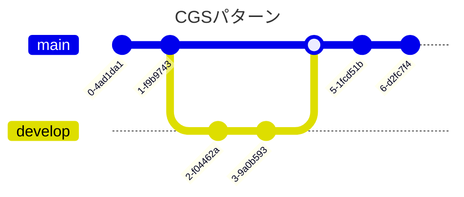

# Gitブランチ管理標準

## はじめに

Gitブランチ管理の標準規則です。2,3名のような小規模チーム～50名程度の中規模での利用を想定しています。

開発プロダクトには、ライブラリ（他のアプリケーションやライブラリからimportして利用されるもの）か、アプリケーション（CLIツール、サーバアプリケーションなど）と言った区別があるが、本規約はアプリケーション開発を中心として規約をまとめる。

Gitリポジトリ構成はモノリポ、マルチレポ複数のケースが存在する前提で記載する。

## 前提

- feature branchesが前提
- trunkやfeature flagsは対象外。

## パターン

フォーマット作って複数人で分散
使い所まで示したい
軸: 人数/

### Githubフロー

- 概要
- 想定人数
- 登場ブランチ
- 通常運用
- 切り戻し運用

### Gitlabフロー

- 概要
- 想定人数
- 登場ブランチ
- 通常運用
- 切り戻し運用

### GitFlowパターン

- 概要
  - デファクトスタンダード？
  - main/release/fix/develop/featureパターン（npg資料あり）
- 想定人数
- 登場ブランチ
- 通常運用
- 切り戻し運用

### GitFlowライト版

- 概要
  - main/develop/featureパターン
- 想定人数
- 登場ブランチ
- 通常運用
- 切り戻し運用

### CGSパターン

- 概要
  - main/release/fix/hotfix/develop複数パターン
  - ちょっと重厚
  - 複数の大型リリースに耐えられる



- 登場ブランチ
- 通常運用
- 切り戻し運用

## 規約

### PR/MR

### コミットメッセージ

- スカッシュするのであればPRタイトルが使用されるのであまり気にせず
- release noteへの影響。いい感じに出す方法

### Tagging

Gitにはタグ機能があり、リリースポイントとしてタグを作成する運用とする。

これにより、リリースしたアプリケーションやライブラリに何か不具合があれば、切り戻しや原因追求が容易になる利点がある。

タグの運用ルール:

- リリースごとに新しいバージョンを示したタグを発行する
- mainブランチにてタグを作成する
- 軽量 (lightweight) 版ではなく、注釈付き (annotated) 版のタグを利用する
- 入力間違えなどのケースを除き、一度タグをつけた後は削除しない
- 次の命名規則に従う

```sh
# OK（注釈付きタグを利用する）
$ git tag "v1.0.4" -m "🐛Fix item api log"

# NG（軽量タグは利用しない）
$ git tag "v1.0.4"
```

タグの命名規則:

- `v1.2.4` などの [セマンティックバージョニング](https://semver.org/lang/ja/) を基本とする
- モノリポの場合は `frontend-v1.0.0`、`backend-v2.0.1` など領域ごとにプレフィックスを付与する形式を取る
    - プレフィックスにすることで、タグをリスト表示した場合に視認性を上げることができる

命名に従うと、次のようなコマンドで絞り込みで表示できる。

```sh
$ git tag -l --sort=-version:refname "frontend-v*"
>git tag -l --sort=-version:refname "frontend-v*"
frontend-v2.0.0
frontend-v1.3.0
frontend-v1.2.0
frontend-v1.1.0
...
```

タグメッセージの規則:

- 任意入力とする。空メッセージでも良い
- フロントエンド・バックエンドで整合性を保っているのであれば、メモ目的でバージョンを記載する運用を推奨とする
- 実用的な利用用途が思いつかない場合は、開発者視点での楽しみリリースの大きなマイルストーンの名称など、チームの関心事を記入することを推奨とする
- タグ名と同様のコメント、例えば `Release version 2.0.0` のようなコメントは意味が無いので、禁止とする（これであれば空にする）

入力例:

```sh
# OK
$ git tag -a backend-v1.8.0 -m ""
$ git tag -a backend-v1.9.0 -m "🚀Release with frontend-v3.0.1"
$ git tag -a backend-v2.0.0 -m "✨Android版アプリリリース対応"

# NG
$ git tag -a backend-v3.0.0 -m "🚀Release version 3.0.0"
```

バージョンアップ規則:

- 開発しているプロダクトがライブラリの場合、セマンティックバージョニングに厳密に従う
- 開発しているプロダクトがシステム（アプリケーション）の場合、その成熟度や初回リリースの区切りでバージョンアップを行うことを推奨する。適切なバージョンアップを行うことで視認性が上がり、運用負荷を下げることができる
    - 例1: 初回リリース、カットオーバーで `v1.0.0` に上げる
    - 例2: 稼働後1年以上経過し、中規模以上の大きな機能アップデートがあったので、 `v2.0.0` に上げる

### mermaid

- 公式Doc
  - https://mermaid.js.org/syntax/gitgraph.html

- NTTDの図がわかりやすかった

## マージ戦略

- rebase/squash/commit

## CICD

- release trigger
- release note
- github actions sample

## 後方互換性管理

- ちょっとネタ特性が違うきもするので後回し

## 情報収集

- JetBrains Space Gitフロー
  https://blog.jetbrains.com/space/2023/04/18/space-git-flow/  
- NTT
  https://engineers.ntt.com/entry/2024/01/19/094639