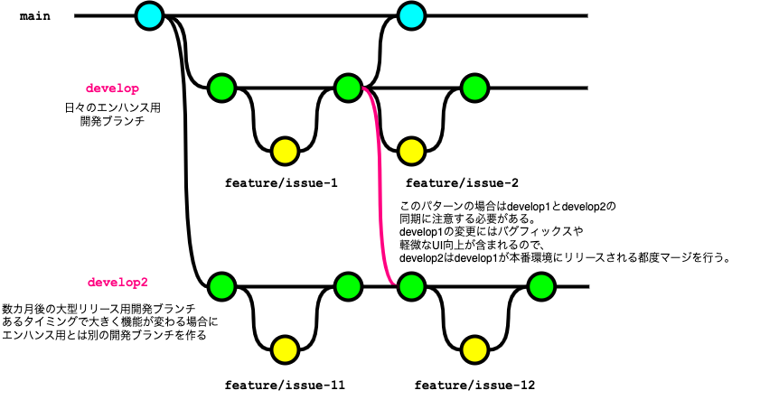

<page-title/>

本コーディング規約は、世の中のシステム開発プロジェクトのために無償で提供致します。

ただし、掲載内容および利用に際して発生した問題、それに伴う損害については、フューチャー株式会社は一切の責務を負わないものとします。

また、掲載している情報は予告なく変更することがございますので、あらかじめご了承下さい。

# はじめに

本ドキュメントはGitブランチ管理の標準的な運用ルールをまとめている。以下の想定で作成されているため留意いただきたい。

- GitHub または GitLab の利用
- 開発プロダクトには、ライブラリ（他のアプリケーションやライブラリからimportして利用されるもの）か、アプリケーション（CLIツール、サーバアプリケーションなど）という区別があるが、アプリケーション開発を想定
- トランクベース開発（フィーチャーフラグ）を **採用しない**

導入に際して行う、GitやGitHub/GitLabの環境設定は、[推奨設定](recommended_settings.md)ページに記載している。

## ブランチ運用パターン

本ドキュメントで想定する各ブランチ役割については[ブランチの整理](each_branch.md)に記載する。

現実的に利用する可能性が高いブランチの運用パターン３つ示す。

基本的には運用コストが最小になるパターンを選択し、プロジェクトの体制に応じて運用を変更する。

（例） GitHub Flow → Lite GitLab Flow → GitLab Flow

|No | 名称             | 永続ブランチ                               | 短命ブランチ           | 概要                                                                                                                                                                                                                                                                                                                                                                                                                        | 運用コスト | 使い所                                                                                               |
|--| ---------------- | ------------------------------------------|--------------------------- | --------------------------------------------------------------------------------------------------------------------------------------------------------------------------------------------------------------------------------------------------------------------------------------------------------------------------------------------------------------------------------------------------------------------------- | ---------- | ---------------------------------------------------------------------------------------------------- |
|1 | GitHub Flow      | `main`                       | `feature`                          | 最小のブランチ管理パターンで、開発人数が少なく、検証作業は全員で行う場合に有効。<br>マージの都度本番環境へデプロイする前提。                                                                                                                                                              | 低         | ・個人開発<br>・プロジェクト初期フェーズで断面管理を厳密に行わない場合                                                          |
|2 | Lite GitLab Flow | `main`<br>`develop`          | `feature`<br>`topic`<br> `hotfix`              | GitHub Flowに`develop`ブランチを追加するパターン。（特定の呼称はないのでLite GitLab FLowと命名。）<br>`main`ブランチをプロダクトリリースブランチとし、開発中ソースコードとは分ける。 | 低         | ・本番リリース済みプロダクトの開発などで、一定品質を保証する必要がある場合<br>・開発作業とリリース作業が並行しないチーム構成である場合                           |
|3 | GitLab Flow      | `main`<br>`develop`<br>`release`| `feature`<br>`topic` <br> `hotfix` | GitHub Flowに`develop`ブランチと`release`ブランチを追加するパターン。<br>GitLab Flowでは`main`ブランチを`production`ブランチ、`release`ブランチとを`pre production`ブランチと呼称するが、本規約では`main`/`release`に統一する。 | 中         | ・リリース作業と開発作業が並行して行われる場合<br>  ・断面を指定して複数テスト環境にデプロイしたい場合 |

### 変則的なパターン

#### developブランチが複数作成する場合



複数リリースバージョンを並行して開発する場合、developブランチを複数作るパターンも考えられる。  
上記の例では日々のエンハンスとは別に数カ月後に大型リリースがある場合を想定する。  
あるタイミングで大きく機能が変わる場合にエンハンス用開発ブランチ（`develop1`）とは別の開発ブランチ（`develop2`）を作成する。（featureフラグでの対応も考えられるが、本記事でブランチで対応する場合を想定する。）  
このパターンではそれぞれのdevelopブランチに対しては独立してfeatureブランチで機能開発が行われるが、`develop1`から`develop2`への同期に注意する必要がある。
`develop1`の変更にはバグフィックスや軽微なUI向上が含まれる想定であり、これらの変更は日次あるいは週次の比較的高頻度で本番環境へリリースされる。  
当然、`develop2`はこれらの変更を加味して大型リリース向け開発を進める必要があるので、`develop1`のmainブランチ反映されるたびに`develop1`から`develop2`への同期を行う必要がある。  

#### 過去バージョンをサポートする場合


過去のバージョンをサポートする場合、バージョン別にsupportブランチを作成するパターンも考えられる。
インターフェースの大型改善や、仕様変更を受けてversion1からversion2へupdateを行った場合を想定する。
メインの更新はversion2（mainブランチ）に対して行っていくが、version1の利用ユーザーが存在する場合、バグfixやセキュリティアップデートを並行して行うことが考えられる。  
そういった場合はversion1を示すブランチ（`support/v1`）を別途作成、そのブランチからfeatureブランチを作成してfixを行う。  
featureブランチのマージ後、マイナーバージョン（あるいはパッチバージョン）を上げたtagをcommitし、本番環境へリリースする。  
※この例ではversion1とversion2が別リソースとして動いていることを前提としている。同一リソースで複数バージョンが稼働する場合はversion2のブランチで対応を行う必要がある。

### ブランチとデプロイ先環境

TODO: 要議論

- mainはproduction環境
  - おそらく議論の余地なし
- developブランチと検証環境を対応させるパターン
  - 本番環境、検証環境の2環境構成であれば通常はこのパターンで充足する
- featureをそのままテスト環境へデプロイするパターン
  - 2/3人の開発であれば十分管理可能
- releaseブランチで管理するパターン
  - テスト環境とreleaseブランチを対応させるパターン。
    - staging環境: `release/stg`
    - develop環境: `release/develop`
  - 管理方法としては一番楽。デプロイ断面の確認にコミュニケーションコストを割かなくて済む。
  - 10人以上の開発で効いてくる。

## マージ戦略

マージ戦略とは、複数のブランチ間でコードの変更を統合する際に使用される方法やポリシーを指し、以下の事項に影響を与えます。

- プロジェクトのコミット履歴の管理
- コンフリクトの解決
- 開発プロセスの円滑な進行
- 最終的なソフトウェア品質

そのため、Gitの使用を開始する前に、適切な戦略を策定することが重要である。

ブランチの管理戦略に関わらず、大半のケースにおいて、メインの開発ブランチとそこから作成される個々の機能ブランチが存在する。

この章では次の2ケースについて、とりうる選択肢と推奨方法を説明する。

1. 開発中の機能ブランチに対してメインの開発ブランチの変更をどう取り込むか
2. メインの開発ブランチに開発およびレビューが完了した機能ブランチをどう取り込むか

### 1. 機能ブランチにメインの開発ブランチの変更を取り込む

複数人により同時並行的に開発が進む場合、特定の機能ブランチで開発を進めている最中に、メインの開発ブランチがアップデートされることはよく起こる。

このような状況において、開発者は自らの機能ブランチに対して、最新の開発ブランチの変更を定期的に取り込むことが望まれる。


[開発ブランチの変更を機能ブランチに取り込む方法](merge_develop_to_feature.md)に記載している通り、次の2つの方法があり、2の「リベース」による方法を推奨する。

1. マージ
2. リベース（★推奨）

理由は次の通り。

- 前提として、別の開発者が行った開発ブランチの変更は、適時機能ブランチに取り込んだテスト実行や動作検証を行うべきである
- 開発ブランチの変更の取り込みをマージで行うと、そのたびにマージコミットが作成され履歴が複雑になるため、レビューアの負荷軽減を目的とする
- リベースによるConflictリスクについては、開発ブランチを取り込む段階でマージ・リベース問わず解消が必要となる

開発者は `git pull` 時の挙動をリベースにするよう設定する（`git config pull.rebase true`）。

マージによる変更の取り込みが既存のブランチを変更しないのに対し、リベースは全く新しい（元のコミットIDとは別のコミットIDで）コミットを作成するため、次の3点に注意すること。

1. 複数人に影響を及ぼすpublicなブランチでは、決してリベースを使用しないこと
   - 永続ブランチである `develop` や `main` ブランチが該当する
   - リベースにより新しいコミットが作成されるため、他の人が作業しているブランチと整合性が取れなくなり、大きな混乱を招く可能性がある。永続ブランチは **強制プッシュできないよう保護しておく**
2. リモートにプッシュ済のブランチでリベースを行った場合、強制プッシュ（Force Push）が必要になること
   - 開発者はプッシュ時に `--force-with-lease --force-if-includes` フラグを渡すことで、意図せずリモートブランチの変更を上書きしないようにする
     - `--force-with-lease`: ローカルのリモート追跡ブランチの ref とリモートの ref を比較し、ローカルの状態が最新でない場合（要はプッシュ先のリモートブランチに変更が入ったが、ローカルで `git fetch` していない場合）は、プッシュに失敗する。逆にいうと、プッシュ前に `git fetch` を実行済みの場合は、リモートの変更を上書きする形で強制プッシュができてしまうため、これを防ぐには `--force-if-includes` フラグを併用する
     - `--force-if-includes`: リモート追跡ブランチの変更がローカルに全て取り込まれていない場合は、プッシュに失敗する。これにより意図せず他の人のコミットを上書きすることを防ぎつつ、必要な変更を強制的にプッシュすることができる
3. メインの開発ブランチの変更を頻繁に取り込む場合、同じようなコンフリクトの解消を何度も求められる可能性があること
   - GitのRerereを有効化する（`git config rerere.enabled true`）ことでコンフリクトの解消を記録し、繰り返しの操作を自動化できる

> [!NOTE]
> 強制プッシュすることにより、レビューコメントが消えてしまわないか、という点を調査した。
> 以下にサービスごとの結果をまとめる。
> 
> | サービス        | Conversation | 該当行の変更なし File changeded | 該当行の変更あり File changeded | 備考                                                          |
> |----------------|--------------|---------------------------------|---------------------------------|---------------------------------------------------------------|
> | GitHub         | OK           | OK                              | NG                              |                                                               |
> | GitLab         | OK           | OK                              | NG                              |                                                               |
> | AWS CodeCommit | OK           | NG                              | NG                              | Force Push関係なく、最新のコミットでFile changed からは消える |
 
### 2. メインの開発ブランチに機能ブランチの変更を取り込む

プルリクエストを経由して、開発が完了した機能ブランチをメインの開発ブランチに取り込むためには、GitHub（GitLab）上でプルリクエスト（マージリクエスト）を経由する運用を前提とする。

[開発ブランチに機能ブランチの変更を取り込む方法](merge_feature_to_develop.md)に記載している通り、次の3パターンの方法があり、3の「Squash and merge」による方法を推奨する。

1. Create a merge commit
2. Rebase and merge
3. Squash and merge（★推奨）

理由は次の通り。

- メインの開発ブランチの履歴をクリーンに保てるため
- 機能ブランチのPRが単一のコミットメッセージで表現できるほどシンプルで明確な単位に保ちたいため

なお、プロテクトブランチの設定にて、メインの開発ブランチに対し「require linear history」を選択することを推奨する。
本設定を行うと、開発ブランチに対して「Create a merge commit」が選択できないよう制御することができる。

また、意図しない方法でのマージを避けるためにブランチごとにマージ戦略を設定しておき、想定外のマージ戦略が選択された時に警告色を表示するとサードパーティ製のChrome拡張も存在する。こちらは必要に応じて導入することが望ましい。
https://zenn.dev/daku10/articles/github-merge-guardian

「Squash and merge」による変更の取り込みを行う場合、次の4点に注意すること。

1. マージ後は機能ブランチを削除すること
   - 変更元の機能ブランチのコミットをまとめたコミットが新たに作成されるめ、元の機能ブランチを再利用して（例えば追加のコミットを作成して）PRを作成してもコンフリクトが発生する。そのためマージ後はリモート/ローカルの双方で速やかに機能ブランチを削除することが望ましい
   - リモート側の機能ブランチはGitHubの設定にて「Automatically delete head branches」を選択することで、マージ後に自動でブランチの削除が行われる。（GitLabでは、マージリクエストから「Delete source branch」オプションを有効にすることで、マージ後に自動でブランチの削除が行われる。プロジェクトの設定で「Enable "Delete source branch" option by default」を選択しておくとデフォルトで有効になる。）
   - ローカル側の機能ブランチは `branch -d` コマンドでは削除できないため、`branch -D` コマンドを用いて削除する必要がある。
2. 部分的なコミットの取り消しができない
   - 履歴上は1つのコミットになるので、マージ後に一部の変更だけを取り消すということができない。取り消しはPRの単位となるため、PRの単位をなるべく小さなまとまりにすることが望ましい
3. Authorが失われる
   - 機能ブランチにコミットを行った人がAuthorになるのではなく、「Squash and merge」を行った人がAuthorになるため、OSS開発を行う場合など、厳密にコントリビューションを管理する必要がある場合は注意されたい。GitHubでは「Squash and merge」を行う場合、デフォルトでコミットメッセージに `co-authored-by` トレーラーが追加され、1つのコミットが複数の作成者に帰属するようにするようになっている[^1]。この記述は削除しないようにする
4. 機能ブランチの取り込み以外のケースでは、「Squash and merge」以外を選択すること
   - 例えば、`develop` ブランチを `main` ブランチや `release`ブランチにマージする場合など、取り込み元のブランチの変更が大きい場合は、コミットメッセージを1つにまとめることによる弊害が大きいため、別のマージ戦略を検討すること

[^1]: https://docs.github.com/ja/pull-requests/committing-changes-to-your-project/creating-and-editing-commits/creating-a-commit-with-multiple-authors

## ブランチ運用時の注意点

xx

## コミットメッセージ

Gitのコミットメッセージは原則自由とする。理由は以下である。

- 通常、作業はチケット管理システムを駆動に開発するため、情報が重複する
- リリースノートの自動生成での扱いは、どちらかといえばラベルとプルリクエストのタイトルが重要
- メンバーによっては粒度の小さいコミットを好む場合も多く、運用の徹底化を図る負荷が高い

チーム規模や特性によっては、Gitのコミットメッセージをルール化する方ことにより、メリットがある場合は `Conventional Commits` をベースとした以下の規約を推奨する。

- [コミットメッセージ規約](commit_message_rule.md)

## ブランチ名

ブランチ戦略で選択したパターンのブランチ名（develop/release/topic/hotfix）を利用する。

featureブランチは以下の命名に従う。

- `feature/` のプレフィックスを付ける
- 課題管理システムと紐付けられるようなブランチ名にする

```sh
# OK（課題管理システムの課題番号をブランチ名に利用）
feature/#12345

# OK（GitHub Issue や JIRA や Backlog のプロジェクトIDをブランチ名に利用）
feature/<PROJECTID>-9403
feature/gh-issue-12345

# NG（プレフィックスが無い）
fixtypo
```

## ラベル

TODO ラベルについて方針を追加する。（ラベルを利用することで、issue, pull requestを分類わけすることができる。適切に設定することでリリースノート作成時に有用である。）

https://docs.github.com/ja/issues/using-labels-and-milestones-to-track-work/managing-labels

## タグ

Gitにはタグ機能があり、リリースポイントとしてタグを作成する運用とする。

これにより、リリースしたアプリケーションやライブラリに何か不具合があれば、切り戻しや原因追求が容易になる利点がある。

タグの運用ルール:

- リリースごとに新しいバージョンを示したタグを発行する
- (推奨) GitHubなどの画面経由でタグを作成する
- mainブランチにてタグを作成する
- 入力間違えなどのケースを除き、一度タグをつけた後は削除しない
- 後述する「タグの命名規則」に従う


何かしらの理由で、コマンドラインからタグを作成する必要がある場合は、以下に注意する。画面経由・コマンドライン経由でのタグ作成は混ぜないようにし、運用手順は統一する。

- 軽量 (lightweight) 版ではなく、注釈付き (annotated) 版のタグを利用する

```sh
# OK（注釈付きタグを利用する）
$ git tag "v1.0.4" -m "v1.0.4 🐛Fix item api log"

# NG（軽量タグは利用しない）
$ git tag "v1.0.4"
```

タグの命名規則:

- `v1.2.4` などの [セマンティックバージョニング](https://semver.org/lang/ja/) を基本とする
- モノリポの場合は `frontend/v1.0.0`、`backend/v2.0.1` など領域ごとにプレフィックスを付与する形式を取る
  - プレフィックスにすることで、タグをリスト表示した場合に視認性を上げることができる

命名に従うと、次のようなコマンドで絞り込みで表示できる。

```sh
$ git tag -l --sort=-version:refname "frontend/v*"
frontend/v2.0.0
frontend/v1.3.0
frontend/v1.2.0
frontend/v1.1.0
...
```

また、Gitクライアントによっては `/` を使うことでフォルダのように階層表示ができるため、プレフィックスの区切り文字は `-` ハイフンではなく、スラッシュとする。

```

```

タグメッセージの規則:

- (推奨) GitHubを利用中の場合、「[Generate release notes](https://docs.github.com/en/repositories/releasing-projects-on-github/automatically-generated-release-notes)」を用いて、タイトルや本文を自動生成する
- フロントエンド・バックエンドで整合性を保っているのであれば、メモ目的でバージョンを記載する運用を推奨とする
- 実用的な利用用途が思いつかない場合は、開発者視点での楽しみリリースの大きなマイルストーンの名称など、チームの関心事を記入することを推奨とする


何かしらの理由で、コマンドラインからタグを作成する必要がある場合は、GitHub利用時の規則に合わせて次のように作成する。

入力例:

```sh
# OK
$ git tag -a backend/v1.8.0 -m "backend/v1.8.0"
$ git tag -a backend/v1.9.0 -m "backend/v1.9.0 🚀Release with frontend-v3.0.1"
$ git tag -a backend/v2.0.0 -m "backend/v2.0.0 ✨Android版アプリリリース対応"

# NG
$ git tag -a backend/v3.0.0 -m "🚀Release version v2.0.0"
```

バージョンアップ規則:

- 開発しているプロダクトがライブラリの場合、セマンティックバージョニングに厳密に従う
- 開発しているプロダクトがシステム（アプリケーション）の場合、その成熟度や初回リリースの区切りでバージョンアップを行うことを推奨する。適切なバージョンアップを行うことで視認性が上がり、運用負荷を下げることができる
  - 例1: 初回リリース、カットオーバーで `v1.0.0` に上げる
  - 例2: 稼働後1年以上経過し、中規模以上の大きな機能アップデートがあったので、 `v2.0.0` に上げる

## 参考1:ローカルでの作業例

gitコマンドでの作業例を記載する。リモートブランチへのプッシュは、`--force-with-lease --force-if-includes` オプションを付けることを必須とする。

```sh
# 変更作業
git checkout -b <branchname>
git add
git commit -a

# リモートブランチの変更を同期
git pull origin develop

# コンフリクト対応
git add <file1> <file2> ...
git commit -a

# リモートブランチへプッシュ
git push origin HEAD --force-with-lease --force-if-includes
```

## 参考2: VS Code上でのGit操作

[VSCode上でのGit操作](vscode_git_ope.md)で、利用頻度が高いとされるGitクライアントである、VS Code上でのGit操作を紹介する。
