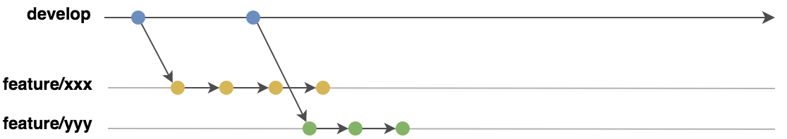
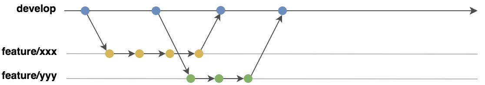
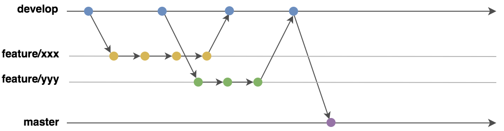
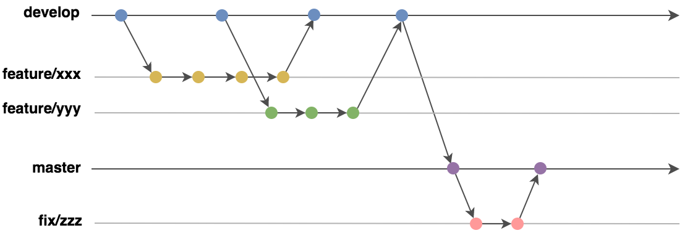
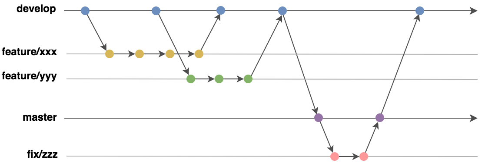
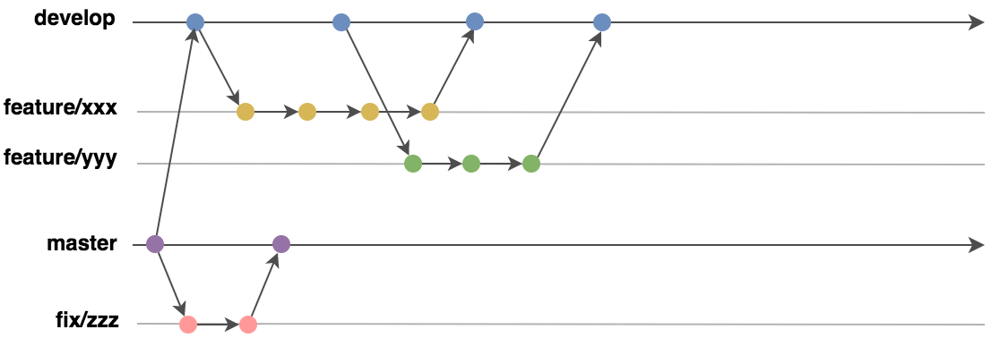

## はじめに

example における git ブランチ運用方法及び 開発・リリースについて記載

## ブランチ運用概要

git の一般的なブランチ管理手法である [git flow](https://nvie.com/posts/a-successful-git-branching-model/) に準拠し、以下ブランチを用途に応じて使い分ける

| branch type                    | usage                            |
| ------------------------------ | -------------------------------- |
| feature/{Issue番号}            | 機能開発用途　                   |
| develop                        | 単体、結合テスト用途             |
| master                         | 本番環境リリース用途             |
| fix/xxx                        | master ブランチ上のバグ fix 用途 |

### git tag 運用
リリースタグの命名は [セマンティック バージョニング 2.0.0](https://semver.org/lang/ja/) に準拠する

## ブランチ運用: 開発時

1. develop ブランチから feature ブランチを切る
2. **local 環境** で feature ブランチの単体テストを実施

## ブランチ運用: 単体・結合テスト時

1. local 環境での単体テストが完了した feature ブランチに対して、develop ブランチへの Pull Request を出す
2. コードレビュー後、レビュアーは対象ブランチを develop ブランチへマージ
3. dev, staging 環境にてテストを実施

**※ staging 環境への feature ブランチのデプロイは原則禁止**

## ブランチ運用: リリース時

1. staging 環境でのテストが完了済みの develop ブランチに対して、 master ブランチへの Pull Request を出す
2. リリース担当者はレビューを実施し、developブランチを master ブランチにマージする(必要に応じてコミット断面をチェリーピックし、リリース対象の機能のみ追加する)
3. staging 環境にてテストを実施 
4. テスト結果が問題なければ master ブランチに対して アプリ バージョンを示すリリースタグを付与し、prod 環境にデプロイ

## ブランチ運用: master ブランチで結合テスト中にバグが発生した場合

1. master ブランチから fix ブランチを切り修正後、master にマージ
2. staging 環境にて master ブランチでテストを実施
3. テスト結果が問題なければ master ブランチに対して アプリ バージョンを示すリリースタグを付与し、prod 環境にデプロイ

## ブランチ運用: リリース完了後

1. (bug fix 対応を含む)prod 環境リリース完了後、master ブランチを 必ず develop ブランチへマージする

## ブランチ運用: 次期機能開発中に prod 環境稼働中の既存機能でバグが発生した場合

1. master ブランチから fix ブランチを切り修正後、master にマージ
2. staging 環境にて master ブランチでテストを実施
3. テスト結果が問題なければ master ブランチに対して リリースタグを付与(アプリバージョンを更新)し、prod 環境にデプロイ

