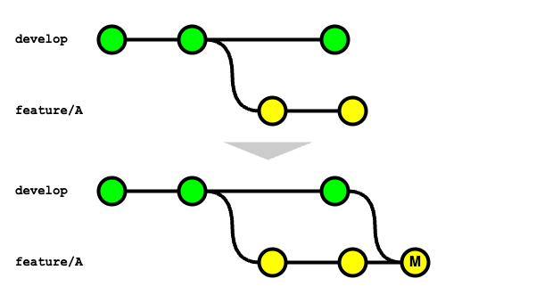

# 開発ブランチに機能ブランチの変更を取り込む方法

機能ブランチに対して開発ブランチの変更を取り込む方法は「マージ」と「リベース」2つの方法が考えられる。

## マージ

マージとは `get fetch & git merge` コマンド（ = `git pull` コマンド）を使用して、開発ブランチの変更を機能ブランチに取り込む方法を指す。
マージを行った場合は下記の通り、「マージコミット」が作成される。



```bash
# 現在のブランチは 機能（feature/A）ブランチ
$ git branch
  develop
* feature/A

# リモート追跡ブランチの最新化
$ git fetch

# 開発（develop）ブランチの変更を機能（feature/A）ブランチにマージ
$ git merge develop
```

## リベース

リベースとは `get fetch & git rebase` コマンド（ = `git pull --rebase` コマンド）を使用して、開発ブランチの変更を機能ブランチに取り込む方法を指す。
最新の開発ブランチの先頭から新たにコミットを作りなおす動きになるので、マージによる方法と異なり「マージコミット」は作成されない。


```bash
# 現在のブランチは 機能（feature/A）ブランチ
$ git branch
  develop
* feature/A

# リモート追跡ブランチの最新化
$ git fetch

# 機能（feature/A）ブランチを開発（develop）ブランチにリベース
$ git rebase develop
```
