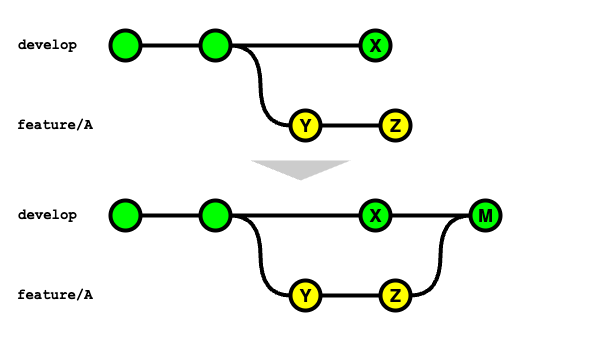
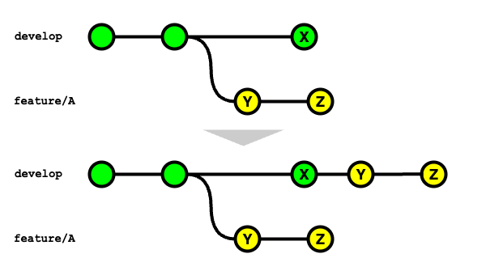

# 開発ブランチに機能ブランチの変更を取り込む方法

プルリクエストを経由して、開発が完了した機能ブランチをメインの開発ブランチに取り込むためには、GitHub（GitLab）上でプルリクエスト（マージリクエスト）を経由する運用を前提とする。

GitHubを利用する場合、開発ブランチに機能ブランチの変更を取り込む方法は3種類ある。

1. Create a merge commit
2. Rebase and merge
3. Squash and merge

## 1. Create a merge commit

動作としては `git merge --no-ff` コマンドを使用して、機能ブランチの変更を取り込む形になる。  
この方法を選択した場合は、下記のとおり、メインの開発ブランチにマージコミットが作成される。



## 2. Rebase and merge

動作としては機能ブランチを最新の開発ブランチにリベースした後に、`git merge --ff` コマンドを使用して、機能ブランチの変更を取り込む形になる。  
この方法を選択した場合は、下記のとおり、メインの開発ブランチにマージコミットは作成されず、履歴が一直線になる。



## 3. Squash and merge

動作としては `git merge --squash` コマンドを使用して、機能ブランチの変更を取り込む形になる。  
この方法では、機能ブランチで行った変更YとZを1つにまとめたコミットがメインの開発ブランチに作成されます。


<details>
  <summary>GitLabを利用する場合</summary>

  開発ブランチに機能ブランチの変更を取り込む方法は3種類ある。  
  ただし、マージリクエスト上のオプションによってコミット履歴が変わるため、別途記載する。

  - Merge commit
  - Merge commit with semi-linear history
  - Fast-forward merge

  ### Merge commit

  動作としては、GitHubにおける `Create a merge commit` と同様のマージ方法になる。  
  ただし、マージリクエスト上で `Squash commits` を選択してマージした場合、`squash commit` と `merge commit` の2つのコミットが作成されるため注意する。

  

  ```bash
  # マージ方法で Merge commit を選択して、マージリクエスト上で Squash commits オプションを選択してマージした場合
  git checkout `git merge-base feature/A develop`
  git merge --squash feature/A
  SOURCE_SHA=`git rev-parse HEAD`
  git checkout develop
  git merge --no-ff $SOURCE_SHA
  ```

  ### Merge commit with semi-linear history

  動作としては、前述の `Merge commit` と同じコマンドを使用して、機能ブランチの変更を取り込む形になる。  
  この方法を選択した場合は、ソースブランチがターゲットブランチより古い場合はリベースしないとマージできない。

  ### Fast-forward merge

  動作としては、GitHubにおける `Rebase and merge` と同様のマージ方法になる。  
  ただし、マージリクエスト上で `Squash commits` を選択してマージした場合、GitHubにおける `Squash and merge` と同様のマージ方法になる。
</details>
