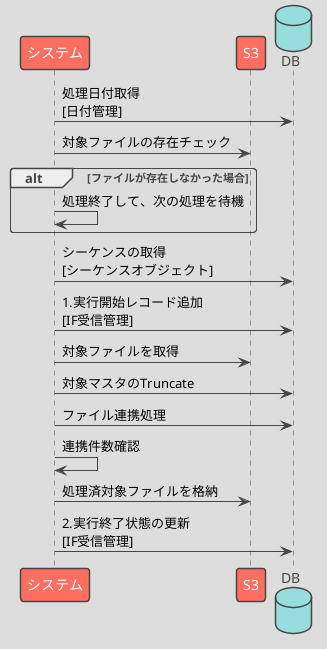

# IF01 設備有効開始受信

設備有効開始の取り込みを行う。

## 対向システム

| 連携元     | 連携先 |
| ---------- | ------ |
| A システム | Future |

## 環境情報

### Input

| Item             | Value                                            |
| ---------------- | ------------------------------------------------ |
| 連携 S3 バケット | `${env}-example-import`                          |
| プレフィックス   | `activate/year=${yyyy}/month=${MM}/day=${dd}/` |
| ファイル名       | `${yyyy}-${mm}-${dd}-${hh}-${MM}-${SS}.csv`      |
| 保持期限         | 3 年                                             |

### Output

| Item             | Value                                            |
| ---------------- | ------------------------------------------------ |
| 連携 S3 バケット | `${env}-example-import`                          |
| プレフィックス   | `activate/year=${yyyy}/month=${MM}/day=${dd}/` |
| ファイル名       | `${yyyy}-${mm}-${dd}-${hh}-${MM}-${SS}.csv`      |
| 保持期限         | 3 年                                             |

## 連携元定義

| Category | Item                                | Value     | Memo                 |
| -------- | ----------------------------------- | --------- | -------------------- |
| Protocol | 連携方式（ファイル/API/ストリーム） | ファイル  |                      |
|          | 連携タイミング（随時/定時）         | 定時      |                      |
|          | 頻度                                | 1 回/日   |                      |
|          | 起動時間                            | **16:00** |                      |
|          | 処理完了期限                                | **16:00** |                      |
|          | 未着チェック（なし/WARN/ERROR）     | WARN      |                      |
|          | 全件/差分                           | 差分      |                      |
|          | 0 件時連携                          | あり      |                      |
| Format   | ファイル種別                        | **CSV**   |                      |
|          | レイアウト                          | RFC 8259  |                      |
|          | 文字コード                          | UTF-8     |                      |
|          | 改行コード                          | LF        |                      |
|          | 圧縮                                | -         |                      |
|          | 暗号化                              | -         |                      |
|          | ヘッダ行                            | あり      |                      |
|          | 項目順                              | 固定      | 項目順は入れ替え不可 |
|          | 機密情報                            | -         |                      |

### 項目定義

| Name       | Physical Name   | Type   | Length | Precision | Enum | Format     | Sensitive | Example    | Memo |
| ---------- | --------------- | ------ | ------ | --------- | ---- | ---------- | --------- | ---------- | ---- |
| 会社コード | company_cd      | string | 5      | -         | -    | -          | -         | 00001      |      |
| 設備コード | device_cd       | string | 8      | -         | -    | -          | -         | 00000052   |      |
| 有効開始日 | activation_date | string | 10     | -         | -    | YYYY-MM-DD | -         | 2022-10-16 | [^1] |

[^1]: 現在日以降である必要があるが、受信ではテスト観点で過去日も許容する

#### サンプル

```csv
company_cd,device_cd,activation_date
12121,00000052,2022-03-01
12121,00000053,2022-03-30
```

## 連携先定義

| Category | Item                                | Value     | Memo                 |
| -------- | ----------------------------------- | --------- | -------------------- |
| Protocol | 連携方式（ファイル/API/ストリーム） | ファイル  |                      |
|          | 連携タイミング（随時/定時）         | 定時      |                      |
|          | 頻度                                | 1 回/日   |                      |
|          | 起動時間                            | **16:00** |                      |
|          | 処理完了期限                                | **16:00** |                      |
|          | 未着チェック（なし/WARN/ERROR）     | WARN      |                      |
|          | 全件/差分                           | 差分      |                      |
|          | 0 件時連携                          | あり      |                      |
| Format   | ファイル種別                        | **CSV**   |                      |
|          | レイアウト                          | RFC 8259  |                      |
|          | 文字コード                          | UTF-8     |                      |
|          | 改行コード                          | LF        |                      |
|          | 圧縮                                | -         |                      |
|          | 暗号化                              | -         |                      |
|          | ヘッダ行                            | あり      |                      |
|          | 項目順                              | 固定      | 項目順は入れ替え不可 |
|          | 機密情報                            | -         |                      |

## 処理概要

- ファイル定義に則ったバリデーションを実施
- 次の項目変換定義に従い加工し、出力先テーブルに Merge する
- 受信完了後、 Completed: YYYY-MM-DDTHH:MI:SS.SSS のタグを追加する

## 処理シーケンス



## DB 項目

### 参照

なし

### 登録

リストワークに以下のカラムでレコードを登録する

- xxx ワーク.会社コード
- xxx ワーク.処理日付
- xxx ワーク.yyy 区分

### 更新

なし

## ビジネスロジック

特記事項なし

## エラー処理

| Pattern   | Description           | recovery                              |
|-----------|-----------------------|---------------------------------------|
| フォーマットエラー | 連携元から提供されているデータ形式が想定外 | 連携元またはIFの処理内容の修正と再実行 |
