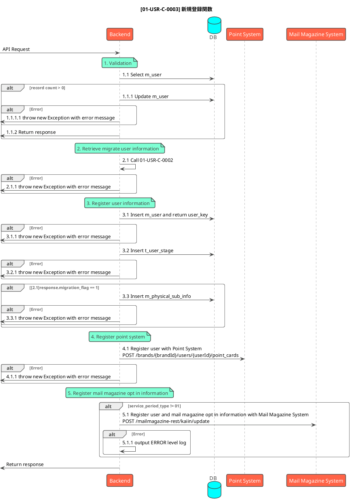

# [機能ID] 新規登録API POST /users

## 説明

- 新規ユーザの会員登録をする

## 仕様

- 本関数は、新規登録APIやAdmin機能として新規登録を実施する際に共通的に必要となる処理を関数化したものである
- 本APIはIDaaSから実行される
  - ユーザマスタにリクエスト.メールアドレスが同一で、有効な（退会していない）レコードが存在する場合は、IDaaSとのデータ不整合ではあるが、データの整合性を直すために、ユーザマスタのユーザIDのみ更新し、処理を終了する
- 既存システムからユーザ属性情報を取得するため、移行ユーザ属性取得関数を呼び出す
  - 本APIリクエスト時点では、移行ユーザか否かの判定ができないため、一律で関数を呼び出す
- 移行ユーザ属性取得関数の戻り値をもとに、ユーザマスタに登録する
  - 移行ユーザ属性取得関数.移行ユーザフラグが1(移行ユーザ)の場合は、ユーザマスタに関数の戻り値に含まれる情報を登録する
  - 移行ユーザ属性取得関数.移行ユーザフラグが0(非移行ユーザ)の場合は、登録する属性情報がないため、属性情報は空または初期値でユーザマスタに登録する
- 移行ユーザ属性取得関数.移行ユーザフラグが1(移行ユーザ)の場合は、移行ユーザと判定して、購読情報の登録を行う
- ポイント基盤への新規登録を行う
- COPがv1.1以降の場合のみの仕様は以下とする
  - メルマガシステムにアカウントとオプトイン情報を登録する

### エラーハンドリングについて

- ポイントシステムへのポイントカード作成完了以降の処理でエラーが発生した場合でもロールバックはせず、エラーログを出力し後続の処理を続ける方針とする
  - 処理完了後、出力されたエラーログを保守担当者が確認し都度対応を行う

## シーケンス図

## Parameter&Return

### Parameter

| Parameter     | Description     | Style |Required | Note         |
| ----------- | ----------------- | ----- | -------- | ------------ |
| email_address     | メールアドレス        | body  | required         |           |
| uid     | ユーザID        | body  | required        | AzureのオブジェクトID（Azureで一意のID）     |

### Return

| Parameter |     Description      | Settings | Note |
| --------- | -------------------- | -------- | ---- |
| user_key  | ユーザサロゲートキー |          |      |

## 外部API仕様書

[配置場所](xxx)

| 処理No |                                 ファイル名                                  |          該当箇所           | 備考 |
| ------ | --------------------------------------------------------------------------- | --------------------------- | ---- |
| 4.1    |  Giftee/Point_Base_API仕様書.html   | ポイントカード作成  | 日付が最新のものを参照        |
| 5.1    | メルマガシステム/API設計書.xls          | 会員情報更新シート     |      |
