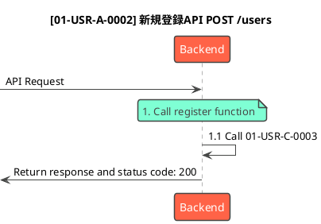

# [機能ID] 新規登録API POST /users

## 説明

- 新規ユーザの会員登録をするAPI

## 仕様

- ユーザー登録

## シーケンス図

## Request & Response

### Request

| Parameter     | Description     | Style |Required | Note         |
| ----------- | ----------------- | ----- | -------- | ------------ |
| email_address     | メールアドレス        | body  | required         |           |
| uid     | ユーザID        | body  | required        | オブジェクトID   |

### Response

| Parameter |     Description      | Settings | Note |
| --------- | -------------------- | -------- | ---- |
| user_key  | ユーザサロゲートキー |          |      |
