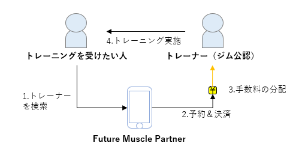

# Future Muscle Partner

「いきつけのジムでパーソナルトレーニングを受けよう」のFuture Muscle Partnerのリポジトリ。

## サービスコンセプト

パーソナルトレーナーを身近なものにして、質が高く安全で楽しいフィットネス体験を提供する。



サービス概要:

- アプリ上でジム公認のトレーナーを検索＆予約し、いきつけのジムでトレーニングを受けることができる

主なアクターとメリット:

- トレーニー
  - 自分が通っているジムでパーソナル受けられる
  - トレーナーの得意分野ごとにトレーナーを使い分けられる
- パーソナルトレーニー
  - 24H型ジムでサービスを提供できる
  - いつ/誰に/どんなメニューでトレーニングしたかを管理できる

## フォルダ階層

```sh
.
├── backend    # バックエンド系のコード
├── docs       # 設計書
├── frontend   # フロントエンド系のコード
├── infra      # インフラ系のコード
```

## 設計書

[docs](docs/README.md) を参照。
