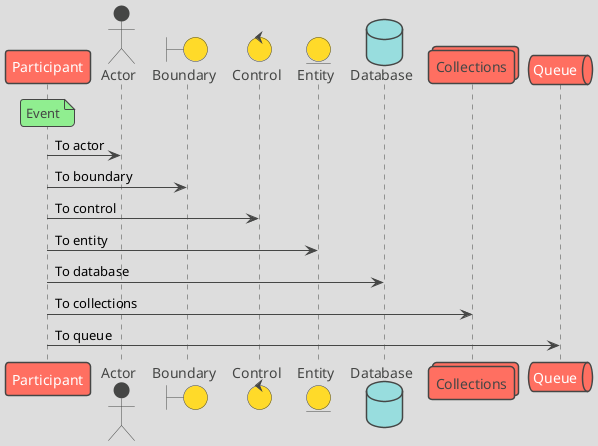
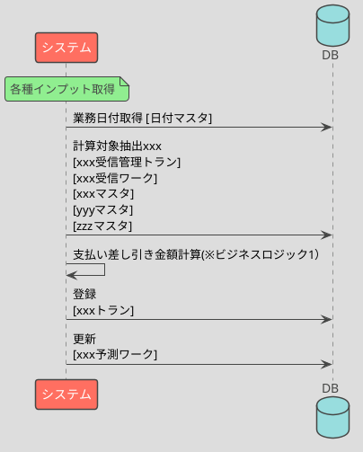
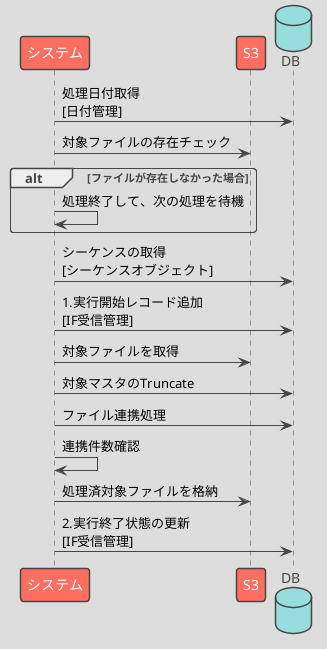

<page-title/>

本規約は、世の中のシステム開発プロジェクトのために無償で提供致します。  
ただし、掲載内容および利用に際して発生した問題、それに伴う損害については、フューチャー株式会社は一切の責務を負わないものとします。  
また、掲載している情報は予告なく変更することがございますので、あらかじめご了承下さい。

# はじめに

Markdown ベースの設計ドキュメントの規約をまとめる。

システム開発にて利用する設計ドキュメントを Markdown ベースにすることで、コーディングと同じ慣れたツールを用いて、Git によるバージョン管理、レビュープロセス、CI/CD などに自動化（静的解析、自動生成）を行いやすくし、ドキュメントを陳腐化させず、俊敏な設計開発を目指す。

Markdown に限った話では無いが、どういった内容を設計書に記載すべきかは悩むポイントは多い。

本規約では、アプリケーションの種別ごとに記載すべき内容と、それをどのような Markdown の構造で記載するかを規約化し、各チームで悩む余地を減らし、注力すべきことに集中できる環境を提供することを目的とする。

# 前提

本規約は以下の前提で作成されている

- チーム/プロジェクトが 3 ～ 10 名程度の規模
- Git（GitHub, GitLab）で管理され、コードと設計書が同一リポジトリで管理される
- システム開発で必要なアプリケーション開発

# 免責事項

::: warning 有志で作成したドキュメントである

- フューチャーアーキテクトには多様なプロジェクトが存在し、それぞれの状況に合わせて工夫された運営方針が存在する。本規約はフューチャーアーキテクトの全ての部署／プロジェクトで利用されているわけではなく、有志が観点を持ち寄って新たに整理したものである。相容れない部分があればその領域を書き換えて利用することを想定している

:::

# 本規約で紹介する設計ドキュメントの位置付け

設計ドキュメントは様々な前提条件／制約／経緯で作成され、Excel／Word／パワーポイントなどのファイル形式で作成することが多い。

本規約はそれらを否定するものではなく、様々な利害関係者の要求に応え洗練され続けた上記の設計ドキュメントのテンプレートには、強く敬意を表する。

一方で、設計ドキュメントを精緻に管理していく優先度より、プロダクト開発の効率とビジネスピードをより重視する場合もあり、それらの開発チームでは設計ドキュメントが存在さえない、あっても設計書が実装と乖離しているなどの問題が世間で課題提起されることも多い。

本規約では、後者のプロダクト開発の効率性を重視し、設計ドキュメントが開発以外の観点から求められない場合において、必要最低限必要だと思われるレベルの記載のサンプルを提供する。

また、設計ドキュメントのファイル形式に制約は無いという前提に立つため、設計ドキュメントの陳腐化を防ぐのに有効だと思われる、テキストベース（Markdown）でGit管理するという思想を採用する。

本規約で紹介した各設計ドキュメントの記載内容を参考にしつつ、各開発チームにおいて必要な情報を追加／削除して利用するという、テンプレートとしての利用を想定する。

# テキストベースにおける設計書の注意点

特に扱いで留意すべき点として、列数が多い表形式で設計ドキュメントを記載するケースがある。

Markdownで表を記載することは可能ですが、列数が多い場合は保守性が非常に低くなり、git diffを用いた差分が見れるメリットも下がる。

例えば、1つの画面の利用項目数が数十以上になり得る場合は、Excelなどのファイル形式を利用することを推奨する。

# フォルダ階層の推奨

リポジトリ直下に `docs` フォルダを作成し、その配下に設計ドキュメントとなる Markdown ファイルを配備する。

次はバックエンド、フロントエンド、インフラのコードをモノリポで管理している例である。

```sh
.
├── backend # バックエンド系のコード
├── docs
├── frontend # フロントエンド系のコード
├── infrastructure # インフラ系のコード
```

`docs` 配下は以下のルールにしたがった構造を取る。

- `01_`、`02_` といったプレフィックスを持つ
- 番号には体系をもたせず、必要になったタイミングでインクリメントさせる
- オンボーディングコストを抑えるため、なるべく先頭に新規参画者が欲する情報を配備する

構成例を次にあげる。

```sh
docs
├── 01_キャッチアップ # ドメイン知識など抑えておくべき前提知識
├── 02_環境構築     #
├── 03_開発規約     # GitFlowなど、リリース方式、CI／CD周り
├── 04_ユーザーストーリー
├── 05_UI設計      # Figmaのパスなど
├── 06_画面設計書
├── 07_API設計書   # OpenAPIのパス＋各BL設計
├── 08_データモデル # ERD, テーブル定義
├── 09_IF設計書    # I/F定義＋受信/送信BL設計
├── 10_バッチ設計書 # タイマー、イベント起動の非同期処理のBL設計
├── 11_インフラ設計 # 監視、キャパシティサイジング、コスト
├── ...
└── README.md
```

# システム構成図

図は基本的に変更差分がGitと相性が良い、PlantUML（またはMermaid.js）で作成すること。PlantUMLの場合、テーマは `toy` を指定すること。



システム構成図などは上記では対応しにくいことが多いため、diagrams.net（draw.io）で作成する。

diagrams.netの場合は、拡張子は以下のいずれかで作成する。

- `.drawio.png`
- `.drawio.jpg`
- `.drawio.svg`

# フロントエンド

以下の方針を取る。

- Figmaを用いて、画面遷移、画面表示項目を定義する
- Markdown設計書には、Figmaで判断可能な見た目の情報は **記載しない**
- Markdown設計書には、Web APIの呼び出しやイベントの定義、パラメータの受け渡し、バリデーションロジックなどを定義する。

[サンプル設計書](./future_muscle_partner/index.md)を参考にする。

# バックエンド

## テーブル定義書

[A5:SQL Mk-2](https://a5m2.mmatsubara.com/)を用い、`erd.a5er` という名称で管理する。

以下の情報の管理は `erd.a5er` で行えないため、別で定義する。

- 保持期限
- 個人情報有無

## 区分値

設計書サンプルを以下に示す。

::: tip 区分値設計書サンプル

```md
# ENUM01 ユーザー権限

## 区分値概要

- 目的: 画面のモードの切り替えに利用する
- 物理名: user permission level
- 型: string
- スコープ: frontend, backend
- マスターテーブル: m_user_role

## 区分値定義

| 論理名             | 物理名          | 値  | バージョン | コメント |
| ------------------ | --------------- | --- | ---------- | -------- |
| ゲスト             | guest           | 01  | 1          |          |
| 未認証ユーザー     | unauthenticated | 02  | 1          |          |
| 登録ユーザー       | user            | 03  | 1          |          |
| プレミアムユーザー | premium_user    | 04  | 2          |          |
| 開発者             | developer       | 05  | 0          |          |
| テスター           | tester          | 06  | 0          |          |
| 管理者             | administrator   | 07  | 0          |          |
```

:::

## メッセージ定義

::: tip メッセージ定義サンプル

```md
## メッセージ定義

| 識別子 | レベル | ステータス | メッセージ                                 | コメント                     |
| ------ | ------ | ---------- | ------------------------------------------ | ---------------------------- |
| 10001  | E      | 400        | ユーザー名またはパスワードが間違っています | ログイン画面で発生           |
| 10002  | W      |            | 文字数オーバーです                         | ログイン画面で発生           |
| 10003  | E      | 500        | {domain}は無効なユーザードメインです       | ユーザーの所属が異なっている |
| 10004  | F      | 500        | EntraIDに接続できません                    | ログインのバックエンドで発生 |
```

:::

## Web API 設計書

API 定義書は `openapi.yaml` で記載すること。

詳細は[OpenAPI Specification 3.0.3規約](https://future-architect.github.io/coding-standards/documents/forOpenAPISpecification/OpenAPI_Specification_3.0.3.html) を参考にする。

## プログラム設計書（バッチ、非同期タスクなど）

::: tip プログラム設計書サンプル

````md
# BAT01 xxx 計算

## 処理概要

- xxx（なぜこれが必要なのか）
- xxx受信の後続処理で起動し、xxx計算を行いxxxトランに登録する（処理の概略）

## 処理シーケンス



## ビジネスロジック

### ビジネスロジック1

```txt
支払金額 = 受信ワーク.商品コード * xxx * xxx - yyyy

IF xxx 区分
  支払金額 = 支払金額 * 支払い係数 + (支払金額 - 前回発注金額)/2
END
```

## DB 項目

### 取得

- xxxマスタ.支払い金額
- xxxマスタ.特定商品区分
- yyyマスタ.新古品フラグ
- zzzマスタ.前回発注金額

抽出条件:

- xxx受信管理トラン.業務日付 = 業務日付
- xxx受信管理トラン.処理連番 = xxx受信管理トラン の最新の処理連番

### 登録

- xxxトラン.会社コード = xxx
- xxxトラン.処理日付 = xxx
- xxxトラン.xxx区分 = xxx
- xxxトラン.支払金額 = ビジネスロジック1計算結果

### 更新

xxx 予測ワーク:

- xxx 予測ワーク.優先度
- xxx 予測ワーク.処理予定日
````

:::

## プログラム設計書（Web API）

Web APIについても、プログラム設計書（バッチ、非同期タスクなど）と同様に機能ID単位で作成する。

ただし、Web APIにおいては `openapi.yaml` と重複する部分で自明な内容（例えば、リクエストパラメータの定義や、レスポンス項目）については、重複するため記載を省略する。

もし、検索APIで複数のテーブルを参照して結果を応答する場合に、項目の由来を示すため、下表のような形式を定義すること。

### Web API応答例

| Parameter       | Description   | Settings      | Note |
| --------------- | ------------- | ------------- | ---- |
| last_name       | 氏名 (姓)     | m_user        |      |
| first_name      | 氏名 (名)     | m_user        |      |
| last_name_kana  | 氏名カナ (姓) | m_user        |      |
| first_name_kana | 氏名カナ (名) | m_user        |      |
| date_of_birth   | 生年月日      | m_user_detail |      |
| gender_type     | 性別区分      | m_user_detail |      |
| tel             | 電話番号      | m_user_detail |      |
| occupation_type | 職業区分      | m_user_detail |      |
| zipcode         | 郵便番号      | m_user_detail |      |

※Descriptionは `openapi.yaml` 側の `description` で記載済みであれば、省略すること
※Noteは何かしら加工処理により生み出された項目であれば、計算ロジックを記載する

## I/F 定義書

I/F 定義書は、システム間の連携について定義と、その受信/配信処理の設計書です。

システム I/F は連携先の対向システムが存在するため、認識齟齬が無いように、どのようなプロトコル・項目であるかを定義する必要がある。

::: tip I/F設計書サンプル

````md
# IF01 設備有効開始受信

設備有効開始の取り込みを行う。

## 対向システム

| 連携元     | 連携先 |
| ---------- | ------ |
| A システム | Future |

## 環境情報

### Input

| Item             | Value                                          |
| ---------------- | ---------------------------------------------- |
| 連携 S3 バケット | `${env}-example-import`                        |
| プレフィックス   | `activate/year=${yyyy}/month=${MM}/day=${dd}/` |
| ファイル名       | `${yyyy}-${mm}-${dd}-${hh}-${MM}-${SS}.csv`    |
| 保持期限         | 3 年                                           |

### Output

| Item             | Value                                          |
| ---------------- | ---------------------------------------------- |
| 連携 S3 バケット | `${env}-example-import`                        |
| プレフィックス   | `activate/year=${yyyy}/month=${MM}/day=${dd}/` |
| ファイル名       | `${yyyy}-${mm}-${dd}-${hh}-${MM}-${SS}.csv`    |
| 保持期限         | 3 年                                           |

## 連携元定義

| Category | Item                                | Value     | Memo                 |
| -------- | ----------------------------------- | --------- | -------------------- |
| Protocol | 連携方式（ファイル/API/ストリーム） | ファイル  |                      |
|          | 連携タイミング（随時/定時）         | 定時      |                      |
|          | 頻度                                | 1 回/日   |                      |
|          | 起動時間                            | **16:00** |                      |
|          | 処理完了期限                        | **16:00** |                      |
|          | 未着チェック（なし/WARN/ERROR）     | WARN      |                      |
|          | 全件/差分                           | 差分      |                      |
|          | 0 件時連携                          | あり      |                      |
| Format   | ファイル種別                        | **CSV**   |                      |
|          | レイアウト                          | RFC 8259  |                      |
|          | 文字コード                          | UTF-8     |                      |
|          | 改行コード                          | LF        |                      |
|          | 圧縮                                | -         |                      |
|          | 暗号化                              | -         |                      |
|          | ヘッダ行                            | あり      |                      |
|          | 項目順                              | 固定      | 項目順は入れ替え不可 |
|          | 機密情報                            | -         |                      |

### 項目定義

| Name       | Physical Name   | Type   | Length | Precision | Enum | Format     | Sensitive | Example    | Memo |
| ---------- | --------------- | ------ | ------ | --------- | ---- | ---------- | --------- | ---------- | ---- |
| 会社コード | company_cd      | string | 5      | -         | -    | -          | -         | 00001      |      |
| 設備コード | device_cd       | string | 8      | -         | -    | -          | -         | 00000052   |      |
| 有効開始日 | activation_date | string | 10     | -         | -    | YYYY-MM-DD | -         | 2022-10-16 | [^1] |

[^1]: 現在日以降である必要があるが、受信ではテスト観点で過去日も許容する

#### サンプル

```csv
company_cd,device_cd,activation_date
12121,00000052,2022-03-01
12121,00000053,2022-03-30
```

## 連携先定義

| Category | Item                                | Value     | Memo                 |
| -------- | ----------------------------------- | --------- | -------------------- |
| Protocol | 連携方式（ファイル/API/ストリーム） | ファイル  |                      |
|          | 連携タイミング（随時/定時）         | 定時      |                      |
|          | 頻度                                | 1 回/日   |                      |
|          | 起動時間                            | **16:00** |                      |
|          | 処理完了期限                        | **16:00** |                      |
|          | 未着チェック（なし/WARN/ERROR）     | WARN      |                      |
|          | 全件/差分                           | 差分      |                      |
|          | 0 件時連携                          | あり      |                      |
| Format   | ファイル種別                        | **CSV**   |                      |
|          | レイアウト                          | RFC 8259  |                      |
|          | 文字コード                          | UTF-8     |                      |
|          | 改行コード                          | LF        |                      |
|          | 圧縮                                | -         |                      |
|          | 暗号化                              | -         |                      |
|          | ヘッダ行                            | あり      |                      |
|          | 項目順                              | 固定      | 項目順は入れ替え不可 |
|          | 機密情報                            | -         |                      |

## 処理概要

- ファイル定義に則ったバリデーションを実施
- 次の項目変換定義に従い加工し、出力先テーブルに Merge する
- 受信完了後、 Completed: YYYY-MM-DDTHH:MI:SS.SSS のタグを追加する

## 処理シーケンス



## DB 項目

### 参照

なし

### 登録

リストワークに以下のカラムでレコードを登録する

- xxx ワーク.会社コード
- xxx ワーク.処理日付
- xxx ワーク.yyy 区分

### 更新

なし

## ビジネスロジック

特記事項なし

## エラー処理

| Pattern            | Description                                | recovery                               |
| ------------------ | ------------------------------------------ | -------------------------------------- |
| フォーマットエラー | 連携元から提供されているデータ形式が想定外 | 連携元またはIFの処理内容の修正と再実行 |
````

:::
