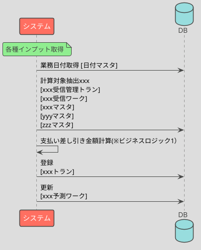

# BAT01 xxx 計算

## 処理概要

- xxx（なぜこれが必要なのか）
- xxx受信の後続処理で起動し、xxx計算を行いxxxトランに登録する（処理の概略）

## 処理シーケンス



## ビジネスロジック

### ビジネスロジック1

```txt
支払金額 = 受信ワーク.商品コード * xxx * xxx - yyyy

IF xxx 区分
  支払金額 = 支払金額 * 支払い係数 + (支払金額 - 前回発注金額)/2
END
```

## DB 項目

### 取得

- xxxマスタ.支払い金額
- xxxマスタ.特定商品区分
- yyyマスタ.新古品フラグ
- zzzマスタ.前回発注金額

抽出条件:

- xxx受信管理トラン.業務日付 = 業務日付
- xxx受信管理トラン.処理連番 = xxx受信管理トラン の最新の処理連番

### 登録

- xxxトラン.会社コード = xxx
- xxxトラン.処理日付 = xxx
- xxxトラン.xxx区分 = xxx
- xxxトラン.支払金額 = ビジネスロジック1計算結果

### 更新

xxx 予測ワーク:

- xxx 予測ワーク.優先度
- xxx 予測ワーク.処理予定日
