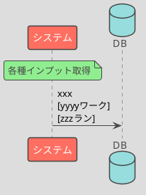

# BAT01 xxx計算

## 処理概要

- xxx
- xxx

## シーケンス図

## DB項目

### 取得

- xxx受信ワーク.会社コード
- xxx受信ワーク.担当者コード
- xxx受信ワーク.エリアコード

### 登録

警告リストワークに以下のカラムでレコードを登録する

- xxxワーク.会社コード
- xxxワーク.処理日付
- xxxワーク.yyy区分

### 更新

xxx予測ワークの以下の項目を更新する

- xxx予測ワーク.優先度
- xxx予測ワーク.処理予定日

## 補足事項

### 1.xxx抽出

xxx

### 2.優先度計算

xxx
