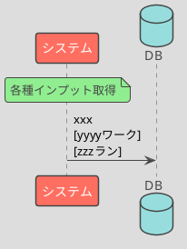

# BAT01 xxx 計算

## 処理概要

- xxx（なぜこれが必要なのか）
- xxx

## 処理シーケンス

## DB 項目

### 取得

- xxx 受信ワーク.会社コード
- xxx 受信ワーク.担当者コード
- xxx 受信ワーク.エリアコード

抽出条件:

- xxx
- xxx

### 登録

警告リストワークに以下のカラムでレコードを登録する

- xxx ワーク.会社コード
- xxx ワーク.処理日付
- xxx ワーク.yyy 区分

### 更新

xxx 予測ワークの以下の項目を更新する

- xxx 予測ワーク.優先度
- xxx 予測ワーク.処理予定日

## 補足事項

### 1.xxx 抽出

xxx

### 2.優先度計算

xxx
