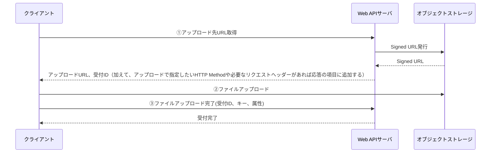

<page-title/>

本コーディング規約は、世の中のシステム開発プロジェクトのために無償で提供致します。
ただし、掲載内容および利用に際して発生した問題、それに伴う損害については、フューチャー株式会社は一切の責務を負わないものとします。
また、掲載している情報は予告なく変更することがございますので、あらかじめご了承下さい。

# はじめに

[OpenAPI Specification 2.0（Swagger, OAS2）](https://github.com/OAI/OpenAPI-Specification/blob/main/versions/2.0.md)定義についてのコーディング規約をまとめます。より新しいバージョンとして OAS 3.0.3 規約（作成中）がありますので、ご注意ください。

## 適用箇所

本規約は以下の[前提条件](prerequisite.md)で作られたものである。

## Web API 自体の設計について

[API 設計標準](API_Design.md) に準じる。

## ファイルフォーマット

[ファイルフォーマット規約](file_standards.md)に準じる。

# 要素規約

Swagger の基本構造は以下の、swagger・info・host・basePath・schemes・paths・definitions から構成される。

要素の並び順は、原則 [OpenAPI Specification 2.0（Swagger, OAS2）](https://github.com/OAI/OpenAPI-Specification/blob/main/versions/2.0.md) に記載された順番に記載する。

```yaml
swagger: "2.0"
info:
  title: サンプルAPI
  description: サンプルAPIはシステムにおけるユーザーのアカウント、契約、支払い、注文履歴などを管理できます
  version: 1.0.0
host: api.example.com
basePath: /v1
schemes:
  - https
consumes:
  - application/json
produces:
  - application/json
tags:
  - name: user
    description: ユーザー
paths:
  /users/{user_id}/account:
    get:
      tags:
        - user
      summary: API-001 ユーザーアカウント取得
      description: ユーザーのアカウント情報を取得します
      operationId: getUserAccount
      parameters:
        - name: user_id
          in: path
          type: string
          pattern: ^[0-9a-zA-Z_-]*$
          minLength: 4
          maxLength: 16
          required: true
          description: 登録時に設定されたユーザーID
      responses:
        "200":
          description: OK
          schema:
            $ref: "#/definitions/UserAccount"
        "400":
          description: パラメータ不正
          schema:
            $ref: "#/definitions/Error"
        "404":
          description: リソースが存在しない
          schema:
            $ref: "#/definitions/Error"
        "500":
          description: 内部エラー
          schema:
            $ref: "#/definitions/Error"
        default:
          description: その他予期せぬエラー
          schema:
            $ref: "#/definitions/Error"
definitions:
  UserAccount:
    required: [user_id, user_name, account_type, register_at]
    properties:
      user_id:
        type: string
        description: ユーザーID
        minLength: 4
        maxLength: 16
        example: 32AB1aaad100eavV
      user_name:
        type: string
        description: ユーザー名
        minLength: 1
        maxLength: 128
        example: 未来太郎
      account_type:
        type: string
        description: アカウント種別(1:ゲスト 2:登録済み 3:プレミアム 4:管理者)
        minLength: 1
        maxLength: 1
        example: "1"
      register_at:
        type: string
        description: 登録日時
        format: date-time
        example: "2023-04-01T11:30:45.000Z"
```

## swagger

- `2.0` 固定とする

## info

info オブジェクトには Web API に関するメタデータを記載する。
`title`, `description`, `version` を必須項目とする。

| フィールド名   | 必須 | 記載内容                         |
| -------------- | :--: | -------------------------------- |
| title          |  ○   | Web API の総称                   |
| description    |  ○   | Web API の簡単な説明             |
| version        |  ○   | OpenAPI ドキュメントのバージョン |
| termsOfService |      | 利用規約の URL                   |
| contact        |      | 連絡先情報                       |
| license        |      | ライセンス情報                   |

### title

WebAPI の総称を記載する。システム名やサービス名 + API のような命名とすることを推奨する。
例. `X System API`

### desctiption

Web API が提供する機能の概要・想定する利用者やユースケース・制約などを記載する。

### version

この API 仕様のドキュメントのバージョンを記載する。アプリケーションのバージョン（git tag やリリースで管理するようなバージョン）とは別である。

本規約の推奨は `major.minor` 形式である。 `0.1 `固定で開発を進め、サービスのリリース時に `1.0` とし、その後の項目やオプション、パスの追加ごとに `1.1` などインクリメントしていく。もし他チームへのドキュメントの頻繁な共有が必要だれば、`1.0` のかわりに `2023.03.26` といった形式も許容する。

## host

OpenAPI 3 系と異なり、 **Swagger では複数のホストを指定できない**。そのため host には開発環境（local, develop, staging, production というステージ区別であれば、develop）で用いる IP、ポート番号を指定する。他チームに提供するサンドボックス環境を用意する場合は、そのエンドポイントを指定しても良い。localhost などのローカル開発への向き先変更は、ツール側で対応している事が多く上書き可能なため記載しない。API 定義書は予期せぬタイミングで他チームに展開する必要がしばしばあり、お試しで触っても良い環境があることを示すことで情報量を増やし、円滑なコミュニケーションを促進することを狙いとする。

```yaml
# OK
host: dev.api.example.com:80
host: sandbox.api.example.com:80

# NG（ローカル開発で用いる環境を指定する）
host: localhost:8001

# NG（LSUDs向けのWeb API開発では不用意に本番環境を触られたくないときが多く、避けるべきである）
host: prod.api.example.com:80
```

## basePath

作成する Swagger 定義の URL パスの全てで、共通するプレフィックスを持つ場合に指定する。Swagger の仕様上、先頭には `/` が必須であるため、以下のように定義する。

```yaml
# OK
basePath: /v1
basePAth: /api/v2

# NG
basePath: v2
```

## schemes

最終的に利用するスキーマのみを記載する。通常、HTTP 通信での Web API 提供は行わないと考えられるため、 `https` 固定で設定する。ローカル開発では `http` を指定することも多いが、ツールで生成されたコードのオプションで通常書き換えが可能なため、`http` の併記は許可しない。ただし、サーバサイドのマイクロサービス同士の通信で、VPC（プライベートセグメント）内であり、SSL 通信を本当に利用しない場合は `http` と記載する。

```yaml
# OK
schemes:
  - https

# NG（httpの指定は通常、Web APIサーバアプリケーションの開発時を除いて不要であるためわざわざ追加しない）
schemes:
  - http
  - https
```

もし、WebSocket スキームを提供するサービスの定義である場合は、`wss` を（追加で）指定する。定義上は `https` 側との共存ができないため、ファイル定義を分けるようにする。

## security, securityDefinitions

Swagger では、次の認証タイプを記載できる（[詳細](https://swagger.io/docs/specification/2-0/authentication/)）。

1. ベーシック認証
1. API キー（リクエストヘッダ, クエリパラメータ）
1. OAuth2

もし、認証が必須であれば記載する。全ての Web API で未認証を受け入れる場合は記載しない。認証の要否が API ごとに異なる場合は、各 API 側で `security: []` と記載しして上書き定義する必要がある。

```yaml
# OK
securityDefinitions:
  OAuth2:
    type: oauth2
    flow: accessCode
    authorizationUrl: https://example.com/authorize
    tokenUrl: https://example.com/.well-known/jwks.json

# OK（OAuth2認証ありの場合）
paths:
  /users/{user_id}/account:
    get:
      ...
      security:      # 認証が不要な場合は security: [] と記載する
        - OAuth2: []
```

## produces

Web API が応答する際の MIME タイプを指定します。未指定の場合に、コード生成などツール側で予期しない動作をすることがあるため、固定で指定する。新規構築の Web API であれば `application/xml` は不要と通常は考えられるので、`application/json` を記載する。また、[RFC 7807 Problem Details for HTTP APIs](https://www.rfc-editor.org/rfc/rfc7807) では Content-Type に `application/problem+json` を設定するとあるが、一部のコード生成ツールにおいて、 `application/problem` と `application/problem+json` の使い分けが難しいため、併記を必須としない。OpenAPI Specification の 3 系ではステータスコードごとに Content-Type を指定できるため、3 系への移行も検討する。

```yaml
# OK（applicaton/problem+json 無しでも良い）
produces:
  - application/json

# OK（利用するツールで複数のContent-Typeの使い分けが実現しやすい場合は以下でも良い）
produces:
  - application/json
  - application/problem+json
```

ある API のみ、バイナリ（画像データなど）を返すなどのケースがあれば、 `paths` 配下で上書き指定する。

```yaml
paths:
  /logo:
    get:
      summary: API-002 ロゴ画像を取得する
      description: サービスのロゴ画像をpng形式で取得します
      operationId: getLogoImage
      produces:
        - image/png
      responses:
        "200":
          description: OK
          schema:
            type: file
```

## consumes

Web API が要求を受け入れる際の MIME タイプを指定する。未指定の場合に、コード生成などツール側で予期しない動作をすることがあるため、固定で指定する。新規構築の Web API であれば `application/xml` は不要と通常は考えらえるので、`application/json` だけ記載する。

仕様上、 `consumes` は POST, PUT, PATCH を利用した操作のみに影響し、GET などリクエストボディが無い操作では無視される。

```yaml
# OK
consumes:
  - application/json
```

## tags

タグを用いて、API 操作をグループ化することができる。ドキュメントやツールにとって非常に重要であるため、 **必須** で指定する。

- Swagger UI（HTML ドキュメント）の順序を制御できる
  - 未指定の場合は、登場順で生成されてしまう
- 命名は、 **単数形** で、小文字かつ半角スペース区切り で記載する
  - コード生成で利用され、Go ではパッケージ名や TypeScript の Class 単位となるため、シンプルな命名にする
  - HTML ドキュメントで参照する場合の可読性を上げるため、単語を半角スペース区切りとする
- タグごとに `description` も必須で記載する

```yaml
# NG
tags:
  - name: product
    description: 製品
  - name: store
    description: 店舗
  - name: user account
    description: ユーザーアカウント

# NG
tags:
  - name: products
  - name: stores
  - name: user_account
  - name: UserAccount
```

## paths

`paths` 配下に個々の API エンドポイントを記載する。

`paths` は根幹となる定義部分であり、以下のように重要な定義が続く。それぞれ重要な要素ごとに規約を示す。

```sh
Paths              # API定義全体
  └ Path           # URLパス
    └ Operation    # HTTPメソッド
      ├ Parameter  # リクエストパラメータ
      └ Responses  # レスポンス
        └ Response # ステータスコードに応じたレスポンス
```

### Paths > Path

記載順は以下のルールである。

- トップレベルの `tags` でグルーピングした順番に記載する
- URL は短いものから並べる
- HTTP メソッドは、 head, get, post, put, patch, delete の順にする

```yaml
# 並び順の例（HTTPメソッドの子要素はtags以外を省略）
tags:
  - user
  - item
paths:
  /users:
    get:
      tags:
        - user
      ...
  /users/{user_id}/account:
    get:
      tags:
        - user
      ...
  /users/{user_id}/account:
    patch:
      tags:
        - user
      ...
  /items:
    get:
      tags:
        - item
      ...
```

### Paths > Path > Operation

URL に紐づく HTTP メソッドで、1 つの操作を定義します。

- `summary`
  - API の操作概要を summary に記載する
  - 機能 ID があるのでれば、ここに記載する
  - 例: `API-001 ユーザアカウント取得`
- `description`
  - API の振る舞いの詳細や注意点（ある条件で区分の値が変わったり、権限についての注意、要素が空になるなど）を記載する
- `operationId`
  - コード生成で利用される項目なので、必須で指定する
  - 原則、`camelCase` の `${HTTPメソッド}${機能物理名}` で記載する（例: getUser, postUser, deleteUser）
    - ただし、HTTP メソッドに紐づかない操作であれば、HTTP メソッドの代わりに個別の動詞（例: searchUser, moveItemList, addPermission）を当てはめる
    - コード生成対象によっては、get_user（Python）、GetUser（Go）といった命名規約にしたくなるが、通常はコード生成側で配慮してくれる
- `consumes`, `produces`
  - トップレベルに `application/json` を記載しているため、同様であれば記載しない

```yaml
/users:
  get:
    tags:
      - user
    summary: API-001 ユーザーアカウント取得
    description: |
      ユーザーのアカウント情報を取得します。
      ログイン情報が不正の場合はアカウントが存在しても404を返すことがあります。
      アカウント種別については【別紙】X_定数一覧 を参照ください。
    operationId: getUser
    parameters: ...
    responses: ...
```

### Paths > Path > Parameter

リクエストの定義を記載する。

- `name`
  - `snake_case` で物理名を記載します
  - HTTP メソッドが POST/PUT/HTTP の場合は `body` に固定する
- `in`
  - 仕様上、必須で `query`, `header`, `path`, `formData`, `body` のどれかを指定する
  - HTTP メソッドが HEAD/GET/DELETE の場合
    - `path`, `query` のみの利用を推奨する
  - HTTP メソッドが POST/PUT/HTTP の場合
    - `body` のみの利用を推奨する
- `required`
  - 必須の場合のみ記載する。デフォルト false であるため、任意項目の場合は記載しない
  - POST, PUT で用いるリクエストボディに対しては、 `required: true` を必ず指定する
    - リクエストボディ自体が未指定だった場合、各項目の `required: true` を指定していてもサーバサイドのチェックが有効に働かないことがあるため
- `pattern`, `minLength`, `maxLength` などの条件について
  - [https://github.com/OAI/OpenAPI-Specification/blob/main/versions/2.0.md#fixed-fields-7](https://github.com/OAI/OpenAPI-Specification/blob/main/versions/2.0.md#fixed-fields-7) を参考に、指定できる条件はなるべく細かく指定する
- `schema`

  - リクエストボディは、`$ref` を用いて、`#/definitions` 配下に記載する。**$ref を用いない記載は許可しない。**

  ```yaml
    # OK
    - name: body
      in: body
      required: true
      schema:
        $ref: "#/definitions/PutUserAccount"

    # NG
    - name: body
      in: body
      required: true
      type: object
      required: [user_name, account_type, register_at, point]
      properties:
        user_name:
          type: string
          ...
        account_type:
          type: string
          ...
  ```

  - モデル名は、 `{HTTPメソッド名}{物理名}` の PascalCase で記載する
    - 例: PutUserAccount、PostUserAccount, PatchUserAccount

- `desription`
  - 項目の論理名や補足説明を記載する

```yaml
  /users/{user_id}/account:
    get:
      ...
      parameters:
        - name: user_id
          in: path
          type: string
          pattern: ^[0-9a-zA-Z_-]*$
          minLength: 4
          maxLength: 16
          required: true
          description: 登録時に設定されたユーザーID
      responses:
        ...
    put:
      ...
      parameters:
        - name: user_id
          in: path
          type: string
          pattern: ^[0-9a-zA-Z_-]*$
          minLength: 4
          maxLength: 16
          required: true
          description: 登録時に設定されたユーザーID
        - name: body
          in: body
          required: true
          schema:
            $ref: "#/definitions/PutUserAccount"
      responses:
        ...
```

### Paths > Path > Responses

レスポンスの定義を記載する。

- `description`
  - 必須で記載する
- ステータスコードは発生し得る全てのパターンを列挙する
  - 正常系の `200 OK`、 `201 Created`、`202 Accepted` `204 No Content` 以外の、異常系も忘れず記載する
  - 通常発生しない、サーバサイドの内部的な予期せぬエラー `500 Internal Server Error` は必須で記載する
  - リクエストパラメータが存在する場合は `400 Bad Request` が、認証がある場合は `401 Unauthorized` や `403 Forbiddend` が考えられる
  - `default` は必須で指定する
    - 例えば、URL 自体が存在しない場合の `404 NotFound` や、提供していない HTTP メソッドを呼び出した場合に `405 Method Not Allowed` を、自動生成したサーバサイドの実装が返すことがある。この場合、 `default` を指定していないとフロントエンド側でパースエラーとなることがあるため。各 API エンドポイントのサーバサイド側の実装が応答しないコードは、 `default` でまとめて指定させる

```yaml
  /users/{user_id}/account:
    get:
      ...
      parameters:
        ...
      responses:
        "200":
          description: OK
          schema:
            $ref: "#/definitions/Users"
        "400":
          description: パラメータ不正
          schema:
            $ref: "#/definitions/Error"
        "404":
          description: リソースが存在しない
          schema:
            $ref: "#/definitions/Error"
        "500":
          description: 内部エラー
          schema:
            $ref: "#/definitions/Error"
        default:
          description: その他予期せぬエラー
          schema:
            $ref: "#/definitions/Error"
    post:
      ...
      parameters:
        ...
      responses:
        "201":
          description: 新規登録に成功
          schema:
            $ref: "#/definitions/UserAccount"
        "400":
          description: パラメータ不正
          schema:
            $ref: "#/definitions/Error"
        "409":
          description: すでに登録済みのユーザーIDを用いている
          schema:
            $ref: "#/definitions/Error"
        "500":
          description: Internal Server Error
          schema:
            $ref: "#/definitions/Error"
        default:
          description: "その他予期せぬエラー"
          schema:
            $ref: "#/definitions/Error"
```

## definitions

- モデル名は、PascalCase で記載する
- 種別が配列の場合、ネストして定義するのではなく、 `$ref` を活用する
- もし、リソース名が単複同形で `type: array` と区別できない場合、 `List` を末尾に付けて区別する

  - そうではない場合は `s` を付けて表現する

  ```yml
  # OK
  - in: query
    name: product_types
    type: array
    description: プロダクト種別

  # NG
  - in: query
    name: product_type_list # xxx_listはNG
    type: array
    description: プロダクト種別
  ```

- リクエストボディ
  - 必須項目は `required` で項目を全て指定する
  - その他、項目定義として可能であればできる限り細かく指定する
- レスポンスボディ
  - `type`, `description`, `example`が必須。
  - `format`, `minLength`, `maxLength` などの型桁はできる限り細かく指定する
    - 多くのクライアントは RDB をデータストアに持ち、それらの型定義の参考にするためである
  - `enum` は **指定してはならない**
    - 一部のクライアント側のコード生成で、存在しない区分値を指定するとエラーになる（レスポンスを受信できない）。これはサーバサイドで区分値を増やす必要があるケースで、サーバ・クライアントの同期をとる必要があり困難なケースが多い。例えばクライアントがモバイルである場合、サーバサイドで区分値を追加した場合には、全端末でアプリアップデートが必要となリ、事実上 API 互換性がなくなるため、v1 を保持しつつ、区分値を追加した v2 の Path を追加する必要が出てくる
  - `pattern` の指定は不要
    - `pattern` も enum と同様に、サーバサイドが当初よりリクエストのバリデーションを緩めた場合に、古い `pattern` でクライアントがレスポンスを検証すると動作しなくなるため。クライアントサイドが RDB など書き込み時のスキーマが厳密であったとしても、正規表現レベルの厳格さで書き込みチェックをすることは無いと考えられる
  - `example` の値は、 例えば Prism でサーバのモックとして動かす場合に返される値になるため、できる限り具体的な値にする
  - 空文字、false, 0 値を返しうる項目に、`x-omitempty :false` を付与する
    - ツールの実装によっては、0 値や false を返した場合に JSON フィールドから除外される（omit される）ことがある
- 日付は `2023-04-02` といった ISO 8601 date フォーマットを推奨する。この場合は `fromat: date` を指定する
- 日時は `2023-04-02T15:04:05+09:00` といった ISO 8601 datetime フォーマットを推奨する。この場合は、 `format: date-time` を指定する
- エラーについて
  - API 全体で一貫したエラーを返すことを推奨とし、そのために `"#/definitions/Error"` といった共通のエラーモデルを利用を推奨する
  - [RFC 7807 Problem Details for HTTP APIs](https://www.rfc-editor.org/rfc/rfc7807) があるため、レイアウトを参考にする

```yaml
definitions:
  UserAccounts:
    type: array
    items:
      $ref: "#/definitions/UserAccount"
  UserAccount:
    required: [user_id, user_name, account_type, register_at, point]
    properties:
      user_id:
        type: string
        description: ユーザーID
        minLength: 4
        maxLength: 16
        example: 32AB1aaad100eavV
      user_name:
        type: string
        description: ユーザー名
        minLength: 1
        maxLength: 128
        example: 未来太郎
      account_type: # enumは指定しないこと
        type: string
        description: アカウント種別(1:ゲスト 2:登録済み 3:プレミアム 4:管理者)
        minLength: 1
        maxLength: 1
        example: "1"
      register_at:
        type: string
        format: date-time
        description: 登録日時
        example: "2023-04-01T11:30:45.000Z"
      point:
        type: integer
        format: int64
        description: ポイント（0ポイント以上）
        exampe: 421
  PostUserAccount:
    required: [user_id, user_name, account_type, register_at]
    properties:
      user_id:
        type: string
        minLength: 4
        maxLength: 16
        pattern: ^[0-9a-zA-Z_-]*$
        description: ユーザーID
        example: 32AB1aaad100eavV
      user_name:
        type: string
        minLength: 1
        maxLength: 128
        description: ユーザー名
        example: 未来太郎
      account_type:
        type: string
        minLength: 1
        maxLength: 1
        enum: ["1", "2", "3", "4"]
        description: アカウント種別(1:ゲスト 2:登録済み 3:プレミアム 4:管理者)
        example: "1"
      register_at:
        type: string
        format: date-time
        description: 登録日時
        example: "2023-04-01T11:30:45.000Z"
  Error:
    description: エラー (RFC 7807)
    type: object
    required: [title, status, detail]
    properties:
      title:
        type: string
        description: タイトル
        minLength: 1
        maxLength: 64
        example: request validation error
      status:
        type: integer
        format: int32
        description: HTTPステータスコード
        minimum: 400
        maximum: 600
        exclusiveMaximum: true
        example: 503
      message_cd:
        type: string
        description: 状態の切り分けとアクションが一意に特定できるメッセージコード
        minLength: 1
        maxLength: 16
        example: APPERR-0001
      detail:
        type: string
        description: エラーメッセージ詳細
        minLength: 1
        maxLength: 128
        example: user name is too long
```

## バリデーションについて

リクエストパラメータの各項目に対して、必須・型・桁・区分値・日付・正規表現のチェックが行える。レスポンスで用いるモデルについても同様に設定でき、`enum`, `pattern` 以外は API の利用者（クライアント）側の DB 設計などに必要な型桁情報を渡すのに有用であるため、できる限り詳しく指定する。

- 必須（`required`）
  - 必須パラメータのみ `required: true` を定義する
- デフォルト値（`default`）

  - パラメータにデフォルト値がある場合は定義する

  ```yaml
  # ex. enum
  name: limit
  type: number
  format: integer
  minimum: 1
  maximum: 100
  default: 20
  description: 検索結果の項目数上限（1~100が指定可能）
  ```

  - API 公開後に、default 値を変更してはならない（API の互換性が崩れるため）。もし変更する場合は、API のバージョンを上げること

- 型（`type`）
  - `string(文字列)`, `number（数値）`, `integer（整数値）`, `boolean（真偽値）` `array（配列）`, `file（ファイル）` のうちどれか指定する
- フォーマット（`format`） は以下の型の詳細情報を示すもので、可能な限り設定する
  - `integer` （整数）
    - `int32`, `int64`
  - `number` （数値）
    - `float`, `double`
  - `string` （バイナリ）
    - `byte`: Base64 でエンコードされた文字列
    - `binary`: バイト配列
  - `string` （日付）
    - `date`: [RFC3339](https://www.rfc-editor.org/rfc/rfc3339) full-date
      - 項目名は `_on` を接尾辞につけることを推奨とする
    - `date-time`: [RFC3339](https://www.rfc-editor.org/rfc/rfc3339) date-time
      - 項目名は `_at` を接尾辞につけることを推奨とする
  - `string` （その他）
    - `password`: Swagger UI で入力が隠される
    - その他、 `email`, `uuid` など Open API 仕様に存在しない任意のフォーマットを独自のドキュメント生成などのために記載しても良い
- 桁
  - 文字列
    - 最大桁数：`maxLength`
    - 最小桁数：`minLength`
  - 数値または整数値
    - 最小値（境界値を含む）：`minimum`
    - 最大値（境界値を含む）：`maximum`
    - 境界値を含まない場合のみ`exclusiveMinimum: true`または`exclusiveMaximum: true`を定義する。minimum, maximum で代用できる場合は利用しない
  - 配列:
    - 最大要素数：`maxItems`
    - 最小要素数：`minItems`
    - `required: true`の場合は原則として`minItems: 1`を定義する
    - `uniqueItems` は必須で指定する（通常は一意であるべき）
  - API 公開後に、レスポンスの `maxLength` を以前より大きい値に変更してはならい
    - レスポンスの `maxLength` など API 利用者側システムの DB の ERD 定義のインプットになる事が多いため。もし行う場合は API のバージョンを上げることや、連携先に桁数変更の旨を調整するなどの考慮を行う
- 区分値（`enum`）

  - `description`に区分値の論理名を記載する

  ```yaml
  name: gender
  type: string
  enum: ["0", "1", "2", "9"]
  description: |
    性別
      0: 不明
      1: 男
      2: 女
      9: 適用不能
  ```

  - **固定値** の場合も enum を 1 つだけ指定して表現する。この場合もレスポンスで利用する場合は指定しない

    ```yaml
    name: file_layout
    type: string
    enum: ["json"]
    description: ファイルレイアウト
    ```

- その他

  - 正規表現で表現できる文字列は`pattern`を利用して定義する。桁や区分値で代替できる場合は、`pattern` を用いない
  - 例:

    ```yaml
    remind_time:
      type: string
      description: リマインド時刻。（hh:mm）形式
      example: 23:59
      pattern: "^(2[0-3]|[01][0-9]):([0-5][0-9])$"
    ```

## ファイルアップロード

Web API におけるファイルアップロードのよく利用される実装手段は、大きく分けて以下の 3 手法に分類できます

1. ファイルのコンテンツを Base64 などにエンコードして、JSON の項目として設定し、リクエストボディで送る
   - メリット: 通常の JSON を扱うのとほぼ変わらないため楽。サムネイルなど限定されたユースケースの場合に向く
   - デメリット: 巨大なファイルを扱う場合などサーバリソース負荷が懸念。Base64 に変換する分 CPU 負荷は余計にかかる。ペイロードが膨れるためモバイルなどのクライアントでは帯域利用での懸念がある
2. multipart/form-data ファイルを送信する
   - メリット: ファイルを Base64 に変換するといった作業が不要
   - デメリット: ブラウザ以外のクライアントにとって手間がかかる
3. アップロード用に用いる、オブジェクトストレージの Signed URL を発行し、クライアントから直接ファイルをアップロードしてもらう
   - 次の流れを想定（Signed URL を取得 -> ファイルアップロード -> ファイルに紐づかせるキーや属性情報などを登録）
   - Amazon API Gateway を利用する場合は、2023 年 6 月時点で[ペイロード上限が 10MB](https://docs.aws.amazon.com/apigateway/latest/developerguide/limits.html)、[AWS Lambda でもペイロード制限がある](https://docs.aws.amazon.com/ja_jp/lambda/latest/dg/gettingstarted-limits.html#api-requests)ため、許容するファイルサイズによってはこの手法一択となる
   - メリット: オブジェクトストレージの可用性・信頼性を享受できる
   - デメリット: アップロードするために複数の API エンドポイント呼び出しが必要なため、煩雑である
   - 2023 年 6 月に AWS ブログでこの方式について解説した記事が出たので、詳細は参照ください。
     - [https://aws.amazon.com/jp/blogs/news/large-size-files-transferring-by-serverless-s3presignedurl-and-clientside-javascript/](https://aws.amazon.com/jp/blogs/news/large-size-files-transferring-by-serverless-s3presignedurl-and-clientside-javascript/)

本規約でファイルアップロードについて上記の 3. Signed URL を推奨する。API 呼び出しとしては次のようなフローとする。



フローの ①、② はアプリケーション固有の紐づけルールにおいて Web API を設計すれば良いため、本規約で YAML の設定例は記載しない。フロー ② については Signed URL を用いたアップロードであり、アプリケーションの Web API 定義を書く必要はない。もし、監査ログなどのガバナンス上、直接オブジェクトストレージへの書き込みを許容されないケースは、B で Signed URL に相当する書き込み先を提供し、B を経由してファイルをアップロードする。

上記どちらのケースも OpenAPI 定義としてはシンプルであるため、記述例は割愛する。

## ファイルダウンロード

ファイルアップロードと同様、オブジェクトストレージの Signed URL 経由を経由してのダウンロードさせる手法を推奨する。Web API としてはオブジェクトストレージにダウンロード用のファイルを書き込み、クライアントが取得するための Signed URL をレスポンスの JSON 項目に渡す方式である。

もし、サムネイルやアイコン画像など、ファイル容量がごく小さい場合は Base64 にエンコードして JSON に埋め込んで渡しても良い。線引をどこに設置するかは本規約で定義しない。

どちらのケースも OpenAPI 定義としてはシンプルであるため、記述例は割愛する。

## CORS

CORS（Cross-Origin Resource Sharing）のために、options メソッドの追記は **原則不要** とする。

理由は以下である。

- サーバ側
  - options メソッド対応は、API 使用ではなく実装レベルの機能横断的な処理（Java における Servlet Filter や Spring の Interceptor、Go における Middleware など）で行うことが大半であり、コード生成が不要
- クライアント側
  - options メソッドを用いるのはクライアントがブラウザであり、クライアントのアプリケーションコードが明示的にアクセスしないため、コード生成が不要
- 使用面として
  - ` Access-Control-Allow-Origin` がどのような値を返すか、呼び出し元によって動的な値を返したい場合があり、記載が困難なケースがある

ただし、Amazon API Gateway のようなサービスを利用する場合は、options メソッドの記載が必須である場合は除く[^1]。

[^1]: https://docs.aws.amazon.com/ja_jp/apigateway/latest/developerguide/enable-cors-for-resource-using-swagger-importer-tool.html

## API のバージョン管理

Swagger 定義で以下の変更を行う場合は、利用するコード生成の動作によってはクライアントにとって互換性を失う破壊的変更であることがあるため、変更は調整の上で行うか、バージョンを上げることを考える。

- リクエスト項目
  - フィールドの型を変更する
  - 桁数を小さくする
  - enum の種類を減らす
  - 正規表現のチェックを厳しくする
  - 必須フィールドを後から追加する
  - デフォルト値を後から変更する
- レスポンス項目
  - フィールドの型を変更する
  - 桁数を大きくする
  - デフォルト値を後から変更する

## ファイル単位

TODO v3 の作成タイミングと合わせて追記する

# 推奨ツール

[本当に使ってよかった OpenAPI (Swagger) ツール ](https://future-architect.github.io/articles/20191008/) にあるように、様々なツールで開発ができる。VS Code を用いる場合は以下のプラグインを推奨する。

- [YAML](https://marketplace.visualstudio.com/items?itemName=redhat.vscode-yaml)
- [Swagger Viewer](https://marketplace.visualstudio.com/items?itemName=Arjun.swagger-viewer)
  - Ctrl + Shift + P (Win: Shift + Alt +P ) → Preview Swagger で現在編集中の Swagger プレビューが可能
- [spectral-cli](https://docs.stoplight.io/docs/spectral/674b27b261c3c-overview)

`editorconfig` を用いる場合は、以下の定義を推奨する。

```ini .editorconfig
root = true

[*]
charset = utf-8
insert_final_newline = true
trim_trailing_whitespace = true
end_of_line = lf

[*.{json,yaml}]
indent_size = 2
indent_style = space
```

---

# License

[](https://creativecommons.org/licenses/by/4.0/deed.ja)
