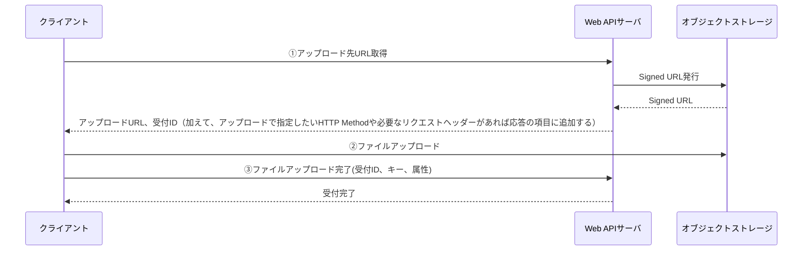

<page-title/>

本コーディング規約は、世の中のシステム開発プロジェクトのために無償で提供致します。  
ただし、掲載内容および利用に際して発生した問題、それに伴う損害については、フューチャー株式会社は一切の責務を負わないものとします。  
また、掲載している情報は予告なく変更することがございますので、あらかじめご了承下さい。

# はじめに

[OpenAPI Specification 3.0.3](https://github.com/OAI/OpenAPI-Specification/blob/main/versions/3.0.3.md)に則った API ドキュメントを記述する際のコーディング規約をまとめます。古いバージョンとして[OpenAPI Specification 2.0 の規約](OpenAPI_Specification_2.0.md)がありますので、v2 をご利用の方はこちらをご参照ください。

本規約の[前提条件](prerequisite.md)に従い作成されています。ToC向けのLSUDs（Large Set of Unknown Developers）なWeb APIにはマッチしない可能性があります。

Web API自体の設計については範囲外としますが、[API 設計標準](API_Design.md)に利用するステータスコードなどは記載しています。

## ファイルフォーマット

[ファイルフォーマット規約](file_standards.md)に準じる。

## OpenAPI ドキュメントの構成要素

OpenAPI ドキュメントを構成する要素はオブジェクトと呼ばれ、ルートオブジェクトは下記の要素で構成される。  
各種規約を読み進めるにあたってあらかじめ大まかに理解しておくことを推奨する。  
各オブジェクトの詳細については[公式ドキュメント](https://spec.openapis.org/oas/v3.0.3#openapi-object)を参照されたい。

| フィールド名 | 必須 | 説明                                                        |
| ------------ | :--: | ----------------------------------------------------------- |
| openapi      |  ○   | OpenAPI ドキュメントが使用する OpenAPI 仕様のバージョン番号 |
| info         |  ○   | API に関するメタデータ                                      |
| servers      |      | API サーバへの接続情報                                      |
| paths        |  ○   | API の利用可能なパスと操作方法                              |
| components   |      | 複数の API における共通の定義                               |
| security     |      | API 全体で利用可能なセキュリティ（認証）機構                |
| tags         |      | 各種 API をグルーピングするためのタグ                       |
| externalDocs |      | 追加の外部ドキュメント                                      |

# 要素規約

先述した OpenAPI ドキュメントを構成する要素別に具体的なコーディング規約を記載する。

## openapi

OpenAPI ドキュメントが使用する OpenAPI 仕様のセマンティックバージョン番号を記載する。  
本規約は`3.0.3`を対象としているため、`3.0.3`とする。

良い例：

```yaml
openapi: 3.0.3
```

悪い例：

```yaml
openapi: 3.0
```

## info

`info`オブジェクトには Web API に関するメタデータを記載する。  
`title`, `description`, `version` を必須項目とする。

| フィールド名   | 必須 | 記載内容                         |
| -------------- | :--: | -------------------------------- |
| title          |  ○   | Web API の総称                   |
| description    |  ○   | Web API の簡単な説明             |
| version        |  ○   | OpenAPI ドキュメントのバージョン |
| termsOfService |      | 利用規約の URL                   |
| contact        |      | 連絡先情報                       |
| license        |      | ライセンス情報                   |

### title

WebAPI の総称を記載する。システム名やサービス名 + API のような命名とすることを推奨する。  
例. `X System API`

### description

Web API が提供する機能の概要・想定する利用者やユースケース・制約などを記載する。

### version

この API 仕様のドキュメントのバージョンを記載する。アプリケーションのバージョン（git tag やリリースで管理するようなバージョン）とは別である。

本規約の推奨は `major.minor` 形式である。 `0.1 `固定で開発を進め、サービスのリリース時に `1.0` とし、その後の項目やオプション、パスの追加ごとに `1.1` などインクリメントしていく。もし他チームへのドキュメントの頻繁な共有が必要だれば、`1.0` のかわりに `2023.03.26` といった形式も許容する。

## servers

Web API を提供するサーバの情報を記載する。  
`url`, `description` を必須項目とする。

| フィールド名 | 必須 | 記載内容   |
| ------------ | :--: | ---------- |
| url          |  ○   | 対象の URL |
| description  |  ○   | 説明       |
| variables    |      | なし       |

ステージ（local, develop, staging など）が複数ある場合は各ステージ分の情報を記載する。 ただし LSUDs 向けの Web API 開発においては本番環境の URL を不用意に公開したくないケースが多く、記載は避けるべきである。

良い例：

```yaml
servers:
  - url: http://localhost:8001/
    description: Localhost Server
  - url: https://dev.api.example.com/v1
    description: Development Server
  - url: https://staging.api.example.com/v1
    description: Staging Server
```

悪い例：

```yaml
servers:
  - url: https://prod.api.example.com/v1
    description: Production Server
```

## paths

API の利用可能なエンドポイントと操作方法を記載する。

* API ごとに機能IDを定義している場合、`paths` 配下の各パスは機能 ID の昇順に定義する。
* URLパスが複数の単語からなる場合、ケバブケースで表現する。
* HTTP メソッドは `GET`, `POST`, `PUT`, `PATCH`, `DELETE` の順に定義する。  

  良い例：

  ```yaml
  paths:
    /products:
      get:
        ...
      post:
        ...
  ```

  悪い例：

  ```yaml
  paths:
    /products:
      post:
        ...
      get:
        ...
  ```

* HTTPメソッドの配下に定義されるオペレーションオブジェクトは、下記の項目を必須項目とする。

| フィールド名 | 必須 | 記載内容                                 |
| ------------ | :--: | ---------------------------------------- |
| tags         |  ○   | API の論理的なグループ                   |
| operationId  |  ○   | API の利用可能なエンドポイントと操作方法 |
| summary      |  ○   | API の操作概要                           |
| description  |      | API の振る舞いの詳細や注意点を記載する。 |
| parameters   |      | API のリクエストパラメータ               |
| requestBody  |      | API のリクエストボディ                   |
| response     |  ○   | API のレスポンス                         |
| security     |      |                                          |


### tags

API の論理的なグループを指定する。

* タグオブジェクトとして事前定義したタグの中から選択すること。

  良い例：

  ```yaml
  paths:
    /users/me:
      get:
        tags:
          - users
        ...
  tags:
    - name: users
  ```

  悪い例：

  ```yaml
  paths:
    /users/me:
      get:
        tags:
          # タグオブジェクトとして定義されていないタグが指定されている
          - users
        ...
  tags: []
  ```

* 1 API につき 1つのタグを指定すること。

  良い例：

  ```yaml
  paths:
    /users/me:
      get:
        tags:
          - users
        ...
  ```

  悪い例：

  ```yaml
  paths:
    /users/me:
      get:
        # 複数のタグが指定されている
        tags:
          - users
          - admin
        ...
  ```

### operationId

API を識別するための一意な文字列を記載する。

* HTTP メソッドとURLパスをアッパーキャメルケースで表現する。  
  ただしOpenAPI ドキュメントのエディタとして広く使用されるStoplightが提供する[Linter](https://docs.stoplight.io/docs/spectral/674b27b261c3c-overview)の定義としてケバブケースが標準になっているため、Stoplightを使用する場合はケバブケースで表現しても良い。

  良い例：

  ```yaml
  paths:
    /users/me:
      get:
        operationId: get-users-me
        ...
    /products/{product_id}:
      put:
        operationId: put-products-product-id
  ```

### summery

API の操作概要を記載する。

* 機能 ID や機能名があるのであれば記載する。

  良い例

  ```yaml
  paths:
    /users/me:
      get:
        summary: API-001 ユーザアカウント取得 
  ```

### description

APIの振る舞いの詳細や注意点を記載する。  
別途参照させるべき設計書があるのであれば、設計書へのリンクを記載しても良い。

### parameters

API のリクエストパラメータ（パスパラメータ、クエリパラメータ、ヘッダ）を記載する。

* HTTP メソッドが `GET`, `DELETE` の場合にのみ指定する。
* パスパラメータはスネークケースで表現する。
* クエリパラメータはスネークケースで表現する。
* ヘッダはハイフンを区切り文字とするパスカルケースで表現する。


### requestBody

API のリクエストボディを記載する。

* リクエストボディを記載する。仕様の[describing-request-body](https://swagger.io/docs/specification/describing-request-body/)の章にある通り、リクエストボディはPOST、PUT、PATCHで使用され、GET、DELETE、HEADには利用できない
* requestBodyの定義は、components/requestBodiesで宣言し、 `$refs` で参照する
* requestBodyの命名は、 `Req` というプレフィクスと、 `Body` というサフィックスで終える必要がある

```yaml
paths:
  /products:
    post:
      operation_id: post-products
      requestBody:
        $ref: '#/components/requestBodies/ReqPostProductsBody'
      ...
```

### responses

API のレスポンスを記載する。

* OpenAPI ドキュメントからソースコードを自動生成する際に生成されるのクラスや構造体の命名をコントロールしたい場合などにおいては、スキーマ定義は `components` オブジェクトとして任意の名称で定義し `$ref` で参照する。  
スキーマ定義の名称は、全体で統一された命名ルールを定めること。（例. `operation_id` をアッパーキャメルケースへ変換の上、プレフィックスに `Res` を付与）
* `schema` オブジェクトの `type` は `object` を指定する。
* 異常系（`4xx`, `5xx`）の HTTP ステータスコードに対応するレスポンス定義は設計者が個別に定義するのではなく、事前に共通的なレスポンスオブジェクトを定義し `$ref` で参照することが望ましい。
        ​

```yaml
paths:
  /products:
    post:
      operation_id: post-products
      responses:
        '200':
          $ref: '#/components/responses/RespPostProducts'
        '400':
          $ref: '#/components/responses/BadRequest'
        '401':
          $ref: '#/components/responses/Unauthorized'
        '403':
          $ref: '#/components/responses/Forbidden'
        '404':
          $ref: '#/components/responses/NotFound'
        '409':
          $ref: '#/components/responses/Conflict'
        '422':
          $ref: '#/components/responses/UnprocessableEntity'
        '500':
          $ref: '#/components/responses/InternalServer'
        '503':
          $ref: '#/components/responses/ServiceUnavailable'
      ...

components:
  responses:
    RespPostProducts:
      type: object
      properties:
        ...
    BadRequest:
      ...
```

### security

APIレベルの認証方式の設定だが、ルートレベルのsecurityで定義済みであるため、通常設定しない。

ヘルスチェックのような認証を通す必要がないAPIのみ、上書きで定義する。

```yml
# 認証しない場合のみ個別で定義する
security: []
```

## components

​
API 定義で利用する共通のデータモデルを定義
​

```yml
components:
  schemas: ...
  parameters: ...
  securitySchemes: ...
  requestBodies:
  responses: ...
  headers: ...
  examples: ...
  links: ...
  callbacks: ...
```


### schemas

* API定義共通で利用するスキーマを定義する
* schemasに定義する項目はリソースやエラー等のドメインオブジェクトのみとし、リクエストパラメータやレスポンスパラメータは`parameter`や`requestBodies`、`responses`に記載する。
  * `paths.requestBodies`から直接参照されるリクエストパラメータオブジェクトは`requestBodies`に定義する。
  * `paths`から直接参照されるレスポンスパラメータは`responses`に定義する。また400や500などのエラーレスポンスも`responses`に定義する。
  * HTTPヘッダやCookie、もしくは検索上限やページングのようなHTTPレイヤのパラメータに相当するものは`parameter`に定義する。
  * レスポンスヘッダーは`headers`にて定義する。
  * 上記いずれにも該当しないuserやidなどのリソース、エラーを示すオブジェクトは`schemas`に定義する。
  * 各APIのリクエストレスポンスオブジェクトは可能な限り、`parameter`,`requestBodies`,`responses`に定義する方針とし、API固有のオブジェクト（所謂`ReqXXX`、`ResXXX`等）は`schemas`には定義しない。
  * ただし、オブジェクトがネストしてしまう場合はAPI固有のオブジェクトであっても`schemas`に定義する。  
  ※定義するオブジェクトの`properties`配下に更に`type: object`が定義されしまう（ネストしてしまう）と生成ツールによってはうまく型が生成されないため。

* 規約
  * リソース名はアッパーキャメルケースで定義
  * リソース名は単数形で定義
  * `type` に複数の型定義の指定不可
  * `type: null`は原則として利用せず、undefinedを利用する。  
  [差分更新APIの場合](#差分更新-API-の場合)にあるとおり、空更新を行う場合は空文字を利用する。
  * `allOf`、`anyOf`、`oneOf` を利用したスキーマ定義は許容しない

```yaml
components:
  schemas:
    # リソースを示すオブジェクト
    Product:
      type: object
      properties:
        ...
    User:
      type: object
      properties:
    # エラーを示すオブジェクト
    ProblemDetailError:
      type: object
      properties:
        ...
    # リクエストパラメータやレスポンスパラメータはrequestBodies、もしくはresponsesに記載する。
    # ReqPostProductsBodyParam:
    #   type: object
    #   properties:
    #     ...
  parameter:
    # HTTPヘッダやCookie、もしくは検索上限やページングのようなHTTPレイヤのパラメータ定義
    QueryLimit:
      name: limit
      in: query
      required: false
      schema:
        type: integer
      description: 検索数上限
  requestBodies:
    # 各API定義（paths.requestBody）から参照されるレスポンス定義
    ReqPostProductsBody:
      required: true
      content:
        application/json:
          schema:
            type: object
            properties:
              product:
                $ref: '#/components/schemas/Product'
              ...
  responses:
    # 各API定義（paths）から参照されるレスポンス定義
    RespPostProducts:
      description: 商品登録の応答
      content:
        application/json:
          schema:
            type: object
            properties:
              product:
                $ref: '#/components/schemas/Product'
              ...
    # 共通で使用するエラーレスポンス定義
    BadRequest:
      description: 400 Bad Request
      content:
        application/json:
          schema:
            "$ref": "#/components/schemas/ProblemDetailError"

```

#### requestBodies(components)

* `requestBody` 直下の `required` は必須で `true` を指定する
* OpenAPI ドキュメントからソースコードを自動生成する際に生成されるのクラスや構造体の命名をコントロールしたい場合などにおいては、スキーマ定義は `component` オブジェクトとして任意の名称で定義し `$ref` で参照する。  
スキーマ定義の名称は、全体で統一された命名ルールを定めること。（例. `operation_id` をアッパーキャメルケースへ変換の上、プレフィックスに `Req` を付与）
* `schema` オブジェクトの `type` は `object` を指定する。

```yaml
components:
  schemas:
    Product:
      type: object
      properties:
        ...
  requestBodies:
    ReqPostProductsBody:
      required: true
      content:
        application/json:
          schema:
            $ref: '#/components/schemas/Product'   
```

#### responses(components)

レスポンスの先頭には複数のエンドポイントで横断的に用いるモデルを定義する。例えば、ステータスコード400~500系のエラーモデルがある。
​
```yml
components:
  schemas:
    ProblemDetailError:
      type: object
      properties:
        ...
  responses:
    BadRequest:
      description: 400 Bad Request
      content:
        application/json:
          schema:
            "$ref": "#/components/schemas/ProblemDetailError"
    Unauthorized:
      description: 401 Unauthorized
      content:
        application/json:
          schema:
            "$ref": "#/components/schemas/ProblemDetailError"
    ...
```
​
正常系のレスポンスの例としてはファイルアップロード・ダウンロードなどが該当する。個別のアプリケーション要件でブレが少ないと複数のエンドポイントで用いられる場合に定義する。オブジェクトのスキーマは、schemasに切り出して定義し、コード生成ツールのために型情報を付与させる。

```yml
components:
  schemas:
    SignedURL:
      type: object
      properties:
        signed_url:
          type: string
          format: uri
        expired_at:
          type: string
          format: date-time
  responses:
    BlobUpload:
      description: BLOB(Binary Large Object) upload using presigned url
      content:
        application/json:
          schema:
            "$ref": "#/components/schemas/SignedURL"
    BlobDownload:
      description: BLOB(Binary Large Object) download using presigned url
      content:
        application/json:
          schema:
            "$ref": "#/components/schemas/SignedURL"
    ImageBinary:
      description: An image
      content:
        image/*:
          schema:
            type: string
            format: binary
```

それらの後に、paths登場順にエンドポイント固有のレスポンスを定義する。レスポンスオブジェクトのスキーマは、schemasに切り出して定義する。

```yml
components:
  schemas:
    Product:
      type: object
      properties:
        product_id:
          type: string
          ...
  responses:
    ...
    RespPostProducts:
      description: 商品登録の応答
      content:
        application/json:
          schema:
            "$ref": "#/components/schemas/Product"
          examples:
            default:
              value:
                ...
            example-1:
              $ref: './examples/post-product.example.1.yaml'
```

#### parameters

API 共通で利用するパラメータ（パスパラメータ、クエリパラメータ、ヘッダ, Cookie）を記載する。

##### パスパラメータ

* API 全体で利用されるパスパラメータが必要なケースが想定されないため、原則定義しない。
特定リソースの操作（例えば更新と削除）を行う際のリソースIDはパスパラメータとして再利用できるが、コンフリクトを避けるため原則共通化は行わない。

##### クエリパラメータ

* API 全体で利用可能な共通のクエリパラメータを定義する （例: 検索数のlimit, offset）
* 命名は クエリパラメータ名に `Query` というプレフィクスを付与する形式を推奨する。


```yml
paths:
  get:
    /products:
      parameters:
        - $ref: '#/components/parameters/QueryLimit'

parameters:
  QueryLimit:
    name: limit
    in: query
    required: false
    schema:
      type: integer
    description: 検索数上限
```

##### ヘッダパラメータ

* API 全体で利用可能な共通のリクエストヘッダを定義する。
* 命名は ヘッダ名に `Header` というプレフィクスを付与する形式を推奨する。

```yml
paths:
  post:
    /products:
      parameters:
        - $ref: '#/components/parameters/HeaderContentType'
...
components:
  parameters:
    HeaderContentType:
      name: Content-Type
      in: header
      schema:
        type: string
      required: true
```

##### Cookie パラメータ

* API 全体で利用可能な共通のCookieパラメータを定義する。（例: CSRF用のトークン）
* 命名は Cookie パラメータ名に `Cookie` というプレフィクスを付与する形式を推奨する。
* Cookie 認証を定義する場合は、`APIKey` を利用すること。

```yml
paths:
  get:
    /products:
      parameters:
        - $ref: '#/components/parameters/CookieCSRFToken'
...
components:
  parameters:
    CookieCSRFToken:
      name: csrftoken
      in: cookie
      required: true
      schema:
        type: string
      description: CSRFトークン
```

### headers

API 共通で利用するレスポンスヘッダを記載する。

* 命名は ヘッダ名からハイフンを除去した形式を推奨する。

```yml
paths:
  get:
    /products:
      responses:
        '200':
          headers:
            ContentType:
              $ref: '#/components/headers/ContentType'
...

components:
  headers:
    ContentType:
      description: the original media type of the resource
      schema:
        type: string
```

### securitySchemes

標準で用いるAPI認証の定義を行う。

```yml
# Bearer トークによる認証
securitySchemes:
    BearerAuth:
      type: http
      scheme: bearer
      bearerFormat: JWT
      description: 'Bearer トークン認証'
```

### links

[links](https://swagger.io/docs/specification/links/) は OpenAPI 3.0 の新機能の1つで、あるAPIレスポンスの値を用いて、別のAPIを呼び出す方法を明示できるセクションである。

興味深い機能であり、APIのセマンティクスを伝えるのに有用であるが、本規約では記載しないことを推奨とする。

理由は下記の通りである。

- 業務システムでは、業務フローを抑えておけば、API操作フローの理解はそこまで難しくないことが多い
    - 逆に、API同士の関係だけを示すだけでは業務モデリング図とのダブルメンテナンスになったり、中途半端になりうる
- [OAS 3.0 Support Backlog](https://github.com/swagger-api/swagger-ui/issues/3641) にあるように、2023/12/15時点ではSwagger-UIが対応していない
    - linksを書いたと言って、APIドキュメントに影響しない

### callbacks

[callbacks](https://swagger.io/docs/specification/callbacks/) は OpenAPI 3.0 の新機能の1つで、APIサーバ側が指定されたコールバックURLを呼び出すという仕組みである。

仕様書には、ECショップで購入のたびにマネージャーに通知を送るといった、何かしらの処理をトリガーにコールバックURLを呼び出す例が示されている。

利便性は高い仕様だが、本規約では記載しないことを推奨とする。

理由は下記の通りである。

- コールバックURL呼び出しの、エラーハンドリングが難しい
- 業務システムでは欠損が許されない、または将来的に許されなくなる可能性があり、その場合にこの機能に頼ると想定以上の追加作業が発生する

コールバックのような仕組みを実現するには、別途キューイングのメッセージサービスの利用などを検討する。

## security

ルートレベルのsecurityを定義すると、全APIに共通で適用される。

業務システムのWeb APIで認証が全く存在しないことは考えにくいため、本規約ではルートレベルで認証を設定し、漏れをなくす。

```yml
# 認証設定方法 (デフォルトで設定済みの為不要)
security:
  - Bearer: []
```

ヘルスチェックなどAPI種別によって認証が不要な場合がある。それらに対しては個別に、認証情報を上書き定義する。

## tags

タグを用いて、API 操作をグループ化することができる。ドキュメントやツールにとって非常に重要であるため、 **必須** で指定する。

- Swagger UI（HTML ドキュメント）の順序を制御できる
  - 未指定の場合は、登場順で生成されてしまう
- 命名は、 **単数形** で、小文字かつ半角スペース区切り で記載する
  - コード生成で利用され、Go ではパッケージ名や TypeScript の Class 単位となるため、シンプルな命名にする
  - HTML ドキュメントで参照する場合の可読性を上げるため、単語を半角スペース区切りとする
- タグごとに `description` も必須で記載する

```yaml
# NG
tags:
  - name: product
    description: 製品
  - name: store
    description: 店舗
  - name: user account
    description: ユーザーアカウント

# NG
tags:
  - name: products
  - name: stores
  - name: user_account
  - name: UserAccount
```


## externalDocs

Schema定義, Paths配下の各API定義, OASのトップ階層などで、参照情報としてのURLを指定し表示が可能。ただし、`description` にてリンクURLを記載する方が、複数リンクを指定可能であるなど自由度が高く使いやすい。そのため、参照先URLリンクの記載には、`externalDocs` ではなく `description` の利用を推奨する。

```yaml
# 推奨
info:
  description: |-
    Some useful links:
    - [The Pet Store repository](https://github.com/swagger-api/swagger-petstore)
    - [The source API definition for the Pet Store](https://github.com/swagger-api/swagger-petstore/blob/master/src/main/resources/openapi.yaml)

# 特別な場合を除き非推奨
externalDocs:
  description: Find out more about Swagger
  url: http://swagger.io
```

# 設計上のポイント

## ファイルアップロード

Web API におけるファイルアップロードのよく利用される実装手段は、大きく分けて以下の 3 手法に分類できます

1. ファイルのコンテンツを Base64 などにエンコードして、JSON の項目として設定し、リクエストボディで送る
   - メリット: 通常の JSON を扱うのとほぼ変わらないため楽。サムネイルなど限定されたユースケースの場合に向く
   - デメリット: 巨大なファイルを扱う場合などサーバリソース負荷が懸念。Base64 に変換する分 CPU 負荷は余計にかかる。ペイロードが膨れるためモバイルなどのクライアントでは帯域利用での懸念がある
2. multipart/form-data ファイルを送信する
   - メリット: ファイルを Base64 に変換するといった作業が不要
   - デメリット: ブラウザ以外のクライアントにとって手間がかかる
3. アップロード用に用いる、オブジェクトストレージの Signed URL を発行し、クライアントから直接ファイルをアップロードしてもらう
   - 次の流れを想定（Signed URL を取得 -> ファイルアップロード -> ファイルに紐づかせるキーや属性情報などを登録）
   - Amazon API Gateway を利用する場合は、2023 年 6 月時点で[ペイロード上限が 10MB](https://docs.aws.amazon.com/apigateway/latest/developerguide/limits.html)、[AWS Lambda でもペイロード制限がある](https://docs.aws.amazon.com/ja_jp/lambda/latest/dg/gettingstarted-limits.html#api-requests)ため、許容するファイルサイズによってはこの手法一択となる
   - メリット: オブジェクトストレージの可用性・信頼性を享受できる
   - デメリット: アップロードするために複数の API エンドポイント呼び出しが必要なため、煩雑である
   - 2023 年 6 月に AWS ブログでこの方式について解説した記事が出たので、詳細は参照ください。
     - [https://aws.amazon.com/jp/blogs/news/large-size-files-transferring-by-serverless-s3presignedurl-and-clientside-javascript/](https://aws.amazon.com/jp/blogs/news/large-size-files-transferring-by-serverless-s3presignedurl-and-clientside-javascript/)

本規約でファイルアップロードについて上記の 3. Signed URL を推奨する。API 呼び出しとしては次のようなフローとする。



フローの ①、② はアプリケーション固有の紐づけルールにおいて Web API を設計すれば良いため、本規約で YAML の設定例は記載しない。フロー ② については Signed URL を用いたアップロードであり、アプリケーションの Web API 定義を書く必要はない。もし、監査ログなどのガバナンス上、直接オブジェクトストレージへの書き込みを許容されないケースは、B で Signed URL に相当する書き込み先を提供し、B を経由してファイルをアップロードする。

上記どちらのケースも OpenAPI 定義としてはシンプルであるため、記述例は割愛する。

## ファイルダウンロード

ファイルアップロードと同様、オブジェクトストレージの Signed URL 経由を経由してのダウンロードさせる手法を推奨する。Web API としてはオブジェクトストレージにダウンロード用のファイルを書き込み、クライアントが取得するための Signed URL をレスポンスの JSON 項目に渡す方式である。

もし、サムネイルやアイコン画像など、ファイル容量がごく小さい場合は Base64 にエンコードして JSON に埋め込んで渡しても良い。線引をどこに設置するかは本規約で定義しない。

どちらのケースも OpenAPI 定義としてはシンプルであるため、記述例は割愛する。

## CORS

CORS（Cross-Origin Resource Sharing）のために、options メソッドの追記は **原則不要** とする。

理由は以下である。

- サーバ側
  - options メソッド対応は、API 使用ではなく実装レベルの機能横断的な処理（Java における Servlet Filter や Spring の Interceptor、Go における Middleware など）で行うことが大半であり、コード生成が不要
- クライアント側
  - options メソッドを用いるのはクライアントがブラウザであり、クライアントのアプリケーションコードが明示的にアクセスしないため、コード生成が不要
- 使用面として
  - ` Access-Control-Allow-Origin` がどのような値を返すか、呼び出し元によって動的な値を返したい場合があり、記載が困難なケースがある

ただし、Amazon API Gateway のようなサービスを利用する場合は、options メソッドの記載が必須である場合は除く[^1]。

[^1]: https://docs.aws.amazon.com/ja_jp/apigateway/latest/developerguide/enable-cors-for-resource-using-swagger-importer-tool.html

## OpenTelemetry Traceparent HTTP Header

OpenOpenTelemetryで用いるられる[traceparent](https://www.w3.org/TR/trace-context/) のリクエストヘッダーはOpenAPIで **原則不要** とする。

理由は以下である。

- OpenTelemetryが定めるヘッダー類は、API横断的に設定されるべきものであり、ミドルウェアやフレームワーク側などでの一律の制御を推奨するため
- 記載することにより、OpenOpenTelemetryに対応していることを明記し開発者に周知できるメリットより、各アプリ開発者が生成されたコードで悩んだり、誤解されることを回避したいため

## バリデーションについて

OpenAPI 定義を記載するにあたり、バリデーションをどこまで厳密に定義すべきかという議論はよく行いがちである。

リクエストパラメータの各項目に対して、必須・型・桁・区分値・日付・正規表現のチェックが行える。レスポンスで用いるモデルについても同様に設定でき、`enum`, `pattern` 以外は API の利用者（クライアント）側の DB 設計などに必要な型桁情報を渡すのに有用であるため、できる限り詳しく指定する。

### 必須

必須パラメータのみ `required: true` を定義する

### デフォルト値

パラメータにデフォルト値がある場合は`default` を定義する。

```yaml
# ex. enum
name: limit
type: number
format: integer
minimum: 1
maximum: 100
default: 20
description: 検索結果の項目数上限（1~100が指定可能）
```

【注意】API 公開後に、default 値を変更してはならない（API の互換性が崩れるため）。もし変更する場合は、API のバージョンを上げること。


### 型・フォーマット

型（`type`）は `string(文字列)`, `number（数値）`, `integer（整数値）`, `boolean（真偽値）` `array（配列）` のうちどれか指定する.

フォーマット（`format`） は以下の型の詳細情報を示すもので、可能な限り設定する。

- `integer` （整数）
  - `int32`, `int64`
- `number` （数値）
  - `float`, `double`
- `string` （バイナリ）
  - `byte`: Base64 でエンコードされた文字列
  - `binary`: バイト配列
- `string` （日付）
  - `date`: [RFC3339](https://www.rfc-editor.org/rfc/rfc3339) full-date(例: 2023-07-21)
    - 項目名は `_on` を接尾辞につけることを推奨とする
  - `date-time`: [RFC3339](https://www.rfc-editor.org/rfc/rfc3339) date-time(例: 2023-07-21T17:32:28Z)
    - 項目名は `_at` を接尾辞につけることを推奨とする
- `string` （その他）
  - `password`: Swagger UI で入力が隠される
  - その他、 `email`, `uuid` など Open API 仕様に存在しない任意のフォーマットを独自のドキュメント生成などのために記載しても良い

OpenAPI 3.0では 2.0 に存在した `file` type は存在しない。もし同等の指定をしたい場合は、以下の様に指定する。

```yaml
type: string
format: binary  # binary file contents
```

### 桁

データ型によって、利用できる桁を指定する項目が異なる。可能な限り設定する。

- 文字列
  - 最大桁数：`maxLength`
  - 最小桁数：`minLength`
- 数値または整数値
  - 最小値（境界値を含む）：`minimum`
  - 最大値（境界値を含む）：`maximum`
  - 境界値を含まない場合のみ`exclusiveMinimum: true`または`exclusiveMaximum: true`を定義する。minimum, maximum で代用できる場合は利用しない
- 配列:
  - 最大要素数：`maxItems`
  - 最小要素数：`minItems`
  - `required: true`の場合は原則として`minItems: 1`を定義する
  - `uniqueItems` は必須で指定する（通常は一意であるべき）

【注意】API 公開後に、レスポンスの `maxLength` を以前より大きい値に変更してはならない。レスポンスの `maxLength` など API 利用者側システムの DB の ERD 定義のインプットになる事が多いため。もし行う場合は API のバージョンを上げることや、連携先に桁数変更の旨を調整するなどの考慮を行う。

### 区分値

区分値の場合は `enum` 属性を利用し、`description`には区分値の論理名を記載する。

```yaml
name: gender
type: string
enum: ["0", "1", "2", "9"]
description: |
  性別
    0: 不明
    1: 男
    2: 女
    9: 適用不能
```

OpenAPI 3.0 では区分値の再利用ができるため、横断的に用いる区分値はcomponents側で定義する。

```yaml
paths:
  /products:
    get:
      parameters:
      - in: query
        name: gender
        required: true
        schema:
          $ref: '#/components/schemas/Gender'
components:
  schemas:
    Gender:
      type: string
      enum: ["0", "1", "2", "9"]
```

### 固定値

**固定値** の場合も enum を 1 つだけ指定して表現する。この場合もレスポンスで利用する場合は指定しない

```yaml
name: file_layout
type: string
enum: ["json"]
description: ファイルレイアウト
```

### その他（正規表現）

正規表現で表現できる文字列は`pattern`を利用して定義する。桁や区分値で代替できる場合は、`pattern` を用いない

例:

```yaml
remind_time:
  type: string
  description: リマインド時刻。（hh:mm）形式
  example: 23:59
  pattern: "^(2[0-3]|[01][0-9]):([0-5][0-9])$"
```

## 値が存在しないという状態の表現

### undefined と null

- リクエスト/レスポンスにおいて、ある項目の値が存在しないという状態を表現する場合、① その項目自体を含めず `undefined` とする方法と、② 値に `null` を使用する方法がある。

  ① `undefined` とする場合、OpenAPI 定義と JSON データの例

  ```yaml
  application/json:
    schema:
      type: object
      properties:
        id:
          type: string
        name:
          type: string
      required:
        - id
  ```

  ```jsonc
  { "id": "00001" } //nameの値が存在しない
  ```

  ```jsonc
  {} //idの値も存在しない場合、idは項目必須であるためバリデーションエラーとなる
  ```

  ② 値に `null` を使用する場合、OpenAPI 定義（OpenAPI3.0）と JSON データの例

  ```yaml
  application/json:
    schema:
      type: object
      properties:
        id:
          type: string
          nullable: true
        name:
          type: string
          nullable: true
      required:
        - id
  ```

  ```jsonc
  { "id": "00001", "name": null } //nameの値が存在しない
  ```

  ```jsonc
  { "id": null, "name": null } //id, nameとも値が存在しない
  ```

  ```jsonc
  {} //この場合は、required指定の、id項目がないためバリデーションエラーとなる
  ```

- 原則としては、①`undefined` による定義を使用する方が、API 仕様の表現が煩雑にならず、また通信サイズの点からも有利である。

### 差分更新 API の場合

- 差分更新（PATCH）API においては、項目が更新対象外であることと、項目が更新してクリアする対象であることを明確に区別する必要がある。このような場合には、以下のいずれかの方法を採用する。

  １）項目を文字列として定義し、空値として空文字("")を採用する。

  - float や int 等の数値についても、文字列型として定義することで、項目が `undefined` または `null` であれば「更新対象外」、項目が空文字であれば「更新してクリアする対象」であると判定できる。
  - この場合、空文字は OpenAPI の`format`定義に許容されないため注意が必要である。`format`定義の代わりに、`pattern`に空文字を許容する正規表現を定義する必要がある。  
    <br>

  ２）カスタムモデルを使用する

  - API で受け取るデータをデシリアライズする際に、`undefined` と `null` を区別できるようなカスタムモデルを作成すると、１）のように数値を文字列型として扱う必要がなく、OpenAPI の`format` 定義を使用することも可能である。
  - この場合、OpenAPI からの自動生成モデルにはカスタマイズが必要となる。
  - カスタムモデルの例 (参照元: [技術ブログ](https://future-architect.github.io/articles/20211028b/#プログラムの観点))

### 各言語による表現の違い

  <details>
  <summary>Golang</summary>
  
  - Golangの場合、以下のように、`nil` になり得る項目はポインタ型とした上で、`undefined` となり得る項目は `omitempty` タグを付与する。
  
  ```go
    type Data struct {
      NotNullableString1 string  `json:"not_nullable_string_1"`
      NotNullableString2 string  `json:"not_nullable_string_2"`
      NullableString1    *string `json:"nullable_string_1"`
      NullableString2    *string `json:"nullable_string_2,omitempty"`
      NullableString3    *string `json:"nullable_string_3"`
      NullableString4    *string `json:"nullable_string_4,omitempty"`
      NotNullableInt1    int64   `json:"not_nullable_int_1"`
      NotNullableInt2    int64   `json:"not_nullable_int_2"`
      NullableInt1       *int64  `json:"nullable_int_1"`
      NullableInt2       *int64  `json:"nullable_int_2,omitempty"`
      NullableInt3       *int64  `json:"nullable_int_3"`
      NullableInt4       *int64  `json:"nullable_int_4,omitempty"`
    }

    // Set values
    data := Data{
      NotNullableString1: "value",
      NullableString1:    nil,
      NullableString2:    nil,
      NotNullableInt1:    1,
      NullableInt1:       nil,
      NullableInt2:       nil,
    }
    // Serialize
    jsonString, _ := json.Marshal(data)
    fmt.Println(string(jsonString))
    buf := bytes.NewBuffer(jsonString)

    decoder := json.NewDecoder(buf)
    var v Data
    // Deserialize
    decoder.Decode(&v)
    fmt.Printf("After decoded: %#v\n", v)
  ```

  - シリアライズ後のjsonを見ると、値がセットされない場合には、項目にゼロ値（ポインタ型は`nil`, string型は空文字、int型は`0`）が入っている。
  - 項目がゼロ値の場合に`omitempty` が付与されていると、 項目ごと除外されている（`undefined` となっている）。

  ```json
    {
      "not_nullable_string_1": "value",
      "not_nullable_string_2": "",
      "nullable_string_1": null,
      "nullable_string_3": null,
      "not_nullable_int_1": 1,
      "not_nullable_int_2": 0,
      "nullable_int_1": null,
      "nullable_int_3": null
    }
  ```

  - デシリアライズ後の構造体を見ると、json の項目が`undefined`であっても `null` であっても、`nil` として保持されている。

  ```go
    After decoded:
    Data{
        NotNullableString1:"value",
        NotNullableString2:"",
        NullableString1:(*string)(nil),
        NullableString2:(*string)(nil),
        NullableString3:(*string)(nil),
        NullableString4:(*string)(nil),
        NotNullableInt1:1,
        NotNullableInt2:0,
        NullableInt1:(*int64)(nil),
        NullableInt2:(*int64)(nil),
        NullableInt3:(*int64)(nil),
        NullableInt4:(*int64)(nil)
    }
  ```

  </details>

  <details>
  <summary>Java</summary>

  - Java の場合、`int` や `double` などのプリミティブ型は `null` になれないため、`nullable` にするためには、それぞれのラッパークラスである参照型（`Integer`, `Double` など）を使用する必要がある。
  - json にシリアライズ後に`null` の項目を保持するか否かは、例えば、[Jackson ライブラリ](https://github.com/FasterXML)を用いて以下のように区別される。

  ```java
    public class Data {
        public Data(){};
        public Data(String str1, String str2, int notNullableInt){
            this.nullableString1 = str1;
            this.nullableString2 = str2;
            this.notNullableInt = notNullableInt;
        };
        @JsonInclude(JsonInclude.Include.ALWAYS)
        private String nullableString1;

        @JsonInclude(JsonInclude.Include.NON_NULL)
        private String nullableString2;

        private int notNullableInt;

        // Setters
        public void setNullableString1(String nullableString1) {
            this.nullableString1 = nullableString1;
        }
        public void setNullableString2(String nullableString2) {
            this.nullableString2 = nullableString2;
        }
        public void setNotNullableInt(int notNullableInt) {
            this.notNullableInt = notNullableInt;
        }
        // Getters
        public String getNullableString1() {
            return nullableString1;
        }
        public String getNullableString2() {
            return nullableString2;
        }
        public int getNotNullableInt() {
            return notNullableInt;
        }
    }
  ```

  ```java
    // Set nothing to the fields.
    Data dataWithNothing = new Data();
    // Set intial values to the fields.
    Data dataWithInitialValues = new Data(null,null,0);
    // Set values to the fields.
    Data dataWithValues = new Data("","",1);

    List<Data> dataList = Arrays.asList(dataWithNothing, dataWithInitialValues, dataWithValues);
    ObjectMapper mapper = new ObjectMapper();
    for(Data d : dataList){
        // Serialize
        String json = mapper.writeValueAsString(d);
        System.out.println(json);

        // Deserialize
        Data deserialized = mapper.readValue(json, Data.class);
        System.out.println(ToStringBuilder.reflectionToString(deserialized, ToStringStyle.SHORT_PREFIX_STYLE));
    }
  ```

  - シリアライズ後の json を見ると、参照型`String`の初期値は`null`、プリミティブ型`int`の初期値は`0`となっている。
  - `@JsonInclude(JsonInclude.Include.ALWAYS)` アノテーションを付与した項目は、値が`null`の場合でも項目が保持される。
  - `@JsonInclude(JsonInclude.Include.NON_NULL)` アノテーションを付与した項目は、値が`null`の場合には項目ごと除外されている（`undefined`となっている）。

  ```json
    {
      "nullableString1": null,
      "notNullableInt": 0
    }

    {
      "nullableString1": null,
      "notNullableInt": 0
    }

    {
      "nullableString1": "",
      "nullableString2": "",
      "notNullableInt": 1
    }
  ```

  - デシリアライズ後のオブジェクトを見ると、json の項目が`undefined`であっても `null` であっても、`null` として保持されている。

  ```java
    Data[nullableString1=<null>,nullableString2=<null>,notNullableInt=0]

    Data[nullableString1=<null>,nullableString2=<null>,notNullableInt=0]

    Data[nullableString1=,nullableString2=,notNullableInt=1]
  ```

  </details>

  <details>
  <summary>TypeScript</summary>
  
  - TypeScriptの場合、以下のように、`null`, `undefined` を区別して定義することが可能である。Optional指定（項目名に`?`を付与）することで`undefined`をセットする必要がなくなる（項目が「非必須」となる）。
  
  ```typescript
    interface Data {
      nullable_string1: string;
      nullable_string2: string;
      nullable_string3: string;
      nullable_string4: string;
      nullable_string5?: string;
      nullable_num1: number;
      nullable_num2: number;
      nullable_num3: number;
      nullable_num4: number;
      nullable_num5?: number;
    }

    const body: Data = {
      nullable_string1: 'value1',
      nullable_string2: '',
      nullable_string3: null,
      nullable_string4: undefined, // 定義しないとエラーとなる
      nullable_num1: 1,
      nullable_num2: 0,
      nullable_num3: null,
      nullable_num4: undefined, // 定義しないとエラーとなる
    }
    var jsonString = JSON.stringify(body)
    console.log(jsonString)

    const deserialized: Data = JSON.parse(jsonString);
    console.log(deserialized)
  ```

  - シリアライズ後のjsonを見ると、`undefined`定義した項目は除外されている。

  ```json
  {
    "nullable_string1": "value1",
    "nullable_string2": "",
    "nullable_string3": null,
    "nullable_num1": 1,
    "nullable_num2": 0,
    "nullable_num3": null
  }
  ```

  - デシリアライズ後のオブジェクトを見ると、json の項目が`null` の場合にのみ`null` として保持されており、項目のない場合と区別されている。

  ```typescript
  nullable_string1: "value1";
  nullable_string2: "";
  nullable_string3: null;
  nullable_num1: 1;
  nullable_num2: 0;
  nullable_num3: null;
  ```
  </details>

### 参照リンク

- `undefined` と `null` の使い方について詳細な解説は、[技術ブログ記事](https://future-architect.github.io/articles/20211028b/)を参照されたい。
- OpenAPI 定義を DB 定義に対応させることにより、異なる API 間で整合のとれた処理設計をすることがのぞましい。DB 定義と OpenAPI 定義の対応例は、[DB 定義と OpenAPI 定義のマッピング](./reference/DB_OpenAPI_Mapping_Example.md)を参照されたい。

## ファイル単位

OpenAPI ドキュメントは単一のファイルで構成することも複数の分割されたファイルで構成することもできるが、**複数のファイルに分割する**ことを推奨する。  
理由は下記の通りである。

- **APIごとに担当者を分けて設計する場合などに、複数人による編集によって意図しないコンフリクトが発生することを防ぐ。**
- **ファイルの肥大化による、可読性の低下を防ぐ。**

### 分割方法の選定

開発方針やOpenAPIの使用用途に合わせて、都合の良いファイルの分割方法を採用する。例えば、以下のような方法がある。

1. APIごとに設計担当者を分けて、それぞれにOpenAPIを編集する場合は、APIの単位で分割する。
2. テストツールとして [stoplightio/prism](https://github.com/stoplightio/prism)を使用する場合、テストケースごとにデータファイルを作成して、`examples` にファイルパスを指定する。

### サンプル説明

分割方法1, 2の両方に当てはまる場合のサンプルを用いて説明する。`openapi.yaml` とディレクトリ構成は下の通り。サンプルの全量は [サンプルzip Download](./reference/divided_files_sample.zip)からダウンロード可能。

- 機能単位（path, method単位）にディレクトリを作成して、それぞれの定義ファイルを格納する。ディレクトリ名は `{path}_{method}` とすると管理し易い。
- `components` の `schemas` には、
  - 各APIごとのリクエスト/リスポンスモデルを切り出して記載する（例えば、`ResPetsPetIdGet`）。
  - API間で同じモデルを使用する場合は共通化して記載する（例えば、`Pet`）。
  - 各APIのリクエスト/リスポンスモデルの中で、モデルがネストする場合は、各モデルの単位で書き出す（例えば、`PetDetail`, `Pedigree`）。

  <details open>
    <summary>ファイル分割例： openapi.yaml</summary>

    ```yaml
      openapi: "3.0.3"
      info:
        version: 1.0.0
        title: Swagger Petstore
        license:
          name: MIT
      servers:
        - url: http://petstore.swagger.io/v1
      tags:
        - name: pets
          description: Everything about your Pets
      paths:
        /pets:
          get:
            $ref: "./pets_get/pets_get.yaml#/operation"
          post:
            $ref: "./pets_post/pets_post.yaml#/operation"
        /pets/{petId}:
          get:
            $ref: "./pets-pet-id_get/pets-pet-id_get.yaml#/operation"

    ```

  </details>

  <details open>
    <summary>ファイル分割例： ディレクトリ構成</summary>

    ```sh
      ├─openapi.gen.yaml
      ├─openapi.yaml
      │
      ├─common
      │  ├─error.yaml
      │  └─pet.yaml
      │
      ├─pets-pet-id_get
      │  ├─pets-pet-id_get.yaml
      │  └─examples
      │         └─res_example1.yaml
      │
      ├─pets_get
      │  ├─pets_get.yaml
      │  └─examples
      │         ├─res_example1.yaml
      │         └─res_example2.yaml
      │
      └─pets_post
          ├─pets_post.yaml
          └─examples
                └─req_example1.yaml
    ```

  </details>

- `openapi.yaml` の `paths` に記載したAPIファイルは以下のように作成する。
- 複数API間に共通のモデルについては `openapi.yaml` に指定したキー（`../openapi.yaml#/components/schemas/Pet`）を参照する。
- `examples` には、各APIのテストケースIDをキーとして指定（`ResExample1`）し、`value` に該当するテストケースのデータファイルパスを指定（`./examples/res_example1.yaml`）する。ファイル名は、指定したキーをスネークケースに変換したものを使用するとよい。

  <details open>
    <summary>API別ファイルの記載例： pets-pet-id_get.yaml</summary>

    ```yaml
      operation:
        operationId: get-pets-pet-id
        summary: Details for a pet
        tags:
          - pets
        parameters:
          - name: petId
            in: path
            required: true
            description: The id of the pet to retrieve
            schema:
              type: string
        responses:
          "200":
            description: Expected response to a valid request
            content:
              application/json:
                schema:
                  $ref: "#/components/responses/ResPetsPetIdGet"
                examples:
                  ResExample1:
                    value:
                      $ref: "./examples/res_example1.yaml"
          "404":
            description: not found error
            content:
              application/json:
                schema:
                  $ref: "../common/error.yaml"
          "500":
            description: unexpected error
            content:
              application/json:
                schema:
                  $ref: "../common/error.yaml"
      components:
        schemas:
          PetDetail:
            type: object
            properties:
              breeder:
                type: string
              date_of_birth:
                type: string
                format: date
              pedigree:
                $ref: "#/components/schemas/Pedigree"
          Pedigree:
            required:
            - registration_no
            - date_of_registration
            - pedigree_image
            type: object
            properties:
              registration_no:
                type: integer
                format: int64
              date_of_registration:
                type: string
                format: date
              pedigree_image:
                type: string
        responses:
          ResPetsPetIdGet:
            required:
            - pet
            - pet_detail
            type: object
            properties:
              pet:
                $ref: "../common/pet.yaml"
              pet_detail:
                $ref: "#/components/schemas/PetDetail"
    ```

  </details>


- OpenAPIの使用用途により、分割ファイルを1つのファイルにまとめる必要がある場合には、例えば[swagger-cli](https://apitools.dev/swagger-cli/)を使用して以下コマンドを実行する。
  
  ```bash
  swagger-cli bundle openapi.yaml --outfile openapi.gen.yaml --type yaml
  ```

  <details>
    <summary>ファイルBundle後： openapi.gen.yaml</summary>

    ```yaml
    openapi: 3.0.3
    info:
      version: 1.0.0
      title: Swagger Petstore
      license:
        name: MIT
    servers:
      - url: 'http://petstore.swagger.io/v1'
    tags:
      - name: pets
        description: Everything about your Pets
    paths:
      /pets:
        get:
          summary: List all pets
          operationId: get-pets
          tags:
            - pets
          parameters:
            - name: limit
              in: query
              description: How many items to return at one time (max 100)
              required: false
              schema:
                type: integer
                maximum: 100
                format: int32
          responses:
            '200':
              description: A paged array of pets
              headers:
                x-next:
                  description: A link to the next page of responses
                  schema:
                    type: string
              content:
                application/json:
                  schema:
                    type: array
                    maxItems: 100
                    items:
                      type: object
                      required:
                        - id
                        - name
                        - category
                        - age
                        - sex
                      properties:
                        id:
                          type: integer
                          format: int64
                        name:
                          type: string
                          maxLength: 50
                        category:
                          type: string
                          maxLength: 10
                        sub_category:
                          type: string
                          maxLength: 50
                        age:
                          type: integer
                          format: int32
                        sex:
                          type: string
                          maxLength: 6
                        note:
                          type: string
                          maxLength: 200
                        tag:
                          type: string
                          maxLength: 20
                  examples:
                    ResExample1:
                      value:
                        - id: 10001
                          name: ToyPoodle
                          category: dog
                          sub_category: ToyPoodle
                          age: 1
                          sex: male
                          note: friendly
                          tag: dog10001
                        - id: 10002
                          name: Chihuahua
                          category: dog
                          sub_category: Chihuahua
                          age: 1
                          sex: female
                          note: friendly
                          tag: dog10002
                        - id: 10003
                          name: Shiba
                          category: dog
                          sub_category: Shiba
                          age: 1
                          sex: male
                          note: friendly
                          tag: dog10003
                        - id: 10004
                          name: MiniatureDachshund
                          category: dog
                          sub_category: MiniatureDachshund
                          age: 1
                          sex: female
                          note: friendly
                          tag: dog10004
                    ResExample2:
                      value: []
            '404':
              description: not found error
              content:
                application/json:
                  schema:
                    type: object
                    required:
                      - code
                      - message
                    properties:
                      code:
                        type: integer
                        format: int32
                      message:
                        type: string
            '500':
              description: unexpected error
              content:
                application/json:
                  schema:
                    $ref: '#/paths/~1pets/get/responses/404/content/application~1json/schema'
        post:
          summary: Register a pet
          operationId: post-pets
          tags:
            - pets
          requestBody:
            content:
              application/json:
                schema:
                  required:
                    - pet
                  type: object
                  properties:
                    pet:
                      $ref: '#/paths/~1pets/get/responses/200/content/application~1json/schema/items'
                examples:
                  ReqExample1:
                    value:
                      pet:
                        id: 10005
                        name: FrenchBulldog
                        category: dog
                        sub_category: FrenchBulldog
                        age: 1
                        sex: male
                        note: friendly
                        tag: dog10005
            required: false
          responses:
            '201':
              description: Null response
            '404':
              description: not found error
              content:
                application/json:
                  schema:
                    $ref: '#/paths/~1pets/get/responses/404/content/application~1json/schema'
            '500':
              description: unexpected error
              content:
                application/json:
                  schema:
                    $ref: '#/paths/~1pets/get/responses/404/content/application~1json/schema'
      '/pets/{petId}':
        get:
          summary: Details for a pet
          operationId: get-pets-pet-id
          tags:
            - pets
          parameters:
            - name: petId
              in: path
              required: true
              description: The id of the pet to retrieve
              schema:
                type: string
          responses:
            '200':
              description: Expected response to a valid request
              content:
                application/json:
                  schema:
                    required:
                      - pet
                      - pet_detail
                    type: object
                    properties:
                      pet:
                        $ref: '#/paths/~1pets/get/responses/200/content/application~1json/schema/items'
                      pet_detail:
                        type: object
                        properties:
                          breeder:
                            type: string
                          date_of_birth:
                            type: string
                            format: date
                          pedigree:
                            required:
                              - registration_no
                              - date_of_registration
                              - pedigree_image
                            type: object
                            properties:
                              registration_no:
                                type: integer
                                format: int64
                              date_of_registration:
                                type: string
                                format: date
                              pedigree_image:
                                type: string
                  examples:
                    ResExample1:
                      value:
                        pet:
                          id: 10001
                          name: ToyPoodle
                          category: dog
                          sub_category: ToyPoodle
                          age: 1
                          sex: male
                          note: friendly
                          tag: dog10001
                        pet_detail:
                          breeder: BreederName
                          date_of_birth: '2023-10-31'
                          pedigree:
                            registration_no: 11111111
                            date_of_registration: '2023-10-31'
                            pedigree_image: 9j2wBDAA...8QAPxAAAQQABAMGBAYDAAEDAg
            '404':
              description: not found error
              content:
                application/json:
                  schema:
                    $ref: '#/paths/~1pets/get/responses/404/content/application~1json/schema'
            '500':
              description: unexpected error
              content:
                application/json:
                  schema:
                    $ref: '#/paths/~1pets/get/responses/404/content/application~1json/schema'

    ```

  </details>


---

# License

[](https://creativecommons.org/licenses/by/4.0/deed.ja)
