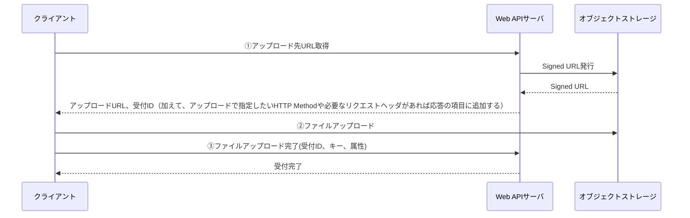

<page-title/>

本コーディング規約は、世の中のシステム開発プロジェクトのために無償で提供致します。  
ただし、掲載内容および利用に際して発生した問題、それに伴う損害については、フューチャー株式会社は一切の責務を負わないものとします。  
また、掲載している情報は予告なく変更することがございますので、あらかじめご了承下さい。

# はじめに

本ドキュメントは [OpenAPI Specification 3.0.3](https://github.com/OAI/OpenAPI-Specification/blob/main/versions/3.0.3.md)に則った API ドキュメントを記述する際のコーディング規約をまとめている。
旧バージョンである[OpenAPI Specification 2.0 の規約](OpenAPI_Specification_2.0.md)も存在するため、v2 を使用している場合はそちらを参照されたい。

# 前提条件

本規約は以下の前提条件に基づいて作成されており、ToC 向けの LSUDs（Large Set of Unknown Developers）向けの Web API には適合しない場合もあるのでご留意いただきたい。

- 業務システム向けの Web API 提供
  - サードパーティ向けに広く開発する Web API ではなく、限られたクライアントやシステムと連携すること
  - いわゆる、LSUDs（Large Set of Unknown Developers）ではなく、SSKDs（Small Set of Known Developers）を対象とする
- RESTish な Web API
  - 原理的な REST を必ずしも守る必要はないが、例えば HTTP メソッドは、参照は GET、登録は POST、更新は PUT や PATCH、削除は DELETE で使い分けていたり、Web API の要求が成功すれば 200（OK）、204（No Content）を返し、リソースが無ければ 404（Not Found）、操作に失敗すれば 500 系のエラーを返すといったことを指す
  - 本規約を利用するに当たり必須条件ではないが、定義例などはそれに基づいて記載しているので注意する
- スキーマファースト
  - OpenAPI Specification の定義ファイルを駆動に、クライアント・サーバサイドのコード生成やモック時の利用に用い、高速な Web API 開発につなげることを前提とする
    - Python における、FastAPI・Django REST Framework のように、アプリケーションコードから OpenAPI document を自動生成する開発手法も存在するが、本規約はこれは想定しない
  - 定義ファイルの完成度はできるかぎり高め、コード生成やドキュメントの価値を高める
    - OAS 定義からコードを生成し、通常は記載した型・項目長・最大～最小・enum・必須定義・正規表現フォーマットでバリデーションを行い、カバーできない部分のバリデーションをアプリケーション固有ロジックとして実装する方針とする。例えば、複数項目間のチェックや DB を確認しないと行えないチェックである
    - ドキュメントとしての価値を高めるため、その API 呼び出しで発生しうる全ての HTTP ステータスコードを記載する
      - API の振る舞いを読み手に伝えるものとして、どのような異常系があるかは有用な場合が多いからである
- JavaScript/TypeScript、Java、Go のエコシステムがターゲット
  - OpenAPI Specification は広く受け入れられており、コレに対応する様々なツールやフレームワークといったエコシステムがあり、中には定義された設定がうまく認識されない場合がある。本規約では対応していないツールが多い場合、特定の記法を非推奨とすることがあり、同時にその理由も説明する
  - 全ての言語・フレームワーク・ツールの対応状況は調査しきれていないため、利用するプロダクトの対応状況は利用者側で確認をお願いする

# 免責事項

::: warning 有志で作成したドキュメントである

フューチャーアーキテクトには多様なプロジェクトが存在し、それぞれの状況に合わせた開発手法が採用されている。本規約はフューチャーアーキテクトの全ての部署／プロジェクトで利用されているわけではなく、有志が観点を持ち寄って新たに整理したものである。相容れない部分があればその領域を書き換えて利用することを想定している

:::

# API設計

Web API の設計自体は、[Web API設計ガイドライン | Future Enterprise Arch Guidelines](https://future-architect.github.io/arch-guidelines/documents/forWebAPI/web_api_guidelines.html)を参考にすること。

# YAMLファイルフォーマット

OpenAPI ドキュメントは JSON 形式、YAML 形式いずれかのフォーマットで記載できるが **YAML 形式** を利用する。理由として、JSON と比較して YAML は視覚的に見やすく、レビューや差分管理が行いやすいためである。

## ファイル名

ファイルの拡張子は `yaml` とする。通常ファイル名は `openapi.yaml` を推奨する。

もし、複数の定義を管理したい場合は `${service}_openapi.yaml` とする。

`${service}` にはサービス名を指定する

## YAML バージョン

[YAML v1.2](https://yaml.org/spec/1.2.2/#61-indentation-spaces)を用いる。

## ファイルレイアウト

- ファイルの最終行には空行を入れる
- 文字コードは UTF-8 とする
- タブは半角スペース 2 つとする

## クォート

クォートは可読性を上げるために、できる限り利用しない。利用する場合はダブルクォートを利用する。

```yaml
# OK
description: 何かしらの説明

# NG（クォートでのラップは不要）
description: '何かしらの説明'
description: "何かしらの説明"
```

以下の場合は必須で利用する

- 文字列として認識させる必要のある数字（"0123"）
- 60 進数と認識させたくない場合（"12:34"）
- Bool として認識させたくない（"true", "false", "yes", "no", "y", "n", "on", "off"）
- `#` で始まる文字列（`#` はコメントを示す記号のためである。例: `#/definitions/Users`）

## YAML 配列スタイル

- 複数項目を指定する場合は、 **Flow style(配列スキーム)** を用いることを推奨する

  ```yaml
  # OK（推奨: 配列リテラル構文）
  required: [user_id, user_name, account_type, register_at]

  # NG（非推奨: リスト構文）
  required:
    - user_id
    - user_name
    - account_type
    - register_at
  ```
  - YAML は項目定義がネストすることで縦長な定義になりやすい。情報密度を上げるために配列リテラルを推奨する

## 改行の表現

改行を含む場合は、パイプ（ブロックスカラー） `|` を用いる

```yaml
description: |
  説明文1
  説明文2
     - 箇条書き1
     - 箇条書き2
     - 箇条書き3
```

# OpenAPI ドキュメントの構成要素

OpenAPI ドキュメントを構成する要素はオブジェクトと呼ばれ、ルートオブジェクトは以下の要素で構成される。

各種規約を理解する上で、これらの要素を大まかに把握しておくことが重要である。

各オブジェクトの詳細については[公式ドキュメント](https://spec.openapis.org/oas/v3.0.3#openapi-object)を参照されたい。

| フィールド名 | 必須 | 説明                                                        |
| ------------ | :--: | ----------------------------------------------------------- |
| openapi      |  ○   | OpenAPI ドキュメントが使用する OpenAPI 仕様のバージョン番号 |
| info         |  ○   | API に関するメタデータ                                      |
| servers      |      | API サーバへの接続情報                                      |
| paths        |  ○   | API の利用可能なパスと操作方法                              |
| components   |      | 複数の API における共通の定義                               |
| security     |      | API 全体で利用可能なセキュリティ（認証）機構                |
| tags         |      | 各種 API をグルーピングするためのタグ                       |
| externalDocs |      | 追加の外部ドキュメント                                      |

続いて各構成要素ごとに具体的なコーディング規約を記載していく。

# openapi

OpenAPI ドキュメントが使用する OpenAPI 仕様のセマンティックバージョン番号を記載する。

本規約はバージョン`3.0.3`を対象としているため、`3.0.3`とする。

良い例：

```yaml
openapi: 3.0.3
```

悪い例：

```yaml
openapi: 3.0
```

# info

`info`オブジェクトには Web API に関するメタデータを記載する。

`title`, `description`, `version` を必須項目とする。

| フィールド名   | 必須 | 記載内容                         |
| -------------- | :--: | -------------------------------- |
| title          |  ○   | Web API の総称                   |
| description    |  ○   | Web API の簡単な説明             |
| version        |  ○   | OpenAPI ドキュメントのバージョン |
| termsOfService |      | 利用規約の URL                   |
| contact        |      | 連絡先情報                       |
| license        |      | ライセンス情報                   |

## info > title

Web API の総称を記載する。

システム名やサービス名 + API のような命名を推奨する。

良い例：

```yaml
info:
  title: X System API
```

## info > description

Web API が提供する機能の概要・想定する利用者やユースケース・制約などを記載する。

## info > version

この API 仕様のドキュメントのバージョンを記載する。

アプリケーションのバージョン（git tag やリリースで管理するようなバージョン）とは別である。

- `major.minor` 形式を推奨する
  - `0.1` 固定で開発を進め、サービスのリリース時に `1.0` とし、その後の項目やオプション、パスの追加ごとにマイナーバージョンをインクリメントしていく

  良い例：

  ```yaml
  info:
    version: 1.0
  ```

- 他チームへの API ドキュメントの頻繁な共有が必要な場合は `YYYY.MM.DD` の日付形式も許容する

  良い例：

  ```yaml
  info:
    version: 2023.03.26
  ```

# servers

Web API を提供するサーバの情報を記載する。

- `url`, `description` を必須項目とする
- ステージ（local, develop, staging など）が複数ある場合は各ステージ分の情報を記載する。
- SSKDs 向けの Web API 開発においては本番環境の URL を不用意に公開したくないケースが多く、記載は避けるべきである

良い例：

```yaml
servers:
  - url: http://localhost:8001/
    description: Localhost Server
  - url: https://dev.api.example.com/v1
    description: Development Server
  - url: https://staging.api.example.com/v1
    description: Staging Server
```

悪い例：

```yaml
servers:
  - url: https://prod.api.example.com/v1
    description: Production Server
```

# paths

API の利用可能なエンドポイントと操作方法を記載する。

- API ごとに機能 ID を定義している場合、`paths` 配下の各パスは機能 ID の昇順に定義する

  良い例：

  ```yaml
  paths:
    /users:
      get:
        summary: API-101 ユーザ一覧取得
    /products:
      get:
        summary: API-201 商品一覧取得
  ```

  悪い例：

  ```yaml
  paths:
    /products:
      get:
        summary: API-201 商品一覧取得
    /users:
      get:
        summary: API-101 ユーザ一覧取得
  ```

- URL パスが複数の単語からなる場合、ケバブケースで表現する

  良い例：

  ```yaml
  paths:
    /product-owners:
      get: ...
  ```

  悪い例：

  ```yaml
  paths:
    /productOwners:
      get: ...
  ```

- HTTP メソッドは `GET`, `POST`, `PUT`, `PATCH`, `DELETE` の順に定義する

  良い例：

  ```yaml
  paths:
    /products:
      get: ...
      post: ...
  ```

  悪い例：

  ```yaml
  paths:
    /products:
      post: ...
      get: ...
  ```

- HTTP メソッドの配下に定義されるオペレーションオブジェクトは、下記の項目を必須項目とする

| フィールド名 | 必須 | 記載内容                                 |
| ------------ | :--: | ---------------------------------------- |
| tags         |  ○   | API の論理的なグループ                   |
| summary      |  ○   | API の操作概要                           |
| description  |  ○   | API の振る舞いの詳細や注意点             |
| externalDocs |      | API に関する追加の文書                   |
| operationId  |  ○   | API の利用可能なエンドポイントと操作方法 |
| parameters   |      | API のリクエストパラメータ               |
| requestBody  |      | API のリクエストボディ                   |
| responses    |  ○   | API のレスポンス                         |
| callbacks    |      |                                          |
| deprecated   |      | API が非推奨であることの宣言             |
| security     |      | API のセキュリティ機構                   |
| servers      |      | API に対応する代替サーバ                 |

## paths > {path} > {method} > tags

API の論理的なグループを指定する。

- タグオブジェクトとして事前定義したタグの中から選択する

  良い例：

  ```yaml
  paths:
    /users:
      get:
        tags:
          - users
        ...
  tags:
    - name: users
  ```

  悪い例：

  ```yaml
  paths:
    /users:
      get:
        tags:
          # タグオブジェクトとして定義されていないタグが指定されている
          - users
        ...
  tags: []
  ```

- 1 API につき 1つのタグを指定する

  良い例：

  ```yaml
  paths:
    /users:
      get:
        tags:
          - users
        ...
  ```

  悪い例：

  ```yaml
  paths:
    /users:
      get:
        # 複数のタグが指定されている
        tags:
          - users
          - admin
        ...
  ```

## paths > {path} > {method} > summary

API の操作概要を記載する。

- API ごとに機能 ID や機能名があるのであれば記載する

  良い例：

  ```yaml
  paths:
    /users:
      get:
        summary: API-001 ユーザ一覧取得
  ```

## paths > {path} > {method} > description

API の振る舞いの詳細や注意点を記載する。

別途参照させるべき設計書があるのであれば、設計書へのリンクを記載しても良い。

良い例：

```yaml
paths:
  /users:
    get:
      description: [API詳細設計書（API-001）](https://example.com/API-001.md)
```

## paths > {path} > {method} > operationId

API を識別するための一意な文字列を記載する。

- HTTP メソッドと URL パスの組み合わせをキャメルケースで表現する
  - キャメルケースの書式は、[OpenAPI 3.0ガイドのPaths and Operations](https://swagger.io/docs/specification/paths-and-operations/#:~:text=role%3Dvalue-,operationId,-operationId%20is%20an)でも利用されているため、一般的である

  良い例：

  ```yaml
  paths:
    /users:
      get:
        operationId: getUsers
        ...
    /products/{product_id}:
      put:
        operationId: putProductsProductId
        ...
  ```

  悪い例：

  ```yaml
  paths:
    /users:
      get:
        operationId: get_users
        ...
  ```

- OpenAPI ドキュメントエディタとして広く使用される Stoplight が提供する[Linter](https://docs.stoplight.io/docs/spectral/674b27b261c3c-overview)の定義としては、ケバブケースが標準になっているため、Stoplight を使用する場合はケバブケースで表現しても良い

## paths > {path} > {method} > parameters

API のリクエストパラメータを記載する。

- クエリパラメータはスネークケースで表現する

  良い例：

  ```yaml
  paths:
    /users:
      get:
        ...
        parameters:
          - name: account_type
            in: query
  ```

  悪い例：

  ```yaml
  paths:
    /users:
      get:
        ...
        parameters:
          - name: account-type
            in: query
  ```

- クエリパラメータは HTTP メソッドが `GET`, `DELETE` の場合にのみ指定する

  良い例：

  ```yaml
  paths:
    /users:
      get:
        ...
        parameters:
          - name: account_type
            in: query
  ```

  悪い例：

  ```yaml
  paths:
    /users:
      post:
        ...
        parameters:
          - name: acaccount_type
            in: query
  ```

- ヘッダはハイフンを区切り文字とするパスカルケースで表現する

  良い例：

  ```yaml
  paths:
    /users:
      post:
        ...
        parameters:
          - name: Content-Type
            in: header
  ```

  悪い例：

  ```yaml
  paths:
    /users:
      post:
        ...
        parameters:
          - name: ContentType
            in: header
  ```

## paths > {path} > {method} > requestBody

API のリクエストボディを記載する。

- 標準仕様の [describing-request-body](https://swagger.io/docs/specification/describing-request-body/) の章にも記載がある通り、リクエストボディは HTTP メソッドが `POST`, `PUT`, `PATCH` の場合のみ指定する

  良い例：

  ```yaml
  paths:
    /users:
      post:
        ...
        requestBody:
          required: true
          content:
            application/json:
              ...
  ```

  悪い例：

  ```yaml
  paths:
    /users:
      get:
        ...
        # HTTP メソッドが GET の場合にリクエストボディを指定
        requestBody:
          ...
  ```

- リクエストボディそのものは通常複数の API を跨いで再利用されるものではないため、原則 `components` オブジェクトとして共通化（コンポーネント化）を行わない
  - [openapi-generator](https://github.com/OpenAPITools/openapi-generator)を使用する場合は、コンポーネント化をせず、`title` を指定することで名称の指定が可能となる
  - [oapi-codegen](https://github.com/oapi-codegen/oapi-codegen)を使用する場合は、名称を指定するためにコンポーネント化が必要となるが、極力コンポーネント化せずデフォルトの名称を使用することを推奨する

  良い例：

  ```yaml
  paths:
    /users:
      post:
        ...
        requestBody:
          required: true
          content:
            application/json:
              ...
  ```

  悪い例：

  ```yaml
  paths:
    /users:
      get:
        ...
        requestBody:
          # コンポーネント化したリクエストボディを参照
          $ref: '#/components/requestBodies/ReqPostProductsBody'

  components:
    requestBodies:
      ReqPostProductsBody:
        content:
          application/json:
  ```

## paths > {path} > {method} > responses

API のレスポンスを記載する。

- 正常系（`2xx`）のレスポンスは通常複数の API を跨いで再利用されるものではないため、原則 `components` オブジェクトとして共通化（コンポーネント化）を行わない
  - [openapi-generator](https://github.com/OpenAPITools/openapi-generator)を使用する場合は、コンポーネント化をせず、`title` を指定することで名称の指定が可能となる
  - [oapi-codegen](https://github.com/oapi-codegen/oapi-codegen)を使用する場合は、レスポンスの構造体を出力するために `strict-server` オプションを `true` に指定する必要がある。名称を指定するためにコンポーネント化が必要となるが、極力コンポーネント化せずデフォルトの名称を使用することを推奨する

  良い例：

  ```yaml
  paths:
    /products:
      post:
        responses:
          "200":
            description: 200 OK
            content:
              application/json: ...
  ```

  悪い例：

  ```yaml
  paths:
    /products:
      post:
        responses:
          "200":
            # コンポーネント化したレスポンスオブジェクトを参照
            $ref: "#/components/responses/RespPostProductsBody"

  components:
    responses:
      RespPostProductsBody:
        description: 200 OK
        content:
          application/json: ...
  ```

- 異常系（`4xx`, `5xx`）のレスポンスは個別に定義するのではなく、事前に `components` オブジェクトとして定義を行い `$ref` で参照する

  良い例：

  ```yaml
  paths:
    /products:
      post:
        responses:
          "400":
            # コンポーネント化したレスポンスオブジェクトを参照
            $ref: "#/components/responses/BadRequest"

  components:
    responses:
      BadRequest:
        description: 400 Bad Request
        content:
          application/json: ...
  ```

  悪い例：

  ```yaml
  paths:
    /products:
      post:
        responses:
          "400":
            # レスポンスオブジェクトを個別に定義
            description: 400 Bad Request
            content:
              application/json: ...
  ```

## paths > {path} > {method} > security

API の認証方式を記載する。

- 通常はルートレベルの `security` で API 共通的な認証方式を設定し、個々の API で個別に設定は行わない
- ヘルスチェックのような認証を通す必要がない API のみ、上書きで定義する

  良い例：

  ```yaml
  paths:
    /session:
      post:
        ...
        # 認証しない場合のみ個別で定義
        security: []
  ```

# components

API 定義で利用する共通のデータモデルを定義する。定義方針は下記の通りである。

| フィールド名    | 方針                                                                                   |
| --------------- | -------------------------------------------------------------------------------------- |
| schemas         | API 共通的なリソース（例. ユーザや商品など）やエラー等のドメインオブジェクトを定義する |
| responses       | API 共通的なレスポンス（例. 異常系（`4xx`, `5xx`）のレスポンス）を定義する             |
| parameters      | API 共通的なリクエストパラメータ（HTTP ヘッダやクエリパラメータ等）を定義する          |
| examples        | 原則何も定義しない                                                                     |
| requestBodies   | 原則何も定義せず、リクエストボディは API 個別に定義する                                |
| headers         | API 共通的なレスポンスヘッダを定義する                                                 |
| securitySchemes | 標準で用いる API 認証のスキームを定義する                                              |
| links           | 原則何も定義しない                                                                     |
| callbacks       | 原則何も定義しない                                                                     |

※ リクエストボディやレスポンスボディにおいてオブジェクトがネストする場合、 API 固有のオブジェクトであっても `schemas` に定義する。
これは、定義するオブジェクトの `properties` 配下に更に `type: object` が定義される場合に、生成ツールによってはうまく型が生成されないためである。
生成ツール上問題ないのであれば、API 固有のオブジェクトを `schemas` に定義する必要はない。

## components　> schemas

API 共通的なリソースやエラー等のドメインオブジェクトを記載する。

- 名称はアッパーキャメルケースで定義する
- 名称は単数形で定義する
- `type` に複数の型を定義しない
- `type` に `null` は原則指定しない（`null` 値を用いる代わりに、キー自体を含めない）。空更新を行う場合は空文字を利用する
- `allOf`, `anyOf`, `oneOf` は利用しない

良い例：

```yaml
components:
  schemas:
    # 共通で使用するリソースを表すオブジェクト
    Product:
      type: object
      properties: ...
    User:
      type: object
      properties:
    # 共通で使用するエラーを表すオブジェクト
    ProblemDetailError:
      type: object
      properties: ...
```

## components > responses

API 共通的なレスポンスを記載する。主に異常系（`4xx`, `5xx`）のレスポンスを定義する。

- 名称はアッパーキャメルケースで定義する
- 異常系（`4xx`, `5xx`）のレスポンスの場合、名称にステータスコードの名称（例. BadRequest, Unauthorized）を用いる

良い例：

```yaml
components:
  schemas:
    ProblemDetailError:
      type: object
      properties:
        ...
  responses:
    # HTTP ステータスコード 400 のレスポンスオブジェクト
    BadRequest:
      description: 400 Bad Request
      content:
        application/json:
          schema:
            "$ref": "#/components/schemas/ProblemDetailError"
    # HTTP ステータスコード 401 のレスポンスオブジェクト
    Unauthorized:
      description: 401 Unauthorized
      content:
        application/json:
          schema:
            "$ref": "#/components/schemas/ProblemDetailError"
    ...
```

正常系のレスポンスの例としてはファイルアップロード・ダウンロードのレスポンスなどが該当する。  
個別のアプリケーション要件でブレが少なく、複数のエンドポイントで用いられる場合に定義する。オブジェクトのスキーマは、`schemas` に切り出して定義し、コード生成ツールのために型情報を付与させる。

良い例：

```yaml
components:
  schemas:
    SignedURL:
      type: object
      properties:
        signed_url:
          type: string
          format: uri
        expired_at:
          type: string
          format: date-time
  responses:
    BlobUpload:
      description: BLOB(Binary Large Object) upload using presigned url
      content:
        application/json:
          schema:
            "$ref": "#/components/schemas/SignedURL"
    BlobDownload:
      description: BLOB(Binary Large Object) download using presigned url
      content:
        application/json:
          schema:
            "$ref": "#/components/schemas/SignedURL"
    ImageBinary:
      description: An image
      content:
        image/*:
          schema:
            type: string
            format: binary
```

## components > parameters

API 共通的なリクエストパラメータ（パスパラメータ、クエリパラメータ、ヘッダ, Cookie）を記載する。

### パスパラメータ

- API 全体で利用されるパスパラメータが必要なケースが想定されないため、原則定義しない
  - 特定リソースの操作（例えば更新と削除）を行う際のリソース ID はパスパラメータとして再利用できるが、コンフリクトを避けるため原則共通化は行わない

### クエリパラメータ

- API 全体で利用可能な共通のクエリパラメータ（例: 検索数の limit, offset）を定義する
- 命名はクエリパラメータ名に `Query` というプレフィックスを付与する形式を推奨する

良い例：

```yaml
paths:
  get:
    /products:
      parameters:
        - $ref: "#/components/parameters/QueryLimit"

components:
  parameters:
    QueryLimit:
      name: limit
      in: query
      required: false
      schema:
        type: integer
      description: 検索数上限
```

### ヘッダ

- API 全体で利用可能な共通のリクエストヘッダを定義する
- 命名はヘッダ名に `Header` というプレフィックスを付与する形式を推奨する

良い例：

```yaml
paths:
  post:
    /products:
      parameters:
        - $ref: "#/components/parameters/HeaderContentType"

components:
  parameters:
    HeaderContentType:
      name: Content-Type
      in: header
      schema:
        type: string
      required: true
```

### Cookie

- API 全体で利用可能な共通の Cookie（例: CSRF 用のトークン）を定義する
- 命名は Cookie 名に `Cookie` というプレフィックスを付与する形式を推奨する
- Cookie 認証を定義する場合は、`APIKey` を利用する

良い例：

```yaml
paths:
  get:
    /products:
      parameters:
        - $ref: "#/components/parameters/CookieCSRFToken"

components:
  parameters:
    CookieCSRFToken:
      name: csrftoken
      in: cookie
      required: true
      schema:
        type: string
      description: CSRFトークン
```

## components > requestBodies

原則何も定義せず、リクエストボディは API 個別に記載する。

## components > headers

API 共通的なレスポンスヘッダを記載する。

- 命名はヘッダ名からハイフンを除去した形式を推奨する

良い例：

```yaml
paths:
  get:
    /products:
      responses:
        "200":
          headers:
            XCacheInfo:
              $ref: "#/components/headers/XCacheInfo"

components:
  headers:
    XCacheInfo:
      description: not cacheable; meta data too large
      schema:
        type: string
```

## components > securitySchemes

標準で用いる API 認証の定義を行う。

良い例：

```yaml
components:
  securitySchemes:
    # Bearer トークンによる認証
    Bearer:
      type: http
      scheme: bearer
      bearerFormat: JWT
      description: "Bearer トークン認証"
```

## components > links

[links](https://swagger.io/docs/specification/links/) は OpenAPI 3.0 の新機能の1つで、ある API レスポンスの値を用いて、別の API を呼び出す方法を明示できるセクションである。

興味深い機能であり、API のセマンティクスを伝えるのに有用であるが、本規約では記載しないことを推奨とする。

理由:

- 業務システムでは、業務フローを抑えておけば、API 操作フローの理解はそこまで難しくないことが多い
  - 逆に、API 同士の関係だけを示すだけでは業務モデリング図とのダブルメンテナンスになったり、中途半端になりうる
- [OAS 3.0 Support Backlog](https://github.com/swagger-api/swagger-ui/issues/3641) にあるように、2023/12/15時点では Swagger-UI が対応していない
  - links を書いたと言って、API ドキュメントに影響しない

## components > callbacks

[callbacks](https://swagger.io/docs/specification/callbacks/) は OpenAPI 3.0 の新機能の1つで、API サーバ側が指定されたコールバック URL を呼び出すという仕組みである。

仕様書には、EC ショップで購入のたびにマネージャーに通知を送るといった、何かしらの処理をトリガーにコールバック URL を呼び出す例が示されている。

利便性は高い仕様だが、本規約では記載しないことを推奨とする。

理由:

- コールバック URL 呼び出しの、エラーハンドリングが難しい
- 業務システムでは欠損が許されない、または将来的に許されなくなる可能性があり、その場合にこの機能に頼ると想定以上の追加作業が発生する

コールバックのような仕組みを実現するには、別途キューイングのメッセージサービスの利用などを検討する。

# security

全 API に共通で適用されるセキュリティ設定を定義する。

業務システムの Web API において認証が全く存在しないケースは考えにくいため、本規約ではルートレベルで認証を設定し、個々の API への適応漏れを無くす。

良い例：

```yaml
security:
  - Bearer: []
```

# tags

API を論理的にグループ化するためのタグを定義する。

- ドキュメントやツールにとって重要であるため **必須** で指定する
- `name`, `description` を必須項目とする
- **単数形** で、小文字かつ半角スペース区切りで記載する
  - 半角スペース区切りで記載する理由は HTML ドキュメントで参照する場合の可読性を上げるため
- コード生成で利用される（Go においてはパッケージ、 TypeScript においてはクラスに相当する）ため、シンプルな命名にする

良い例：

```yaml
tags:
  - name: product
    description: 製品
  - name: user account
    description: ユーザーアカウント
```

悪い例：

```yaml
tags:
  - name: products
    description: 製品
  - name: user_account
    description: ユーザーアカウント
```

# externalDocs

参照情報としての URL を記載できる。

ただし、`description` にて参考情報となる URL を記載する方が、複数リンクを指定可能であるなど自由度が高く使いやすいため `externalDocs` は利用せず `description` の利用を推奨する。

良い例：

```yaml
info:
  description: |-
    Some useful links:
    - [The Pet Store repository](https://github.com/swagger-api/swagger-petstore)
    - [The source API definition for the Pet Store](https://github.com/swagger-api/swagger-petstore/blob/master/src/main/resources/openapi.yaml)

# 特別な場合を除き非推奨
externalDocs:
  description: Find out more about Swagger
  url: http://swagger.io
```

# ファイル操作

OpenAPI ドキュメントを作成する上でのファイルのアップロード／ダウンロードについて設計上ポイントを記載する。

## ファイルアップロード

[Web API設計ガイドライン>ファイル連携>ファイルアップロード](https://future-architect.github.io/arch-guidelines/documents/forWebAPI/web_api_guidelines.html#%E3%83%95%E3%82%A1%E3%82%A4%E3%83%AB%E3%82%A2%E3%83%83%E3%83%95%E3%82%9A%E3%83%AD%E3%83%BC%E3%83%88%E3%82%99) で推奨された「署名付きURL」を用いた手法を採用する場合、次のようなフローとする。



フローの ①、② はアプリケーション固有の紐づけルールにおいて Web API を設計すれば良いため、本規約で YAML の設定例は記載しない。フロー ② については Signed URL を用いたアップロードであり、アプリケーションの Web API 定義を書く必要はない。もし、監査ログなどのガバナンス上、直接オブジェクトストレージへの書き込みを許容されないケースは、B で Signed URL に相当する書き込み先を提供し、B を経由してファイルをアップロードする。

上記どちらのケースも OpenAPI 定義としてはシンプルであるため、記述例は割愛する。

## ファイルダウンロード

[Web API設計ガイドライン>ファイル連携>ファイルダウンロード](https://future-architect.github.io/arch-guidelines/documents/forWebAPI/web_api_guidelines.html#%E3%83%95%E3%82%A1%E3%82%A4%E3%83%AB%E3%82%BF%E3%82%99%E3%82%A6%E3%83%B3%E3%83%AD%E3%83%BC%E3%83%88%E3%82%99) で推奨された方法は、Signed URL をレスポンスの JSON 項目に渡すか、ファイル容量がごく小さい場合に限り Base64 にエンコードして JSON に埋め込んで渡すかの2つである。

どちらのケースも OpenAPI 定義としてはシンプルであるため、記述例は割愛する。

# CORS

CORS（Cross-Origin Resource Sharing）のために、options メソッドの追記は **原則不要** とする。

理由:

- サーバ側
  - options メソッド対応は、API 仕様ではなく実装レベルの機能横断的な処理（Java における Servlet Filter や Spring の Interceptor、Go における Middleware など）で行うことが大半であり、コード生成が不要
- クライアント側
  - options メソッドを用いるのはクライアントがブラウザであり、クライアントのアプリケーションコードが明示的にアクセスしないため、コード生成が不要
- 仕様面として
  - `Access-Control-Allow-Origin` がどのような値を返すか、呼び出し元によって動的な値を返したい場合があり、記載が困難なケースがある

ただし、Amazon API Gateway のようなサービスを利用する場合は、options メソッドの記載が必須である場合は除く[^1]。

[^1]: <https://docs.aws.amazon.com/ja_jp/apigateway/latest/developerguide/enable-cors-for-resource-using-swagger-importer-tool.html>

# OpenTelemetry Traceparent HTTP Header

OpenOpenTelemetry で用いるられる[traceparent](https://www.w3.org/TR/trace-context/) のリクエストヘッダは OpenAPI で **原則不要** とする。

理由:

- OpenTelemetry が定めるヘッダ類は、API 横断的に設定されるべきものであり、ミドルウェアやフレームワーク側などでの一律の制御を推奨するため
- 記載することにより、OpenOpenTelemetry に対応していることを明記し開発者に周知できるメリットより、各アプリ開発者が生成されたコードで悩んだり、誤解されることを回避したいため

# バリデーション

パラメータのバリデーションをどこまで厳密に定義すべきかという議論はしばしば行われる。

リクエストパラメータの各項目に対して、必須・型・桁・区分値・日付・正規表現のチェックが行える。レスポンスで用いるモデルについても同様に設定でき、`enum`, `pattern` 以外は API の利用者（クライアント）側の DB 設計などに必要な型桁情報を渡すのに有用であるため、できる限り詳しく指定する。

## 必須

必須パラメータのみ `required: true` を定義する

## デフォルト値

パラメータにデフォルト値がある場合は`default` を定義する。

```yaml
# ex. enum
name: limit
type: number
format: integer
minimum: 1
maximum: 100
default: 20
description: 検索結果の項目数上限（1~100が指定可能）
```

【注意】API 公開後に、default 値を変更してはならない（API の互換性が崩れるため）。もし変更する場合は、API のバージョンを上げること。

## 型・フォーマット

型（`type`）は `string(文字列)`, `number（数値）`, `integer（整数値）`, `boolean（真偽値）` `array（配列）` のうちどれか指定する。

フォーマット（`format`）は以下の型の詳細情報を示すもので、可能な限り設定する。

- `integer`（整数）
  - `int32`, `int64`
- `number`（数値）
  - `float`, `double`
- `string`（バイナリ）
  - `byte`: Base64 でエンコードされた文字列
  - `binary`: バイト配列
- `string`（日付）
  - `date`: [RFC3339](https://www.rfc-editor.org/rfc/rfc3339) full-date(例: 2023-07-21)
    - 項目名は `_on` を接尾辞につけることを推奨とする
  - `date-time`: [RFC3339](https://www.rfc-editor.org/rfc/rfc3339) date-time(例: 2023-07-21T17:32:28Z)
    - 項目名は `_at` を接尾辞につけることを推奨とする
- `string`（その他）
  - `password`: Swagger UI で入力が隠される
  - その他、 `email`, `uuid` など Open API 仕様に存在しない任意のフォーマットを独自のドキュメント生成などのために記載しても良い

OpenAPI 3.0 では 2.0 に存在した `file` type は存在しない。もし同等の指定をしたい場合は、以下の様に指定する。

```yaml
type: string
format: binary # binary file contents
```

## 桁

データ型によって、利用できる桁を指定する項目が異なる。可能な限り設定する。

- 文字列
  - 最大桁数：`maxLength`
  - 最小桁数：`minLength`
- 数値または整数値
  - 最小値（境界値を含む）：`minimum`
  - 最大値（境界値を含む）：`maximum`
  - 境界値を含まない場合のみ`exclusiveMinimum: true`または`exclusiveMaximum: true`を定義する。minimum, maximum で代用できる場合は利用しない
- 配列:
  - 最大要素数：`maxItems`
  - 最小要素数：`minItems`
  - `required: true`の場合は原則として`minItems: 1`を定義する
  - `uniqueItems` は必須で指定する（通常は一意であるべき）

【注意】API 公開後に、レスポンスの `maxLength` を以前より大きい値に変更してはならない。レスポンスの `maxLength` など API 利用者側システムの DB の ERD 定義のインプットになる事が多いため。もし行う場合は API のバージョンを上げることや、連携先に桁数変更の旨を調整するなどの考慮を行う。

## 区分値

区分値の場合は `enum` 属性を利用し、`description`には区分値の論理名を記載する。

```yaml
name: gender
type: string
enum: ["0", "1", "2", "9"]
description: |
  性別
    0: 不明
    1: 男
    2: 女
    9: 適用不能
```

OpenAPI 3.0 では区分値の再利用ができるため、横断的に用いる区分値は components 側で定義する。

```yaml
paths:
  /products:
    get:
      parameters:
        - in: query
          name: gender
          required: true
          schema:
            $ref: "#/components/schemas/Gender"
components:
  schemas:
    Gender:
      type: string
      enum: ["0", "1", "2", "9"]
```

## 固定値

**固定値** の場合も enum を 1 つだけ指定して表現する。この場合もレスポンスで利用する場合は指定しない

```yaml
name: file_layout
type: string
enum: ["json"]
description: ファイルレイアウト
```

## その他（正規表現）

正規表現で表現できる文字列は`pattern`を利用して定義する。桁や区分値で代替できる場合は、`pattern` を用いない

例:

```yaml
remind_time:
  type: string
  description: リマインド時刻。（hh:mm）形式
  example: 23:59
  pattern: "^(2[0-3]|[01][0-9]):([0-5][0-9])$"
```

# ファイル分割

OpenAPI ドキュメントは単一のファイルで構成することも複数の分割されたファイルで構成することもできるが、**複数のファイルに分割する**ことを推奨する。

理由:

- API path ごとに担当者を分けて設計する場合などに、複数人による編集によって意図しないコンフリクトが発生することを防ぐ
- ファイルの肥大化による、可読性の低下を防ぐ

## 分割方法の選定

開発方針や OpenAPI の使用用途に合わせて、都合の良いファイルの分割方法を採用する。例えば、以下のような方法がある。

1. API path ごとに設計担当者を分けて、それぞれに OpenAPI を編集する場合は、path の単位で分割する。
2. テストツールとして [stoplightio/prism](https://github.com/stoplightio/prism)を使用する場合、テストケースごとにデータファイルを作成して、`examples` にファイルパスを指定する。

注意点:

- OpenAPI 仕様上、`$ref` は[利用できる箇所が限定されている](https://swagger.io/docs/specification/using-ref/#allowed-places)ことに注意する
  - 例えば[Path](https://github.com/OAI/OpenAPI-Specification/blob/main/versions/3.0.3.md#path-item-object)は `$ref` が利用可能だが、[Operation](https://github.com/OAI/OpenAPI-Specification/blob/main/versions/3.0.3.md#operation-object)（HTTPメソッドの粒度）では利用不可である

## サンプル説明

分割方法 1, 2 の両方に当てはまる場合のサンプルを用いて説明する。`openapi.yaml` とディレクトリ構成は下の通り。全量は [sample_divided](https://github.com/future-architect/coding-standards/tree/master/documents/forOpenAPISpecification/sample_divided)を参照すること。

- リソース単位にディレクトリを作成して、path ごとに定義ファイルを格納する。
- `components` の schemas モデルの中身は別ファイルとして切り出すことが可能である。

  ```yaml
  # openapi.yaml（ファイル分割例）
  openapi: "3.0.3"
  info:
    version: 1.0.0
    title: Swagger Petstore
  security:
    - Bearer: []
  servers:
    - url: http://petstore.swagger.io/v1
  tags:
    - name: pets
      description: Everything about your Pets
  paths:
    /pets:
      $ref: "./pets/pets.yaml"
    /pets/{pet_id}:
      $ref: "./pets/pets_pet_id.yaml"

  components:
    securitySchemes:
      Bearer:
        type: http
        scheme: bearer
        bearerFormat: JWT
        description: "Authenthicaiton with bearer token"
  ```

  ```sh
  # ディレクトリ構成（ファイル分割例）

  ├─openapi.gen.yaml
  ├─openapi.yaml
  │
  ├─examples
  │  ├─pets_get
  │  │    ├─test_case_001.yaml
  │  │    └─test_case_002.yaml
  │  │
  │  ├─pets_pet_id_get
  │  │    └─test_case_003.yaml
  │  │
  │  └─pets_post
  │       └─test_case_004.yaml
  │
  └─pets
    ├─pets.yaml
    └─pets_pet_id.yaml
  ```

- `openapi.yaml` の `paths` に記載した API ファイルは以下のように作成する（例: pets-pet-id.yaml）。
- `examples` には、例えば各 API のテストケース ID をキーとして指定（`TestCase003`）し、該当するテストケースのデータファイルパスを参照させる。

  <details>
  <summary>pets-pet-id.yamlを見る</summary>

  ```yaml
  # pets-pet-id.yaml（API path 別ファイルの記載例）
  get:
    summary: Get details of a pet
    description: Get details of a pet by specifying its pet ID.
    operationId: getPetsPetId
    tags:
      - pets
    parameters:
      - name: pet_id
        in: path
        description: The id of the pet to retrieve
        schema:
          type: string
        required: true
    responses:
      "200":
        description: Expected response to a valid request
        content:
          application/json:
            schema:
              type: object
              properties:
                pet_detail:
                  type: object
                  properties:
                    breeder:
                      type: string
                    date_of_birth:
                      type: string
                      format: date
                    pedigree:
                      type: object
                      properties:
                        registration_no:
                          type: integer
                          format: int64
                        date_of_registration:
                          type: string
                          format: date
                        pedigree_image:
                          type: string
                      required:
                        - registration_no
                        - date_of_registration
                        - pedigree_image
              required:
                - pet_detail
            examples:
              TestCase003:
                $ref: "../examples/pets_pet_id_get/test_case_003.yaml"
      "404":
        $ref: "../common/responses.yaml#/components/responses/NotFound"
      "500":
        $ref: "../common/responses.yaml#/components/responses/InternalServerError"
  ```

  </details>

- OpenAPI の使用用途により、分割ファイルを1つのファイルにまとめる必要がある場合には、例えば[Redocly CLI](https://redocly.com/redocly-cli)を使用して以下コマンドを実行する
- まとめたファイルは、以下のようになる（例: openapi.gen.yaml）。

  ```bash
  redocly bundle openapi.yaml --output openapi.gen.yaml
  ```

  <details>
  <summary>openapi.gen.yamlを見る</summary>

  ```yaml
  # openapi.gen.yaml（ファイルBundle後）
  openapi: 3.0.3
  info:
    version: 1.0.0
    title: Swagger Petstore
  servers:
    - url: http://petstore.swagger.io/v1
  security:
    - Bearer: []
  tags:
    - name: pets
      description: Everything about your Pets
  paths:
    /pets:
      get:
        summary: Search a pet list
        description: Search a list of registered pets up to 100.
        operationId: getPets
        tags:
          - pets
        parameters:
          - name: limit
            in: query
            description: How many items to return at one time (max 100)
            schema:
              type: integer
              maximum: 100
              format: int32
            required: false
        responses:
          "200":
            description: A paged array of pets
            headers:
              x-next:
                description: A link to the next page of responses
                schema:
                  type: string
            content:
              application/json:
                schema:
                  type: object
                  properties:
                    pets:
                      type: array
                      maxItems: 100
                      items:
                        type: object
                        properties:
                          id:
                            type: integer
                            format: int64
                          name:
                            type: string
                            maxLength: 50
                          category:
                            type: string
                            maxLength: 10
                          sub_category:
                            type: string
                            maxLength: 50
                          age:
                            type: integer
                            format: int32
                          sex:
                            type: string
                            maxLength: 6
                          note:
                            type: string
                            maxLength: 200
                          tag:
                            type: string
                            maxLength: 20
                        required:
                          - id
                          - name
                          - category
                          - age
                          - sex
                examples:
                  TestCase001:
                    $ref: "#/components/examples/test_case_001"
                  TestCase002:
                    $ref: "#/components/examples/test_case_002"
          "404":
            $ref: "#/components/responses/NotFound"
          "500":
            $ref: "#/components/responses/InternalServerError"
      post:
        summary: Register a pet
        description: Reginster basic information of new pet.
        operationId: postPets
        tags:
          - pets
        requestBody:
          content:
            application/json:
              schema:
                type: object
                properties:
                  pet:
                    type: object
                    properties:
                      id:
                        type: integer
                        format: int64
                      name:
                        type: string
                        maxLength: 50
                      category:
                        type: string
                        maxLength: 10
                      sub_category:
                        type: string
                        maxLength: 50
                      age:
                        type: integer
                        format: int32
                      sex:
                        type: string
                        maxLength: 6
                      note:
                        type: string
                        maxLength: 200
                      tag:
                        type: string
                        maxLength: 20
                    required:
                      - id
                      - name
                      - category
                      - age
                      - sex
                required:
                  - pet
              examples:
                TestCase004:
                  $ref: "#/components/examples/test_case_004"
          required: true
        responses:
          "200":
            description: OK
            content:
              application/json:
                schema:
                  type: object
                  properties:
                    id:
                      type: integer
                      format: int64
                    name:
                      type: string
                      maxLength: 50
                    category:
                      type: string
                      maxLength: 10
                    sub_category:
                      type: string
                      maxLength: 50
                    age:
                      type: integer
                      format: int32
                    sex:
                      type: string
                      maxLength: 6
                    note:
                      type: string
                      maxLength: 200
                    tag:
                      type: string
                      maxLength: 20
                  required:
                    - id
                    - name
                    - category
                    - age
                    - sex
          "404":
            $ref: "#/components/responses/NotFound"
          "500":
            $ref: "#/components/responses/InternalServerError"
    /pets/{pet_id}:
      get:
        summary: Get details of a pet
        description: Get details of a pet by specifying its pet ID.
        operationId: getPetsPetId
        tags:
          - pets
        parameters:
          - name: pet_id
            in: path
            description: The id of the pet to retrieve
            schema:
              type: string
            required: true
        responses:
          "200":
            description: Expected response to a valid request
            content:
              application/json:
                schema:
                  type: object
                  properties:
                    pet_detail:
                      type: object
                      properties:
                        breeder:
                          type: string
                        date_of_birth:
                          type: string
                          format: date
                        pedigree:
                          type: object
                          properties:
                            registration_no:
                              type: integer
                              format: int64
                            date_of_registration:
                              type: string
                              format: date
                            pedigree_image:
                              type: string
                          required:
                            - registration_no
                            - date_of_registration
                            - pedigree_image
                  required:
                    - pet_detail
                examples:
                  TestCase003:
                    $ref: "#/components/examples/test_case_003"
          "404":
            $ref: "#/components/responses/NotFound"
          "500":
            $ref: "#/components/responses/InternalServerError"
  components:
    securitySchemes:
      Bearer:
        type: http
        scheme: bearer
        bearerFormat: JWT
        description: Authenthicaiton with bearer token
    examples:
      test_case_001:
        value:
          pets:
            - id: 10001
              name: ToyPoodle
              category: dog
              sub_category: ToyPoodle
              age: 1
              sex: male
              note: friendly
              tag: dog10001
            - id: 10002
              name: Chihuahua
              category: dog
              sub_category: Chihuahua
              age: 1
              sex: female
              note: friendly
              tag: dog10002
            - id: 10003
              name: Shiba
              category: dog
              sub_category: Shiba
              age: 1
              sex: male
              note: friendly
              tag: dog10003
            - id: 10004
              name: MiniatureDachshund
              category: dog
              sub_category: MiniatureDachshund
              age: 1
              sex: female
              note: friendly
              tag: dog10004
      test_case_002:
        value:
          pets: []
      test_case_004:
        value:
          pet:
            id: 10005
            name: FrenchBulldog
            category: dog
            sub_category: FrenchBulldog
            age: 1
            sex: male
            note: friendly
            tag: dog10005
      test_case_003:
        value:
          pet_detail:
            breeder: BreederName
            date_of_birth: "2023-10-31"
            pedigree:
              registration_no: 11111111
              date_of_registration: "2023-10-31"
              pedigree_image: 9j2wBDAA...8QAPxAAAQQABAMGBAYDAAEDAg
    schemas:
      ProblemDetailError:
        type: object
        properties:
          code:
            type: integer
            format: int32
          message:
            type: string
        required:
          - code
          - message
    responses:
      NotFound:
        description: Not Found
        content:
          application/json:
            schema:
              $ref: "#/components/schemas/ProblemDetailError"
      InternalServerError:
        description: Internal Server Error
        content:
          application/json:
            schema:
              $ref: "#/components/schemas/ProblemDetailError"
  ```

  </details>

---

# License

[](https://creativecommons.org/licenses/by/4.0/deed.ja)
